# SGRPO Main Results

This directory is the repo-local index for the main `original` vs `GRPO` vs `SGRPO` comparison assets across:

- `genmol de novo`
- `mmgenmol`
- `progen2`

The intent is to keep three things in one place:

1. the exact weight paths used in the comparison
2. the exact training config paths used to produce those weights
3. the output locations for diversity-property Pareto sweeps and their raw result files

## Conventions

- Config paths below are repo-root-relative inside the `genmol` git repo.
- Checkpoint paths below are the current verified cluster absolute paths.
- `Invocation` is recorded because several Slurm wrappers have their own default `CONFIG_PATH` or `CONFIG_NAME`; the required override is part of the actual experiment identity.
- `Verified` means the path was confirmed from a repo config or an already-used run artifact.
- `Partial` means an artifact exists, but it is not yet the locked main comparison asset.
- `TODO` means the comparison asset is not selected or not generated yet.
- Any unverifiable statement is explicitly labeled as an `Unverified assumption`.

## Sweep Policy

- `genmol de novo`: sweep `randomness = 0.1, 0.2, ..., 1.0`
- `genmol de novo`: sweep `temperature = 0.5, 1.0, 2.0, 3.0`
- `genmol de novo`: paired sweep `(randomness, temperature) = (0.1, 0.5), (0.3, 0.8), (0.5, 1.1), (0.7, 1.4), (0.9, 1.7), (1.0, 2.0)`
- `mmgenmol`: sweep `randomness = 0.1, 0.3, 0.6, 1.0`
- `mmgenmol`: sweep `temperature = 0.5, 1.0, 5.0`
- `mmgenmol`: paired sweep `(randomness, temperature) = (0.1, 0.5), (0.3, 0.8), (0.5, 1.1), (0.7, 1.4), (0.9, 1.7), (1.0, 2.0)`
- `mmgenmol`: report docking with `vina_dock` only for the main sweep; `qvina` is excluded from the current main-result plan.
- `progen2`: sweep `temperature = 0.1, 0.2, ..., 1.0`

For every family and every property curve, save:

- raw sweep rows
- aggregated summary JSON
- rendered plot files

Planned local layout under this directory:

- `genmol-denovo/`
- `mmgenmol/`
- `progen2/`

## GenMol De Novo

### Original

Status: `Verified`

Checkpoint:

```text
/public/home/xinwuye/ai4s-tool-joint-train/genmol/checkpoints/genmol_v2_v1.0/model_v2.ckpt
```

Training config:

```text
N/A in this repo for the current comparison campaign
```

Launch Script:

```text
N/A
```

Expected GPU Topology:

```text
N/A
```

Invocation:

```text
N/A
```

Notes:

- This is the pretrained `GenMol v2` weight used as the original model baseline.

### GRPO

Status: `Verified`

Checkpoint:

```text
/public/home/xinwuye/ai4s-tool-joint-train/runs/cpgrpo_denovo/cpgrpo_denovo_ng512_bs1024_lr5e-5_beta5e-3_ni1_20260422_025828/checkpoint-001000
```

Training config:

```text
configs/cpgrpo_denovo_ng512_bs1024_lr5e-5_beta5e-3_ni1.yaml
```

Launch Script:

```text
scripts/slurm/cpgrpo_denovo_8gpu_ng512_bs1024_ni1.sbatch
```

Expected GPU Topology:

```text
8 GPU
```

Invocation:

```text
CONFIG_PATH=configs/cpgrpo_denovo_ng512_bs1024_lr5e-5_beta5e-3_ni1.yaml sbatch scripts/slurm/cpgrpo_denovo_8gpu_ng512_bs1024_ni1.sbatch
```

Notes:

- Locked main comparison asset produced by the 8-GPU GRPO run completed on 2026-04-22.
- Training job: `41260`

### GRPO 2000-Step Variant

Status: `Verified`

Checkpoint:

```text
/public/home/xinwuye/ai4s-tool-joint-train/runs/cpgrpo_denovo/cpgrpo_denovo_ng512_bs1024_lr5e-5_beta5e-3_ni1_ms2000_20260422_161812/checkpoint-002000
```

Training config:

```text
configs/cpgrpo_denovo_ng512_bs1024_lr5e-5_beta5e-3_ni1_ms2000.yaml
```

Launch Script:

```text
scripts/slurm/cpgrpo_denovo_8gpu_ng512_bs1024_ni1.sbatch
```

Expected GPU Topology:

```text
8 GPU
```

Invocation:

```text
CONFIG_PATH=configs/cpgrpo_denovo_ng512_bs1024_lr5e-5_beta5e-3_ni1_ms2000.yaml sbatch scripts/slurm/cpgrpo_denovo_8gpu_ng512_bs1024_ni1.sbatch
```

Notes:

- Completed rerun with `max_steps = 2000`.
- All other hyperparameters and launch topology are intentionally unchanged relative to the locked 1000-step GRPO run.
- Training job: `41711`

### GRPO + `qed = 0.8, sa_score = 0.2`

Status: `Verified`

Checkpoint:

```text
/public/home/xinwuye/ai4s-tool-joint-train/runs/cpgrpo_denovo/cpgrpo_denovo_ng512_bs1024_lr5e-5_beta5e-3_ni1_q08_sa02_20260427_012110/checkpoint-001000
```

Training config:

```text
configs/cpgrpo_denovo_ng512_bs1024_lr5e-5_beta5e-3_ni1_q08_sa02.yaml
```

Launch Script:

```text
scripts/slurm/cpgrpo_denovo_8gpu_ng512_bs1024_ni1.sbatch
```

Expected GPU Topology:

```text
8 GPU
```

Invocation:

```text
CONFIG_PATH=configs/cpgrpo_denovo_ng512_bs1024_lr5e-5_beta5e-3_ni1_q08_sa02.yaml sbatch scripts/slurm/cpgrpo_denovo_8gpu_ng512_bs1024_ni1.sbatch
```

Notes:

- Baseline is the locked 1000-step GRPO configuration.
- Only changed rollout-level reward weights to `qed = 0.8` and `sa_score = 0.2`.
- Training job: `46997`
- Training completed successfully.

### GRPO + `qed = 0.8, sa_score = 0.2` 2000-Step Variant

Status: `Verified`

Checkpoint:

```text
/public/home/xinwuye/ai4s-tool-joint-train/runs/cpgrpo_denovo/cpgrpo_denovo_ng512_bs1024_lr5e-5_beta5e-3_ni1_q08_sa02_ms2000_20260427_023803/checkpoint-002000
```

Training config:

```text
configs/cpgrpo_denovo_ng512_bs1024_lr5e-5_beta5e-3_ni1_q08_sa02_ms2000.yaml
```

Launch Script:

```text
scripts/slurm/cpgrpo_denovo_8gpu_ng512_bs1024_ni1.sbatch
```

Expected GPU Topology:

```text
8 GPU
```

Invocation:

```text
CONFIG_PATH=configs/cpgrpo_denovo_ng512_bs1024_lr5e-5_beta5e-3_ni1_q08_sa02_ms2000.yaml sbatch scripts/slurm/cpgrpo_denovo_8gpu_ng512_bs1024_ni1.sbatch
```

Notes:

- Baseline is the new 1000-step `qed = 0.8, sa_score = 0.2` GRPO configuration.
- Only changed `max_steps = 2000`.
- Training job: `46999`
- Training completed successfully.

### GRPO Diversity-Regularizer 2000-Step

Status: `Verified`

Checkpoint:

```text
/public/home/xinwuye/ai4s-tool-joint-train/runs/cpgrpo_denovo/cpgrpo_denovo_ng512_bs1024_lr5e-5_beta5e-3_ni1_ms2000_divreg005_20260422_203200/checkpoint-002000
```

Training config:

```text
configs/cpgrpo_denovo_ng512_bs1024_lr5e-5_beta5e-3_ni1_ms2000_divreg005.yaml
```

Launch Script:

```text
scripts/slurm/cpgrpo_denovo_8gpu_ng512_bs1024_ni1.sbatch
```

Expected GPU Topology:

```text
8 GPU
```

Invocation:

```text
CONFIG_PATH=configs/cpgrpo_denovo_ng512_bs1024_lr5e-5_beta5e-3_ni1_ms2000_divreg005.yaml sbatch scripts/slurm/cpgrpo_denovo_8gpu_ng512_bs1024_ni1.sbatch
```

Notes:

- Completed rerun with `max_steps = 2000`.
- All other hyperparameters and launch topology are intentionally unchanged relative to the locked 1000-step GRPO run.
- `diversity_regularizer_weight = 0.05`.
- Training job: `42249`
- The sibling timestamp directory ending in `_203159` is not the locked artifact; it does not contain the complete `checkpoint-002000/model.ckpt`.

### SGRPO

Status: `Verified`

Checkpoint:

```text
/public/home/xinwuye/ai4s-tool-joint-train/runs/cpgrpo_denovo/cpgrpo_denovo_sgrpo_ng64_sg8_bs1024_lr5e-5_beta5e-3_gw09_20260422_030845/checkpoint-001000
```

Training config:

```text
configs/cpgrpo_denovo_sgrpo_ng64_sg8_bs1024_lr5e-5_beta5e-3_gw09.yaml
```

Launch Script:

```text
scripts/slurm/cpgrpo_denovo_8gpu_ng64_bs1024.sbatch
```

Expected GPU Topology:

```text
8 GPU
```

Invocation:

```text
CONFIG_PATH=configs/cpgrpo_denovo_sgrpo_ng64_sg8_bs1024_lr5e-5_beta5e-3_gw09.yaml sbatch scripts/slurm/cpgrpo_denovo_8gpu_ng64_bs1024.sbatch
```

Notes:

- Locked main comparison asset produced by the 8-GPU SGRPO run completed on 2026-04-22.
- Training job: `41262`

### SGRPO 2000-Step Variant

Status: `Verified`

Checkpoint:

```text
/public/home/xinwuye/ai4s-tool-joint-train/runs/cpgrpo_denovo/cpgrpo_denovo_sgrpo_ng64_sg8_bs1024_lr5e-5_beta5e-3_gw09_ms2000_20260422_162050/checkpoint-002000
```

Training config:

```text
configs/cpgrpo_denovo_sgrpo_ng64_sg8_bs1024_lr5e-5_beta5e-3_gw09_ms2000.yaml
```

Launch Script:

```text
scripts/slurm/cpgrpo_denovo_8gpu_ng64_bs1024.sbatch
```

Expected GPU Topology:

```text
8 GPU
```

Invocation:

```text
CONFIG_PATH=configs/cpgrpo_denovo_sgrpo_ng64_sg8_bs1024_lr5e-5_beta5e-3_gw09_ms2000.yaml sbatch scripts/slurm/cpgrpo_denovo_8gpu_ng64_bs1024.sbatch
```

Notes:

- Completed rerun with `max_steps = 2000`.
- All other hyperparameters and launch topology are intentionally unchanged relative to the locked 1000-step SGRPO run.
- Training job: `41712`

### SGRPO Thresholded (`qed > 0.85`, `sa_score > 0.72`)

Status: `Verified`

Checkpoint:

```text
/public/home/xinwuye/ai4s-tool-joint-train/runs/cpgrpo_denovo/cpgrpo_denovo_sgrpo_ng64_sg8_bs1024_lr5e-5_beta5e-3_gw09_thr_q085_sa072_20260424_012813/checkpoint-001000/model.ckpt
```

Training config:

```text
configs/cpgrpo_denovo_sgrpo_ng64_sg8_bs1024_lr5e-5_beta5e-3_gw09_thr_q085_sa072.yaml
```

Launch Script:

```text
scripts/slurm/cpgrpo_denovo_8gpu_ng64_bs1024.sbatch
```

Expected GPU Topology:

```text
8 GPU
```

Invocation:

```text
CONFIG_PATH=configs/cpgrpo_denovo_sgrpo_ng64_sg8_bs1024_lr5e-5_beta5e-3_gw09_thr_q085_sa072.yaml sbatch scripts/slurm/cpgrpo_denovo_8gpu_ng64_bs1024.sbatch
```

Notes:

- Baseline is the locked 1000-step SGRPO configuration.
- Only added `individual_reward_thresholds.qed = 0.85` and `individual_reward_thresholds.sa_score = 0.72`.
- Smoke job `43314` completed successfully.
- Formal training job `43326` completed successfully.
- Smoke config:

```text
configs/cpgrpo_denovo_sgrpo_ng64_sg8_bs1024_lr5e-5_beta5e-3_gw09_thr_q085_sa072_smoke20.yaml
```

### SGRPO Reward-Sum Hierarchy

Status: `Verified`

Checkpoint:

```text
/public/home/xinwuye/ai4s-tool-joint-train/runs/cpgrpo_denovo/cpgrpo_denovo_sgrpo_ng64_sg8_bs1024_lr5e-5_beta5e-3_gw09_rewardsum_20260424_013430/checkpoint-001000/model.ckpt
```

Training config:

```text
configs/cpgrpo_denovo_sgrpo_ng64_sg8_bs1024_lr5e-5_beta5e-3_gw09_rewardsum.yaml
```

Launch Script:

```text
scripts/slurm/cpgrpo_denovo_8gpu_ng64_bs1024.sbatch
```

Expected GPU Topology:

```text
8 GPU
```

Invocation:

```text
CONFIG_PATH=configs/cpgrpo_denovo_sgrpo_ng64_sg8_bs1024_lr5e-5_beta5e-3_gw09_rewardsum.yaml sbatch scripts/slurm/cpgrpo_denovo_8gpu_ng64_bs1024.sbatch
```

Notes:

- Baseline is the locked 1000-step SGRPO configuration.
- Only changed `hierarchy = reward_sum`.
- Smoke job `43318` completed successfully.
- Formal training job `43327` completed successfully.
- Smoke config:

```text
configs/cpgrpo_denovo_sgrpo_ng64_sg8_bs1024_lr5e-5_beta5e-3_gw09_rewardsum_smoke20.yaml
```

### SGRPO Hierarchical-Sum Hierarchy

Status: `Verified`

Checkpoint:

```text
/public/home/xinwuye/ai4s-tool-joint-train/runs/cpgrpo_denovo/cpgrpo_denovo_sgrpo_ng64_sg8_bs1024_lr5e-5_beta5e-3_gw09_hierarchicalsum_20260424_204857/checkpoint-001000/model.ckpt
```

Training config:

```text
configs/cpgrpo_denovo_sgrpo_ng64_sg8_bs1024_lr5e-5_beta5e-3_gw09_hierarchicalsum.yaml
```

Launch Script:

```text
scripts/slurm/cpgrpo_denovo_8gpu_ng64_bs1024.sbatch
```

Expected GPU Topology:

```text
8 GPU
```

Invocation:

```text
CONFIG_PATH=configs/cpgrpo_denovo_sgrpo_ng64_sg8_bs1024_lr5e-5_beta5e-3_gw09_hierarchicalsum.yaml WANDB_NAME=denovo-sgrpo-hierarchicalsum sbatch --exclude=server13 scripts/slurm/cpgrpo_denovo_8gpu_ng64_bs1024.sbatch
```

Notes:

- Baseline is the locked 1000-step reward-sum SGRPO configuration.
- Only changed `hierarchy = hierarchical_sum`.
- Smoke config:

```text
configs/cpgrpo_denovo_sgrpo_ng64_sg8_bs1024_lr5e-5_beta5e-3_gw09_hierarchicalsum_smoke20.yaml
```

- Smoke job: `44015`
- Formal training job: `44080`
- Training completed successfully.

### SGRPO Thresholded + Reward-Sum Hierarchy

Status: `Verified`

Checkpoint:

```text
/public/home/xinwuye/ai4s-tool-joint-train/runs/cpgrpo_denovo/cpgrpo_denovo_sgrpo_ng64_sg8_bs1024_lr5e-5_beta5e-3_gw09_thr_q085_sa072_rewardsum_20260424_013817/checkpoint-001000/model.ckpt
```

Training config:

```text
configs/cpgrpo_denovo_sgrpo_ng64_sg8_bs1024_lr5e-5_beta5e-3_gw09_thr_q085_sa072_rewardsum.yaml
```

Launch Script:

```text
scripts/slurm/cpgrpo_denovo_8gpu_ng64_bs1024.sbatch
```

Expected GPU Topology:

```text
8 GPU
```

Invocation:

```text
CONFIG_PATH=configs/cpgrpo_denovo_sgrpo_ng64_sg8_bs1024_lr5e-5_beta5e-3_gw09_thr_q085_sa072_rewardsum.yaml sbatch scripts/slurm/cpgrpo_denovo_8gpu_ng64_bs1024.sbatch
```

Notes:

- Baseline is the locked 1000-step SGRPO configuration.
- Added `individual_reward_thresholds.qed = 0.85` and `individual_reward_thresholds.sa_score = 0.72`.
- Changed `hierarchy = reward_sum`.
- Smoke job `43319` completed successfully.
- Formal training job `43331` completed successfully.
- Smoke config:

```text
configs/cpgrpo_denovo_sgrpo_ng64_sg8_bs1024_lr5e-5_beta5e-3_gw09_thr_q085_sa072_rewardsum_smoke20.yaml
```

### SGRPO Thresholded 2000-Step Variant (`qed > 0.85`, `sa_score > 0.72`)

Status: `Verified`

Checkpoint:

```text
/public/home/xinwuye/ai4s-tool-joint-train/runs/cpgrpo_denovo/cpgrpo_denovo_sgrpo_ng64_sg8_bs1024_lr5e-5_beta5e-3_gw09_thr_q085_sa072_ms2000_20260424_120030/checkpoint-002000/model.ckpt
```

Training config:

```text
configs/cpgrpo_denovo_sgrpo_ng64_sg8_bs1024_lr5e-5_beta5e-3_gw09_thr_q085_sa072_ms2000.yaml
```

Launch Script:

```text
scripts/slurm/cpgrpo_denovo_8gpu_ng64_bs1024.sbatch
```

Expected GPU Topology:

```text
8 GPU
```

Invocation:

```text
CONFIG_PATH=configs/cpgrpo_denovo_sgrpo_ng64_sg8_bs1024_lr5e-5_beta5e-3_gw09_thr_q085_sa072_ms2000.yaml sbatch scripts/slurm/cpgrpo_denovo_8gpu_ng64_bs1024.sbatch
```

Notes:

- Baseline is the 1000-step thresholded SGRPO configuration.
- Only changed `max_steps = 2000`.
- Training job: `43478`
- Training completed successfully.
- Superseded failed job `43474` because `server13` could not initialize CUDA/NVML.

### SGRPO Reward-Sum Hierarchy 2000-Step Variant

Status: `Verified`

Checkpoint:

```text
/public/home/xinwuye/ai4s-tool-joint-train/runs/cpgrpo_denovo/cpgrpo_denovo_sgrpo_ng64_sg8_bs1024_lr5e-5_beta5e-3_gw09_rewardsum_ms2000_20260424_115413/checkpoint-002000/model.ckpt
```

Training config:

```text
configs/cpgrpo_denovo_sgrpo_ng64_sg8_bs1024_lr5e-5_beta5e-3_gw09_rewardsum_ms2000.yaml
```

Launch Script:

```text
scripts/slurm/cpgrpo_denovo_8gpu_ng64_bs1024.sbatch
```

Expected GPU Topology:

```text
8 GPU
```

Invocation:

```text
CONFIG_PATH=configs/cpgrpo_denovo_sgrpo_ng64_sg8_bs1024_lr5e-5_beta5e-3_gw09_rewardsum_ms2000.yaml sbatch scripts/slurm/cpgrpo_denovo_8gpu_ng64_bs1024.sbatch
```

Notes:

- Baseline is the 1000-step reward-sum SGRPO configuration.
- Only changed `max_steps = 2000`.
- Training job: `43475`
- Training completed successfully.

### SGRPO Reward-Sum Hierarchy + LOO Group Credit

Status: `Verified`

Checkpoint:

```text
/public/home/xinwuye/ai4s-tool-joint-train/runs/cpgrpo_denovo/cpgrpo_denovo_sgrpo_ng64_sg8_bs1024_lr5e-5_beta5e-3_gw09_rewardsum_loo_20260426_112205/checkpoint-001000/model.ckpt
```

Training config:

```text
configs/cpgrpo_denovo_sgrpo_ng64_sg8_bs1024_lr5e-5_beta5e-3_gw09_rewardsum_loo.yaml
```

Launch Script:

```text
scripts/slurm/cpgrpo_denovo_8gpu_ng64_bs1024.sbatch
```

Expected GPU Topology:

```text
8 GPU
```

Invocation:

```text
CONFIG_PATH=configs/cpgrpo_denovo_sgrpo_ng64_sg8_bs1024_lr5e-5_beta5e-3_gw09_rewardsum_loo.yaml sbatch scripts/slurm/cpgrpo_denovo_8gpu_ng64_bs1024.sbatch
```

Notes:

- Baseline is the 1000-step reward-sum SGRPO configuration.
- Only changed `group_rewrad_credit = loo`.
- `group_rewrad_credit_temperature = 1.0`.
- Training job: `45684`
- Training completed successfully.

### SGRPO Reward-Sum Hierarchy + LOO Group Credit + `group_advantage_weight = 0.5`

Status: `Verified`

Checkpoint:

```text
/public/home/xinwuye/ai4s-tool-joint-train/runs/cpgrpo_denovo/cpgrpo_denovo_sgrpo_ng64_sg8_bs1024_lr5e-5_beta5e-3_gw05_rewardsum_loo_20260426_210520/checkpoint-001000
```

Training config:

```text
configs/cpgrpo_denovo_sgrpo_ng64_sg8_bs1024_lr5e-5_beta5e-3_gw05_rewardsum_loo.yaml
```

Launch Script:

```text
scripts/slurm/cpgrpo_denovo_8gpu_ng64_bs1024.sbatch
```

Expected GPU Topology:

```text
8 GPU
```

Invocation:

```text
CONFIG_PATH=configs/cpgrpo_denovo_sgrpo_ng64_sg8_bs1024_lr5e-5_beta5e-3_gw05_rewardsum_loo.yaml sbatch scripts/slurm/cpgrpo_denovo_8gpu_ng64_bs1024.sbatch
```

Notes:

- Baseline is the 1000-step reward-sum + LOO SGRPO configuration.
- Only changed `group_advantage_weight = 0.5`.
- `group_rewrad_credit = loo`.
- `group_rewrad_credit_temperature = 1.0`.
- Training job: `46469`
- Current run directory: `/public/home/xinwuye/ai4s-tool-joint-train/runs/cpgrpo_denovo/cpgrpo_denovo_sgrpo_ng64_sg8_bs1024_lr5e-5_beta5e-3_gw05_rewardsum_loo_20260426_210520`
- Training completed successfully.

### SGRPO Reward-Sum Hierarchy + LOO Group Credit + `group_advantage_weight = 0.5` 2000-Step Variant

Status: `Verified`

Checkpoint:

```text
/public/home/xinwuye/ai4s-tool-joint-train/runs/cpgrpo_denovo/cpgrpo_denovo_sgrpo_ng64_sg8_bs1024_lr5e-5_beta5e-3_gw05_rewardsum_loo_ms2000_20260427_005454/checkpoint-002000
```

Training config:

```text
configs/cpgrpo_denovo_sgrpo_ng64_sg8_bs1024_lr5e-5_beta5e-3_gw05_rewardsum_loo_ms2000.yaml
```

Launch Script:

```text
scripts/slurm/cpgrpo_denovo_8gpu_ng64_bs1024.sbatch
```

Expected GPU Topology:

```text
8 GPU
```

Invocation:

```text
CONFIG_PATH=configs/cpgrpo_denovo_sgrpo_ng64_sg8_bs1024_lr5e-5_beta5e-3_gw05_rewardsum_loo_ms2000.yaml sbatch scripts/slurm/cpgrpo_denovo_8gpu_ng64_bs1024.sbatch
```

Notes:

- Baseline is the new 1000-step reward-sum + LOO SGRPO configuration with `group_advantage_weight = 0.5`.
- Only changed `max_steps = 2000`.
- `group_rewrad_credit = loo`.
- `group_rewrad_credit_temperature = 1.0`.
- Training job: `46996`
- Current run directory: `/public/home/xinwuye/ai4s-tool-joint-train/runs/cpgrpo_denovo/cpgrpo_denovo_sgrpo_ng64_sg8_bs1024_lr5e-5_beta5e-3_gw05_rewardsum_loo_ms2000_20260427_005454`
- Training completed successfully.

### SGRPO Reward-Sum Hierarchy + LOO Group Credit + `group_advantage_weight = 0.5` + `qed = 0.8, sa_score = 0.2`

Status: `Verified`

Checkpoint:

```text
/public/home/xinwuye/ai4s-tool-joint-train/runs/cpgrpo_denovo/cpgrpo_denovo_sgrpo_ng64_sg8_bs1024_lr5e-5_beta5e-3_gw05_rewardsum_loo_q08_sa02_20260426_210521/checkpoint-001000
```

Training config:

```text
configs/cpgrpo_denovo_sgrpo_ng64_sg8_bs1024_lr5e-5_beta5e-3_gw05_rewardsum_loo_q08_sa02.yaml
```

Launch Script:

```text
scripts/slurm/cpgrpo_denovo_8gpu_ng64_bs1024.sbatch
```

Expected GPU Topology:

```text
8 GPU
```

Invocation:

```text
CONFIG_PATH=configs/cpgrpo_denovo_sgrpo_ng64_sg8_bs1024_lr5e-5_beta5e-3_gw05_rewardsum_loo_q08_sa02.yaml sbatch scripts/slurm/cpgrpo_denovo_8gpu_ng64_bs1024.sbatch
```

Notes:

- Baseline is the 1000-step reward-sum + LOO SGRPO configuration.
- Changed `group_advantage_weight = 0.5`, `qed = 0.8`, and `sa_score = 0.2`.
- `group_rewrad_credit = loo`.
- `group_rewrad_credit_temperature = 1.0`.
- Training job: `46470`
- Current run directory: `/public/home/xinwuye/ai4s-tool-joint-train/runs/cpgrpo_denovo/cpgrpo_denovo_sgrpo_ng64_sg8_bs1024_lr5e-5_beta5e-3_gw05_rewardsum_loo_q08_sa02_20260426_210521`
- Training completed successfully.

### SGRPO Reward-Sum Hierarchy + LOO Group Credit + `group_advantage_weight = 0.5` + `qed = 0.8, sa_score = 0.2` 2000-Step Variant

Status: `Verified`

Checkpoint:

```text
/public/home/xinwuye/ai4s-tool-joint-train/runs/cpgrpo_denovo/cpgrpo_denovo_sgrpo_ng64_sg8_bs1024_lr5e-5_beta5e-3_gw05_rewardsum_loo_q08_sa02_ms2000_20260427_023803/checkpoint-002000
```

Training config:

```text
configs/cpgrpo_denovo_sgrpo_ng64_sg8_bs1024_lr5e-5_beta5e-3_gw05_rewardsum_loo_q08_sa02_ms2000.yaml
```

Launch Script:

```text
scripts/slurm/cpgrpo_denovo_8gpu_ng64_bs1024.sbatch
```

Expected GPU Topology:

```text
8 GPU
```

Invocation:

```text
CONFIG_PATH=configs/cpgrpo_denovo_sgrpo_ng64_sg8_bs1024_lr5e-5_beta5e-3_gw05_rewardsum_loo_q08_sa02_ms2000.yaml sbatch scripts/slurm/cpgrpo_denovo_8gpu_ng64_bs1024.sbatch
```

Notes:

- Baseline is the new 1000-step reward-sum + LOO SGRPO configuration with `group_advantage_weight = 0.5`, `qed = 0.8`, and `sa_score = 0.2`.
- Only changed `max_steps = 2000`.
- `group_rewrad_credit = loo`.
- `group_rewrad_credit_temperature = 1.0`.
- Training job: `46998`
- Current run directory: `/public/home/xinwuye/ai4s-tool-joint-train/runs/cpgrpo_denovo/cpgrpo_denovo_sgrpo_ng64_sg8_bs1024_lr5e-5_beta5e-3_gw05_rewardsum_loo_q08_sa02_ms2000_20260427_023803`
- Training completed successfully.

### SGRPO Reward-Sum Hierarchy + Sampled Temperature/Randomness

Status: `Verified`

Checkpoint:

```text
/public/home/xinwuye/ai4s-tool-joint-train/runs/cpgrpo_denovo/cpgrpo_denovo_sgrpo_ng64_sg8_bs1024_lr5e-5_beta5e-3_gw09_rewardsum_tempsamp_rndsamp_20260426_011105/checkpoint-001000/model.ckpt
```

Training config:

```text
configs/cpgrpo_denovo_sgrpo_ng64_sg8_bs1024_lr5e-5_beta5e-3_gw09_rewardsum_tempsamp_rndsamp.yaml
```

Launch Script:

```text
scripts/slurm/cpgrpo_denovo_8gpu_ng64_bs1024.sbatch
```

Expected GPU Topology:

```text
8 GPU
```

Invocation:

```text
CONFIG_PATH=configs/cpgrpo_denovo_sgrpo_ng64_sg8_bs1024_lr5e-5_beta5e-3_gw09_rewardsum_tempsamp_rndsamp.yaml sbatch scripts/slurm/cpgrpo_denovo_8gpu_ng64_bs1024.sbatch
```

Notes:

- Baseline is the 1000-step reward-sum SGRPO configuration.
- Only changed `generation_temperature = [0.5, 3.0]` and `randomness = [0.1, 1.0]`.
- For SGRPO, each supergroup samples one temperature/randomness pair and shares it across groups in that supergroup.
- Training job: `45099`
- Training completed successfully.

### SGRPO Reward-Sum Hierarchy + LOO Group Credit + Sampled Temperature/Randomness

Status: `Verified`

Checkpoint:

```text
/public/home/xinwuye/ai4s-tool-joint-train/runs/cpgrpo_denovo/cpgrpo_denovo_sgrpo_ng64_sg8_bs1024_lr5e-5_beta5e-3_gw09_rewardsum_loo_tempsamp_rndsamp_20260426_112204/checkpoint-001000/model.ckpt
```

Training config:

```text
configs/cpgrpo_denovo_sgrpo_ng64_sg8_bs1024_lr5e-5_beta5e-3_gw09_rewardsum_loo_tempsamp_rndsamp.yaml
```

Launch Script:

```text
scripts/slurm/cpgrpo_denovo_8gpu_ng64_bs1024.sbatch
```

Expected GPU Topology:

```text
8 GPU
```

Invocation:

```text
CONFIG_PATH=configs/cpgrpo_denovo_sgrpo_ng64_sg8_bs1024_lr5e-5_beta5e-3_gw09_rewardsum_loo_tempsamp_rndsamp.yaml sbatch scripts/slurm/cpgrpo_denovo_8gpu_ng64_bs1024.sbatch
```

Notes:

- Baseline is the 1000-step reward-sum SGRPO configuration.
- Changed `group_rewrad_credit = loo`, `generation_temperature = [0.5, 3.0]`, and `randomness = [0.1, 1.0]`.
- `group_rewrad_credit_temperature = 1.0`.
- Training job: `45685`
- Training completed successfully.

### SGRPO Reward-Sum Hierarchy + LOO Group Credit 2000-Step Variant

Status: `Verified`

Checkpoint:

```text
/public/home/xinwuye/ai4s-tool-joint-train/runs/cpgrpo_denovo/cpgrpo_denovo_sgrpo_ng64_sg8_bs1024_lr5e-5_beta5e-3_gw09_rewardsum_loo_ms2000_20260426_115639/checkpoint-002000/model.ckpt
```

Training config:

```text
configs/cpgrpo_denovo_sgrpo_ng64_sg8_bs1024_lr5e-5_beta5e-3_gw09_rewardsum_loo_ms2000.yaml
```

Launch Script:

```text
scripts/slurm/cpgrpo_denovo_8gpu_ng64_bs1024.sbatch
```

Expected GPU Topology:

```text
8 GPU
```

Invocation:

```text
CONFIG_PATH=configs/cpgrpo_denovo_sgrpo_ng64_sg8_bs1024_lr5e-5_beta5e-3_gw09_rewardsum_loo_ms2000.yaml sbatch scripts/slurm/cpgrpo_denovo_8gpu_ng64_bs1024.sbatch
```

Notes:

- Baseline is the 2000-step reward-sum SGRPO configuration.
- Only changed `group_rewrad_credit = loo`.
- `group_rewrad_credit_temperature = 1.0`.
- Run directory: `/public/home/xinwuye/ai4s-tool-joint-train/runs/cpgrpo_denovo/cpgrpo_denovo_sgrpo_ng64_sg8_bs1024_lr5e-5_beta5e-3_gw09_rewardsum_loo_ms2000_20260426_115639`
- Training completed successfully.

### SGRPO Reward-Sum Hierarchy + Sampled Temperature/Randomness 2000-Step Variant

Status: `Verified`

Checkpoint:

```text
/public/home/xinwuye/ai4s-tool-joint-train/runs/cpgrpo_denovo/cpgrpo_denovo_sgrpo_ng64_sg8_bs1024_lr5e-5_beta5e-3_gw09_rewardsum_tempsamp_rndsamp_ms2000_20260426_115639/checkpoint-002000/model.ckpt
```

Training config:

```text
configs/cpgrpo_denovo_sgrpo_ng64_sg8_bs1024_lr5e-5_beta5e-3_gw09_rewardsum_tempsamp_rndsamp_ms2000.yaml
```

Launch Script:

```text
scripts/slurm/cpgrpo_denovo_8gpu_ng64_bs1024.sbatch
```

Expected GPU Topology:

```text
8 GPU
```

Invocation:

```text
CONFIG_PATH=configs/cpgrpo_denovo_sgrpo_ng64_sg8_bs1024_lr5e-5_beta5e-3_gw09_rewardsum_tempsamp_rndsamp_ms2000.yaml sbatch scripts/slurm/cpgrpo_denovo_8gpu_ng64_bs1024.sbatch
```

Notes:

- Baseline is the 2000-step reward-sum SGRPO configuration.
- Only changed `generation_temperature = [0.5, 3.0]` and `randomness = [0.1, 1.0]`.
- For SGRPO, each supergroup samples one temperature/randomness pair and shares it across groups in that supergroup.
- Run directory: `/public/home/xinwuye/ai4s-tool-joint-train/runs/cpgrpo_denovo/cpgrpo_denovo_sgrpo_ng64_sg8_bs1024_lr5e-5_beta5e-3_gw09_rewardsum_tempsamp_rndsamp_ms2000_20260426_115639`
- Training completed successfully.

### SGRPO Reward-Sum Hierarchy + LOO Group Credit + Sampled Temperature/Randomness 2000-Step Variant

Status: `Verified`

Checkpoint:

```text
/public/home/xinwuye/ai4s-tool-joint-train/runs/cpgrpo_denovo/cpgrpo_denovo_sgrpo_ng64_sg8_bs1024_lr5e-5_beta5e-3_gw09_rewardsum_loo_tempsamp_rndsamp_ms2000_20260426_115639/checkpoint-002000/model.ckpt
```

Training config:

```text
configs/cpgrpo_denovo_sgrpo_ng64_sg8_bs1024_lr5e-5_beta5e-3_gw09_rewardsum_loo_tempsamp_rndsamp_ms2000.yaml
```

Launch Script:

```text
scripts/slurm/cpgrpo_denovo_8gpu_ng64_bs1024.sbatch
```

Expected GPU Topology:

```text
8 GPU
```

Invocation:

```text
CONFIG_PATH=configs/cpgrpo_denovo_sgrpo_ng64_sg8_bs1024_lr5e-5_beta5e-3_gw09_rewardsum_loo_tempsamp_rndsamp_ms2000.yaml sbatch scripts/slurm/cpgrpo_denovo_8gpu_ng64_bs1024.sbatch
```

Notes:

- Baseline is the 2000-step reward-sum SGRPO configuration.
- Changed `group_rewrad_credit = loo`, `generation_temperature = [0.5, 3.0]`, and `randomness = [0.1, 1.0]`.
- `group_rewrad_credit_temperature = 1.0`.
- Run directory: `/public/home/xinwuye/ai4s-tool-joint-train/runs/cpgrpo_denovo/cpgrpo_denovo_sgrpo_ng64_sg8_bs1024_lr5e-5_beta5e-3_gw09_rewardsum_loo_tempsamp_rndsamp_ms2000_20260426_115639`
- Training completed successfully.

### SGRPO Hierarchical-Sum Hierarchy 2000-Step Variant

Status: `Verified`

Checkpoint:

```text
/public/home/xinwuye/ai4s-tool-joint-train/runs/cpgrpo_denovo/cpgrpo_denovo_sgrpo_ng64_sg8_bs1024_lr5e-5_beta5e-3_gw09_hierarchicalsum_ms2000_20260424_211108/checkpoint-002000/model.ckpt
```

Training config:

```text
configs/cpgrpo_denovo_sgrpo_ng64_sg8_bs1024_lr5e-5_beta5e-3_gw09_hierarchicalsum_ms2000.yaml
```

Launch Script:

```text
scripts/slurm/cpgrpo_denovo_8gpu_ng64_bs1024.sbatch
```

Expected GPU Topology:

```text
8 GPU
```

Invocation:

```text
CONFIG_PATH=configs/cpgrpo_denovo_sgrpo_ng64_sg8_bs1024_lr5e-5_beta5e-3_gw09_hierarchicalsum_ms2000.yaml WANDB_NAME=denovo-sgrpo-hierarchicalsum-ms2000 sbatch --exclude=server13 scripts/slurm/cpgrpo_denovo_8gpu_ng64_bs1024.sbatch
```

Notes:

- Baseline is the 2000-step reward-sum SGRPO configuration.
- Only changed `hierarchy = hierarchical_sum`.
- Formal training job: `44081`
- Training completed successfully.

### SGRPO Thresholded + Reward-Sum Hierarchy 2000-Step Variant

Status: `Verified`

Checkpoint:

```text
/public/home/xinwuye/ai4s-tool-joint-train/runs/cpgrpo_denovo/cpgrpo_denovo_sgrpo_ng64_sg8_bs1024_lr5e-5_beta5e-3_gw09_thr_q085_sa072_rewardsum_ms2000_20260424_115503/checkpoint-002000/model.ckpt
```

Training config:

```text
configs/cpgrpo_denovo_sgrpo_ng64_sg8_bs1024_lr5e-5_beta5e-3_gw09_thr_q085_sa072_rewardsum_ms2000.yaml
```

Launch Script:

```text
scripts/slurm/cpgrpo_denovo_8gpu_ng64_bs1024.sbatch
```

Expected GPU Topology:

```text
8 GPU
```

Invocation:

```text
CONFIG_PATH=configs/cpgrpo_denovo_sgrpo_ng64_sg8_bs1024_lr5e-5_beta5e-3_gw09_thr_q085_sa072_rewardsum_ms2000.yaml sbatch scripts/slurm/cpgrpo_denovo_8gpu_ng64_bs1024.sbatch
```

Notes:

- Baseline is the 1000-step thresholded reward-sum SGRPO configuration.
- Only changed `max_steps = 2000`.
- Training job: `43476`
- Training completed successfully.

### Pareto Curves To Maintain

#### Randomness Sweep

Sweep config:

```text
configs/eval_denovo_main_results_randomness_sweep_20260425.yaml
```

Generated artifacts:

```text
genmol-denovo/denovo_main_results_randomness_sweep_20260425.md
genmol-denovo/denovo_main_results_randomness_sweep_20260425.json
```

Notes:

- Latest incremental eval job for the newest 2000-step variants: `48778`.
- Latest merged-summary and plot refresh for the current 1000+2000-step update was regenerated locally on `2026-04-27`.
- Sweep grid: `randomness = 0.1, 0.2, ..., 1.0`
- Sample budget: `1000` molecules per model per randomness
- Included models: Original, GRPO 1000, SGRPO 1000, GRPO 2000, SGRPO 2000, GRPO DivReg0.05 2000, SGRPO Thresholded 1000, SGRPO RewardSum 1000, SGRPO Thresholded+RewardSum 1000, SGRPO HierarchicalSum 1000, SGRPO RewardSum LOO 1000, SGRPO RewardSum Temp/Rand 1000, SGRPO RewardSum LOO+Temp/Rand 1000, GRPO `qed=0.8/sa_score=0.2` 1000, SGRPO `gw=0.5` RewardSum LOO 1000, SGRPO `gw=0.5` RewardSum LOO + `qed=0.8/sa_score=0.2` 1000, SGRPO Thresholded 2000, SGRPO RewardSum 2000, SGRPO Thresholded+RewardSum 2000, SGRPO HierarchicalSum 2000, SGRPO RewardSum LOO 2000, SGRPO `gw=0.5` RewardSum LOO 2000, SGRPO RewardSum Temp/Rand 2000, SGRPO RewardSum LOO+Temp/Rand 2000, GRPO `qed=0.8/sa_score=0.2` 2000, SGRPO `gw=0.5` RewardSum LOO + `qed=0.8/sa_score=0.2` 2000
- `soft_reward_mean` is the rollout-level quality reward before invalid and alert gating: `0.6 * qed_mean + 0.4 * sa_score_mean`.
- Plots are split into 1000-step and 2000-step model groups to avoid color reuse. Original GenMol v2 is included in both groups.
- This update reused the legacy `20260425` summary for the old models, retained the previously added 3 new 2000-step models, incrementally added the 3 new 1000-step models, and then incrementally added the latest 3 new 2000-step models.
- Legacy remote raw rows remain at `/public/home/xinwuye/ai4s-tool-joint-train/genmol/sgrpo-main-results/genmol-denovo/denovo_main_results_randomness_sweep_20260425.rows.jsonl`.
- The previous 3 new 2000-step models, the 3 new 1000-step models, and the latest 3 new 2000-step models in this merged update were all added from incremental summary JSON, not from a newly materialized combined rows file.
- QED and SA-score plots below include both the 3 new 1000-step models and the latest 3 new 2000-step models in their respective step-group panels.
- The canonical `0.6/0.4` soft-reward panels also include `SGRPO gw=0.5 RewardSum LOO 1000` and `SGRPO gw=0.5 RewardSum LOO 2000`, because their rollout-level quality weighting is unchanged.
- The separate soft-reward panels below are only for the `qed=0.8/sa_score=0.2` reweighted variants, with `Original` included as the reference point.

#### `diversity` vs `qed` for 1000-step models

Plot:

```text
genmol-denovo/qed_vs_diversity_randomness_1000_20260425.png
```

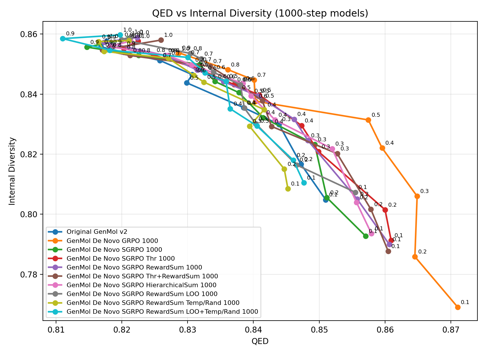

#### `diversity` vs `qed` for 2000-step models

Plot:

```text
genmol-denovo/qed_vs_diversity_randomness_2000_20260425.png
```

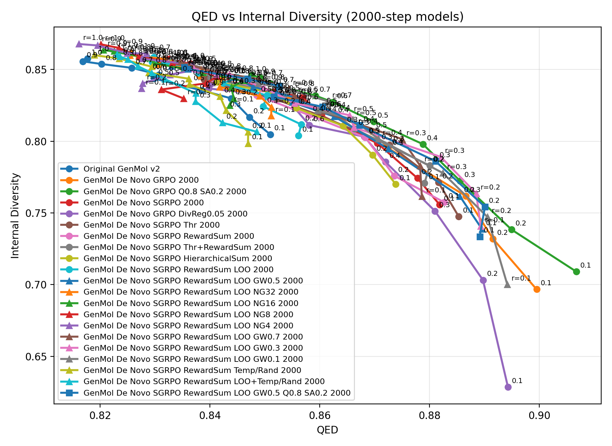

#### `diversity` vs `sa_score` for 1000-step models

Plot:

```text
genmol-denovo/sa_score_vs_diversity_randomness_1000_20260425.png
```

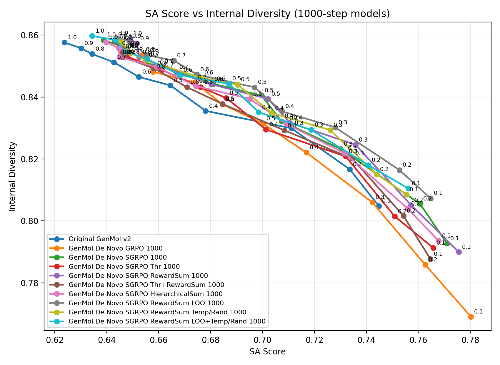

#### `diversity` vs `sa_score` for 2000-step models

Plot:

```text
genmol-denovo/sa_score_vs_diversity_randomness_2000_20260425.png
```

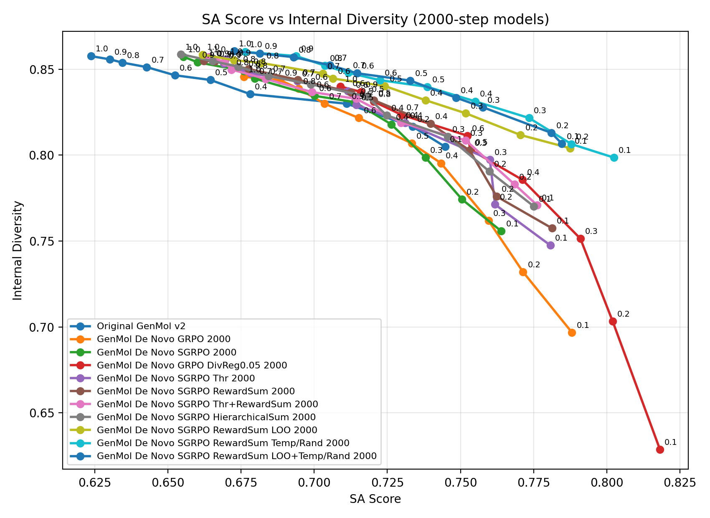

#### `diversity` vs `soft_reward` for 1000-step models

Plot:

```text
genmol-denovo/soft_reward_vs_diversity_randomness_1000_20260425.png
```

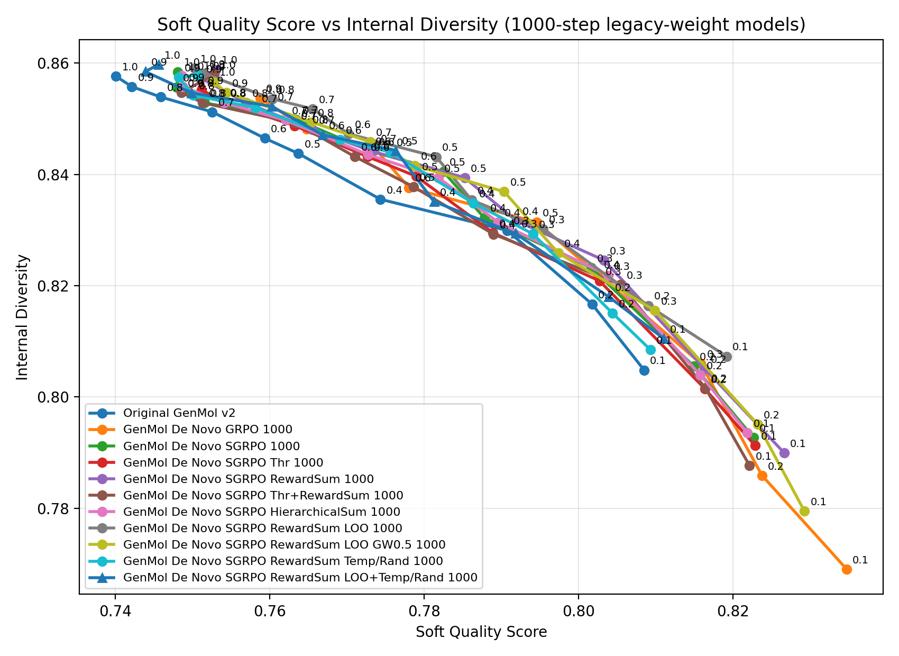

#### `diversity` vs `soft_reward` for `qed=0.8/sa_score=0.2` 1000-step variants + Original

Plot:

```text
genmol-denovo/soft_reward_new_variants_vs_diversity_randomness_new_1000_20260427.png
```

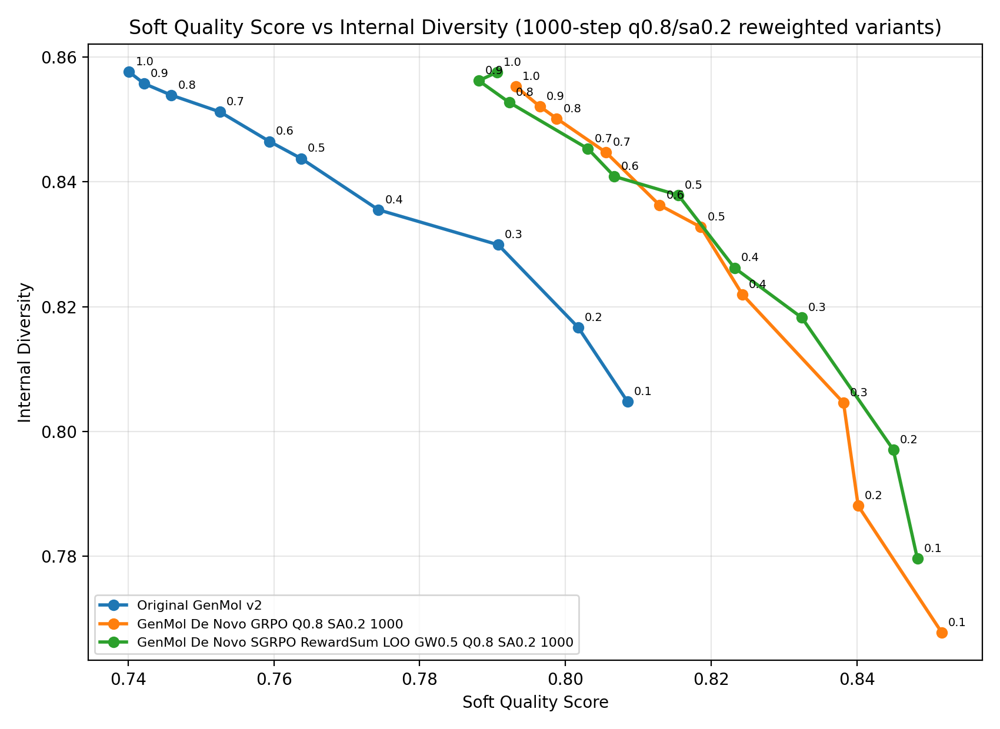

#### `diversity` vs `soft_reward` for 2000-step models

Plot:

```text
genmol-denovo/soft_reward_vs_diversity_randomness_2000_20260425.png
```

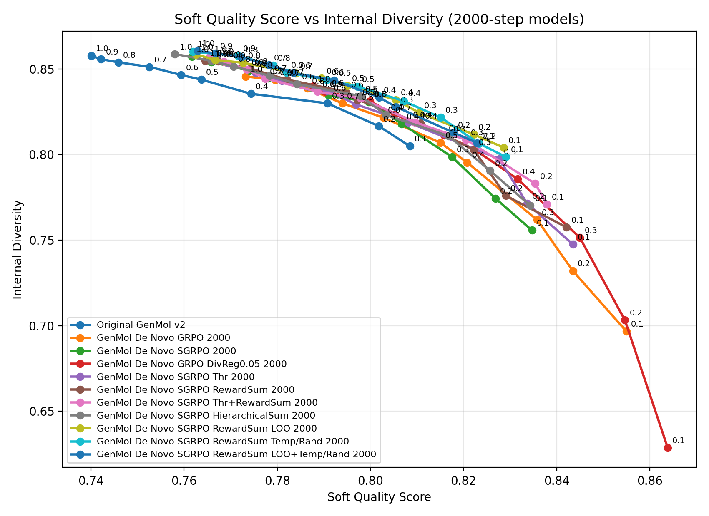

#### `diversity` vs `soft_reward` for `qed=0.8/sa_score=0.2` 2000-step variants + Original

Plot:

```text
genmol-denovo/soft_reward_new_variants_vs_diversity_randomness_new_2000_20260427.png
```

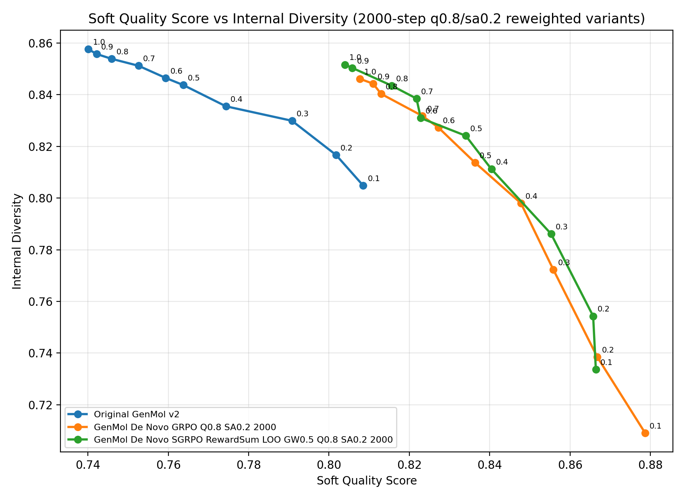

#### Temperature Sweep

Sweep config:

```text
configs/eval_denovo_main_results_temperature_sweep_20260425.yaml
```

Generated artifacts:

```text
genmol-denovo/denovo_main_results_temperature_sweep_20260425.md
genmol-denovo/denovo_main_results_temperature_sweep_20260425.json
```

Notes:

- Latest incremental eval job for the newest 2000-step variants: `48779`.
- Latest merged-summary and plot refresh for the current 1000+2000-step update was regenerated locally on `2026-04-27`.
- Previous eval job `44458` used the retired grid `temperature = 0.1, 0.2, ..., 1.0`.
- Sweep grid: `temperature = 0.5, 1.0, 2.0, 3.0`
- Fixed `randomness = 0.3`
- Sample budget: `1000` molecules per model per temperature
- Included models: Original, GRPO 1000, SGRPO 1000, GRPO 2000, SGRPO 2000, GRPO DivReg0.05 2000, SGRPO Thresholded 1000, SGRPO RewardSum 1000, SGRPO Thresholded+RewardSum 1000, SGRPO HierarchicalSum 1000, SGRPO RewardSum LOO 1000, SGRPO RewardSum Temp/Rand 1000, SGRPO RewardSum LOO+Temp/Rand 1000, GRPO `qed=0.8/sa_score=0.2` 1000, SGRPO `gw=0.5` RewardSum LOO 1000, SGRPO `gw=0.5` RewardSum LOO + `qed=0.8/sa_score=0.2` 1000, SGRPO Thresholded 2000, SGRPO RewardSum 2000, SGRPO Thresholded+RewardSum 2000, SGRPO HierarchicalSum 2000, SGRPO RewardSum LOO 2000, SGRPO `gw=0.5` RewardSum LOO 2000, SGRPO RewardSum Temp/Rand 2000, SGRPO RewardSum LOO+Temp/Rand 2000, GRPO `qed=0.8/sa_score=0.2` 2000, SGRPO `gw=0.5` RewardSum LOO + `qed=0.8/sa_score=0.2` 2000
- `soft_reward_mean` is the rollout-level quality reward before invalid and alert gating: `0.6 * qed_mean + 0.4 * sa_score_mean`.
- Plots are split into 1000-step and 2000-step model groups to avoid color reuse. Original GenMol v2 is included in both groups.
- This update reused the legacy `20260425` summary for the old models, retained the previously added 3 new 2000-step models, incrementally added the 3 new 1000-step models, and then incrementally added the latest 3 new 2000-step models.
- Legacy remote raw rows remain at `/public/home/xinwuye/ai4s-tool-joint-train/genmol/sgrpo-main-results/genmol-denovo/denovo_main_results_temperature_sweep_20260425.rows.jsonl`.
- The previous 3 new 2000-step models, the 3 new 1000-step models, and the latest 3 new 2000-step models in this merged update were all added from incremental summary JSON, not from a newly materialized combined rows file.
- QED and SA-score plots below include both the 3 new 1000-step models and the latest 3 new 2000-step models in their respective step-group panels.
- The canonical `0.6/0.4` soft-reward panels also include `SGRPO gw=0.5 RewardSum LOO 1000` and `SGRPO gw=0.5 RewardSum LOO 2000`, because their rollout-level quality weighting is unchanged.
- The separate soft-reward panels below are only for the `qed=0.8/sa_score=0.2` reweighted variants, with `Original` included as the reference point.

#### `diversity` vs `qed` for temperature sweep, 1000-step models

Plot:

```text
genmol-denovo/qed_vs_diversity_temperature_1000_20260425.png
```

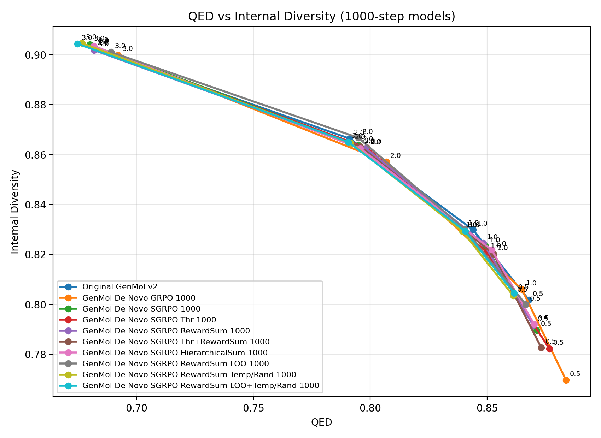

#### `diversity` vs `qed` for temperature sweep, 2000-step models

Plot:

```text
genmol-denovo/qed_vs_diversity_temperature_2000_20260425.png
```

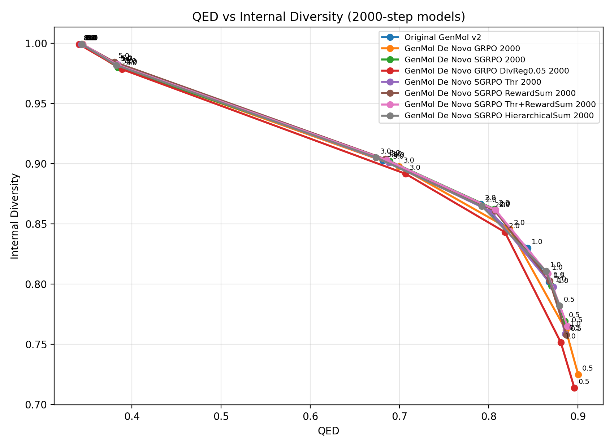

#### `diversity` vs `sa_score` for temperature sweep, 1000-step models

Plot:

```text
genmol-denovo/sa_score_vs_diversity_temperature_1000_20260425.png
```

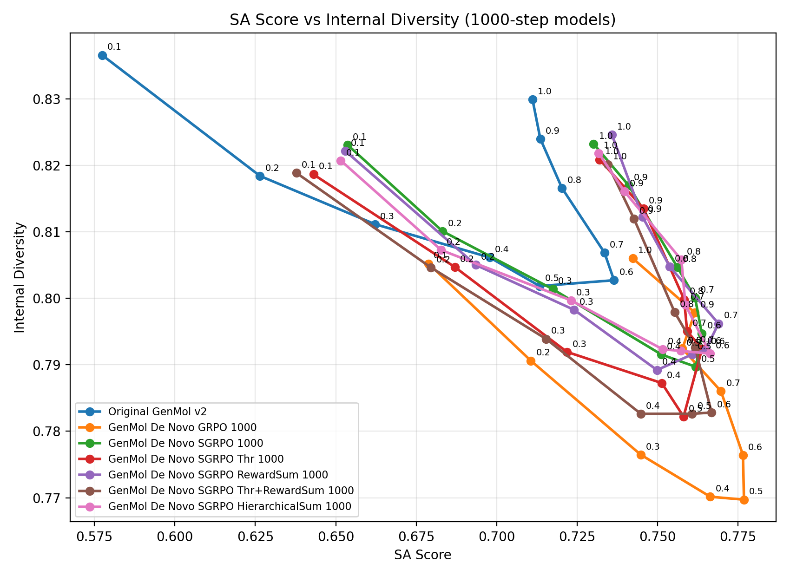

#### `diversity` vs `sa_score` for temperature sweep, 2000-step models

Plot:

```text
genmol-denovo/sa_score_vs_diversity_temperature_2000_20260425.png
```

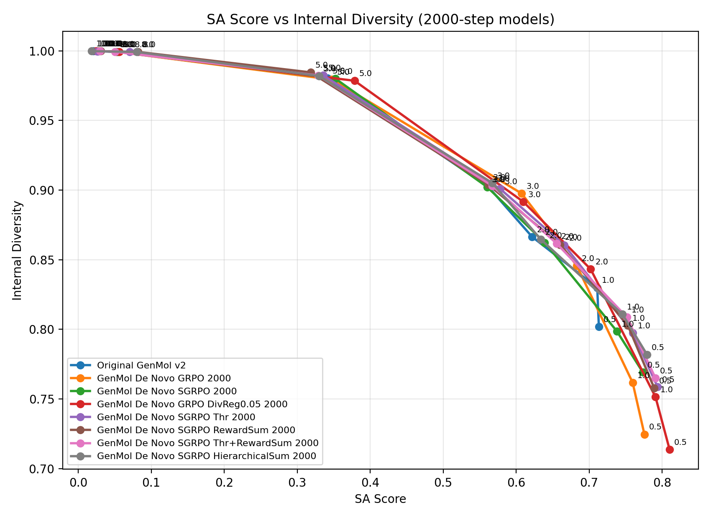

#### `diversity` vs `soft_reward` for temperature sweep, 1000-step models

Plot:

```text
genmol-denovo/soft_reward_vs_diversity_temperature_1000_20260425.png
```

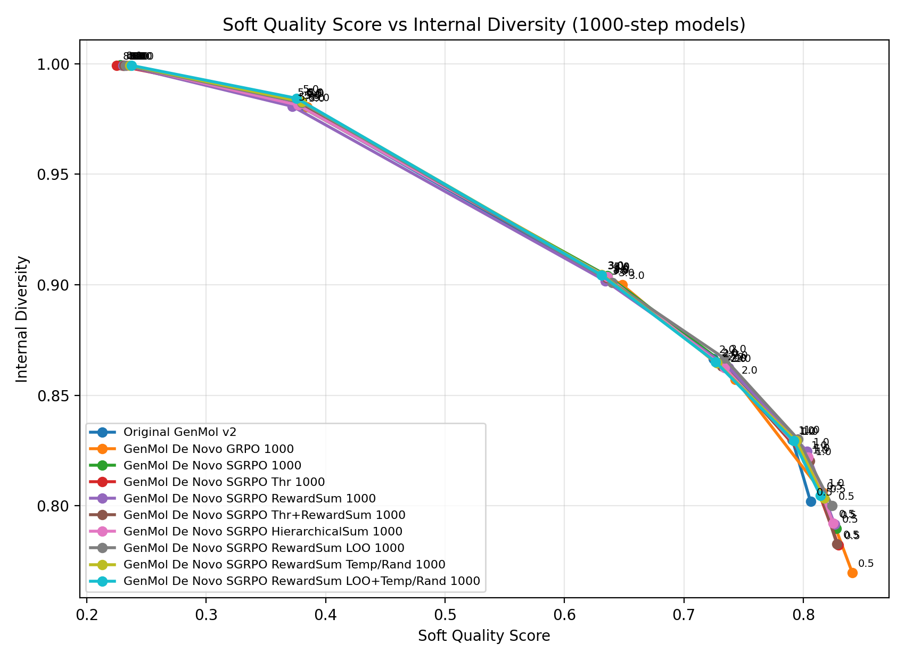

#### `diversity` vs `soft_reward` for temperature sweep, `qed=0.8/sa_score=0.2` 1000-step variants + Original

Plot:

```text
genmol-denovo/soft_reward_new_variants_vs_diversity_temperature_new_1000_20260427.png
```

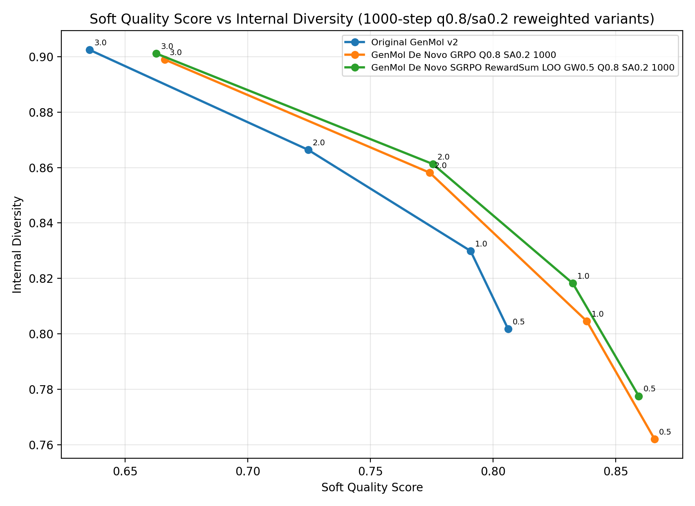

#### `diversity` vs `soft_reward` for temperature sweep, 2000-step models

Plot:

```text
genmol-denovo/soft_reward_vs_diversity_temperature_2000_20260425.png
```

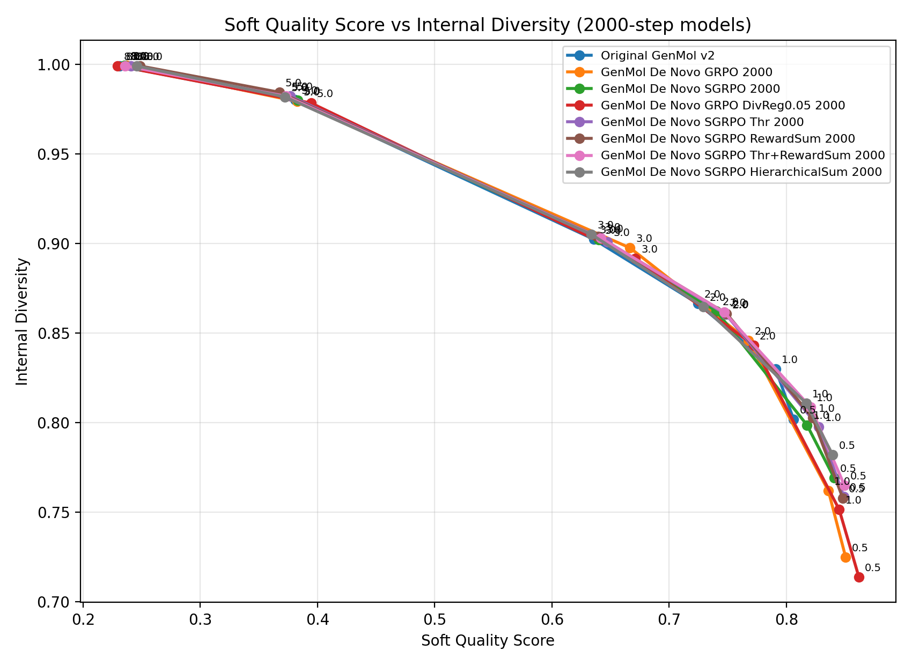

#### `diversity` vs `soft_reward` for temperature sweep, `qed=0.8/sa_score=0.2` 2000-step variants + Original

Plot:

```text
genmol-denovo/soft_reward_new_variants_vs_diversity_temperature_new_2000_20260427.png
```

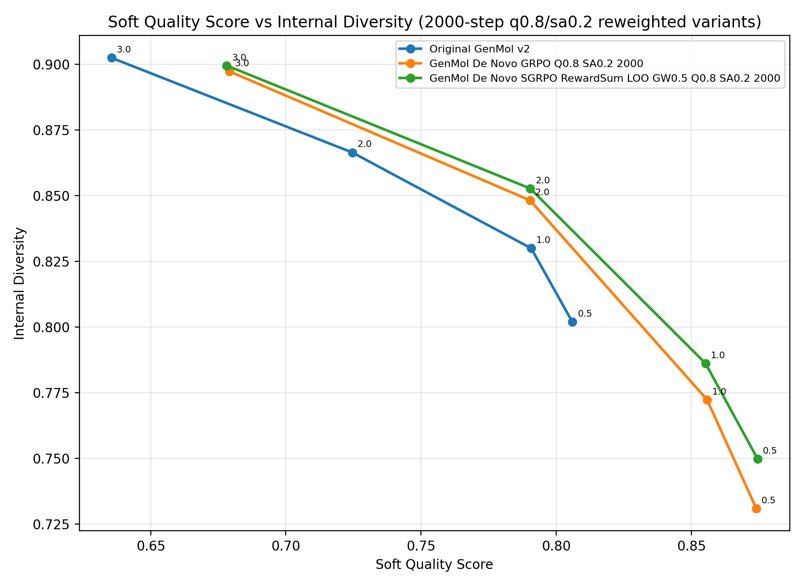

#### Paired Randomness-Temperature Sweep

Sweep config:

```text
configs/eval_denovo_main_results_paired_sweep_20260427.yaml
```

Generated artifacts:

```text
genmol-denovo/denovo_main_results_paired_sweep_20260427.md
genmol-denovo/denovo_main_results_paired_sweep_20260427.json
genmol-denovo/denovo_main_results_paired_sweep_20260427.rows.jsonl
```

Notes:

- Latest paired eval + split-plot job: `49030`.
- Job `49030` completed successfully on `2026-04-27`.
- Sweep pairs: `(0.1, 0.5)`, `(0.3, 0.8)`, `(0.5, 1.1)`, `(0.7, 1.4)`, `(0.9, 1.7)`, `(1.0, 2.0)`.
- Sample budget: `1000` molecules per model per pair.
- Included models: Original, GRPO 1000, SGRPO 1000, GRPO 2000, SGRPO 2000, GRPO DivReg0.05 2000, SGRPO Thresholded 1000, SGRPO RewardSum 1000, SGRPO Thresholded+RewardSum 1000, SGRPO HierarchicalSum 1000, SGRPO RewardSum LOO 1000, SGRPO RewardSum Temp/Rand 1000, SGRPO RewardSum LOO+Temp/Rand 1000, GRPO `qed=0.8/sa_score=0.2` 1000, SGRPO `gw=0.5` RewardSum LOO 1000, SGRPO `gw=0.5` RewardSum LOO + `qed=0.8/sa_score=0.2` 1000, SGRPO Thresholded 2000, SGRPO RewardSum 2000, SGRPO Thresholded+RewardSum 2000, SGRPO HierarchicalSum 2000, SGRPO RewardSum LOO 2000, SGRPO `gw=0.5` RewardSum LOO 2000, SGRPO RewardSum Temp/Rand 2000, SGRPO RewardSum LOO+Temp/Rand 2000, GRPO `qed=0.8/sa_score=0.2` 2000, SGRPO `gw=0.5` RewardSum LOO + `qed=0.8/sa_score=0.2` 2000.
- `soft_reward_mean` is the rollout-level quality reward before invalid and alert gating: `0.6 * qed_mean + 0.4 * sa_score_mean`.
- Plots are split into 1000-step and 2000-step model groups to avoid color reuse. Original GenMol v2 is included in both groups.
- In the paired summary markdown, `Sweep Value` is the 1-based pair index; the actual pair is recorded by the `Generation Temperature` and `Randomness` columns and by the plot annotations.
- The separate soft-reward panels below are only for the `qed=0.8/sa_score=0.2` reweighted variants, with `Original` included as the reference point.

#### `diversity` vs `qed` for paired sweep, 1000-step models

Plot:

```text
genmol-denovo/qed_vs_diversity_paired_1000_20260427.png
```

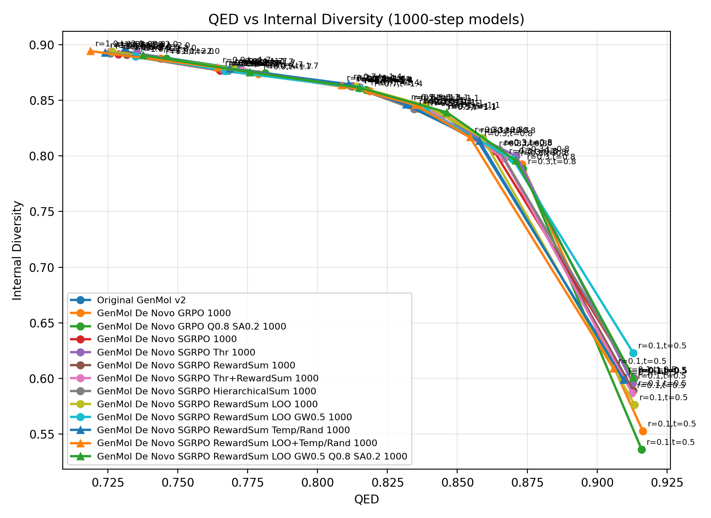

#### `diversity` vs `qed` for paired sweep, 2000-step models

Plot:

```text
genmol-denovo/qed_vs_diversity_paired_2000_20260427.png
```

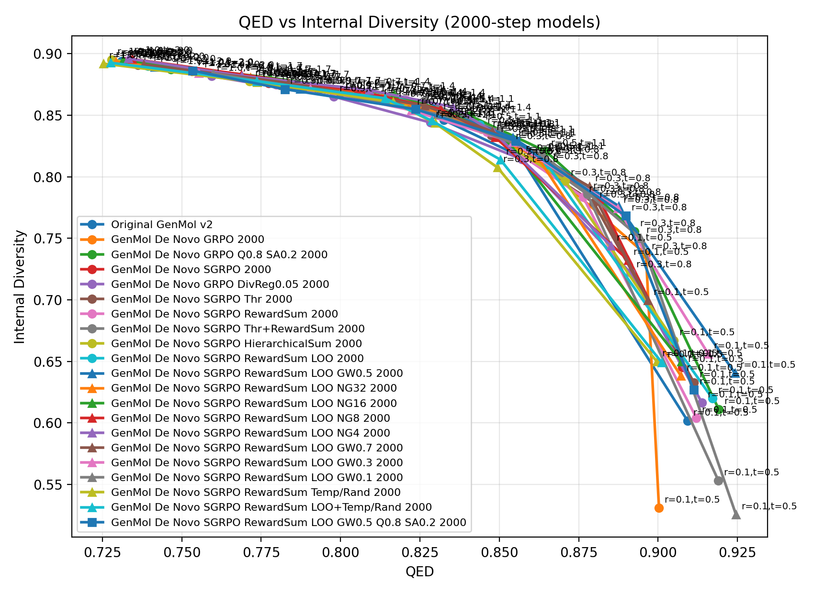

#### `diversity` vs `sa_score` for paired sweep, 1000-step models

Plot:

```text
genmol-denovo/sa_score_vs_diversity_paired_1000_20260427.png
```

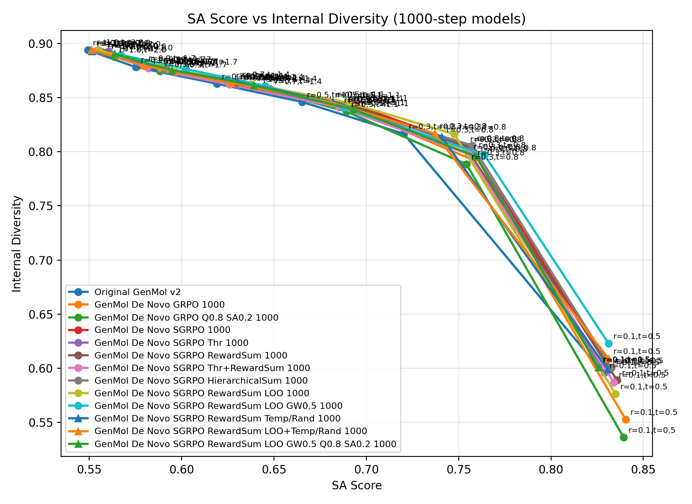

#### `diversity` vs `sa_score` for paired sweep, 2000-step models

Plot:

```text
genmol-denovo/sa_score_vs_diversity_paired_2000_20260427.png
```

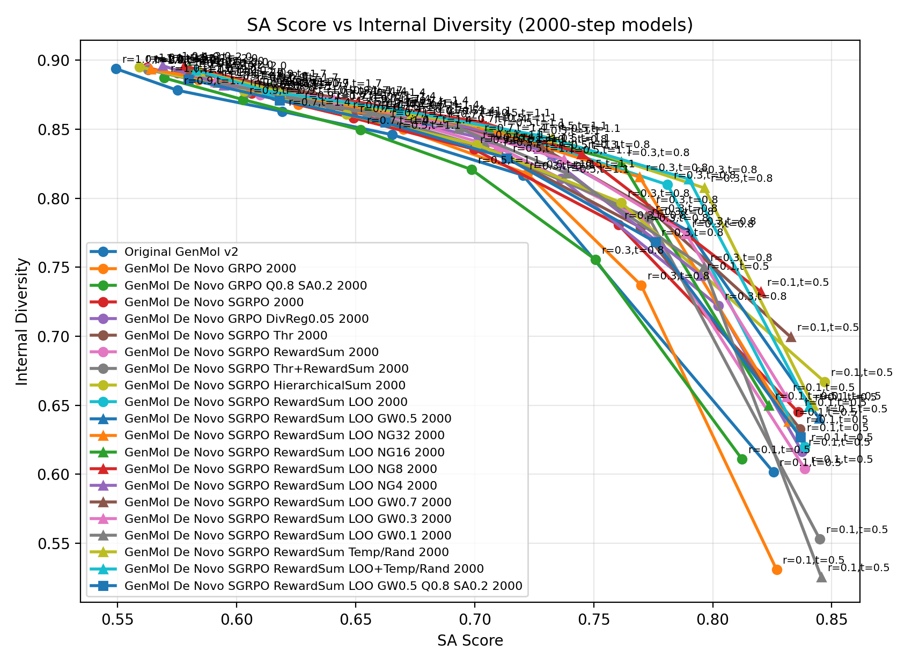

#### `diversity` vs `soft_reward` for paired sweep, 1000-step models

Plot:

```text
genmol-denovo/soft_reward_vs_diversity_paired_1000_20260427.png
```

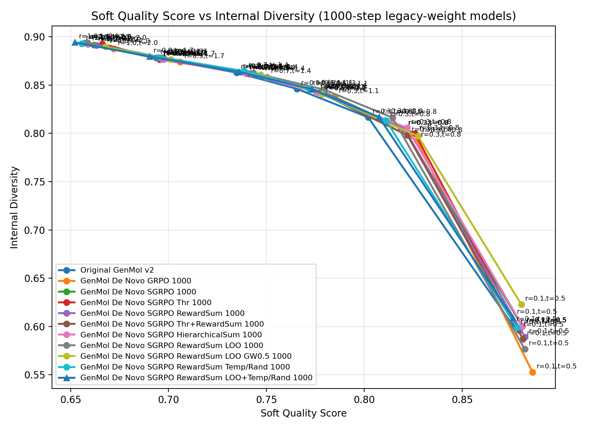

#### `diversity` vs `soft_reward` for paired sweep, `qed=0.8/sa_score=0.2` 1000-step variants + Original

Plot:

```text
genmol-denovo/soft_reward_new_variants_vs_diversity_paired_new_1000_20260427.png
```

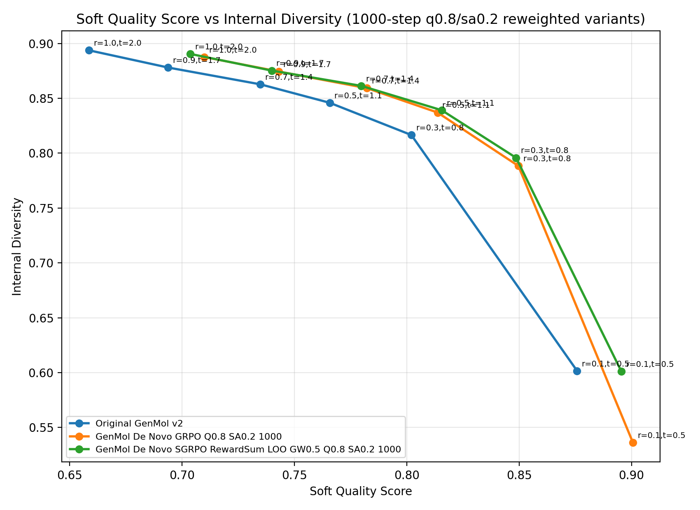

#### `diversity` vs `soft_reward` for paired sweep, 2000-step models

Plot:

```text
genmol-denovo/soft_reward_vs_diversity_paired_2000_20260427.png
```

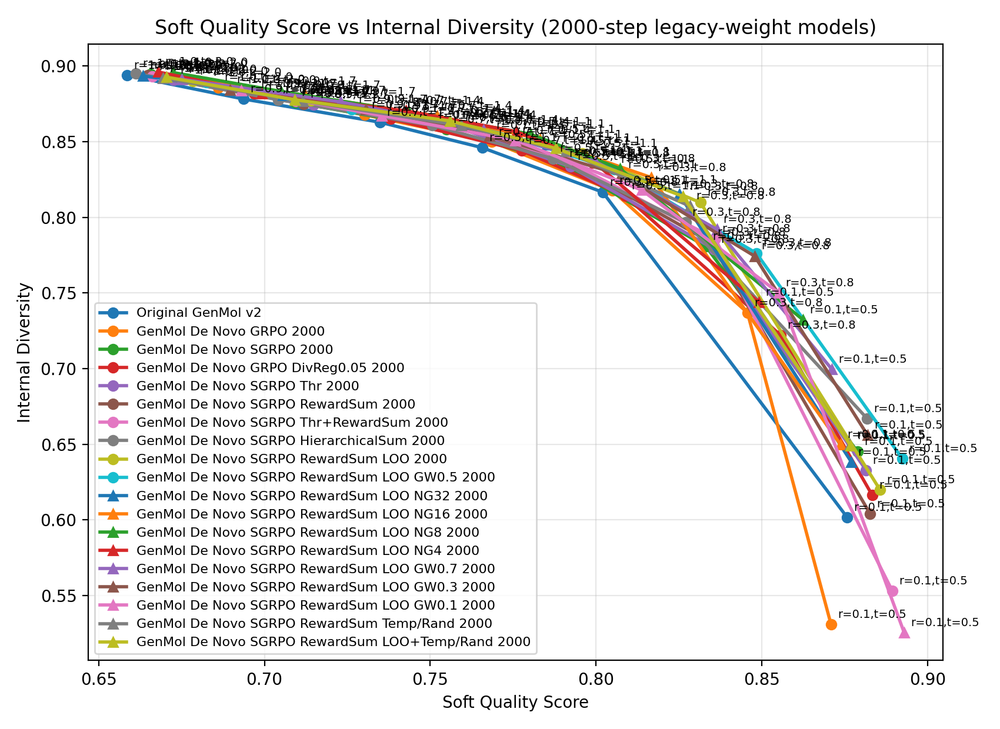

#### `diversity` vs `soft_reward` for paired sweep, `qed=0.8/sa_score=0.2` 2000-step variants + Original

Plot:

```text
genmol-denovo/soft_reward_new_variants_vs_diversity_paired_new_2000_20260427.png
```

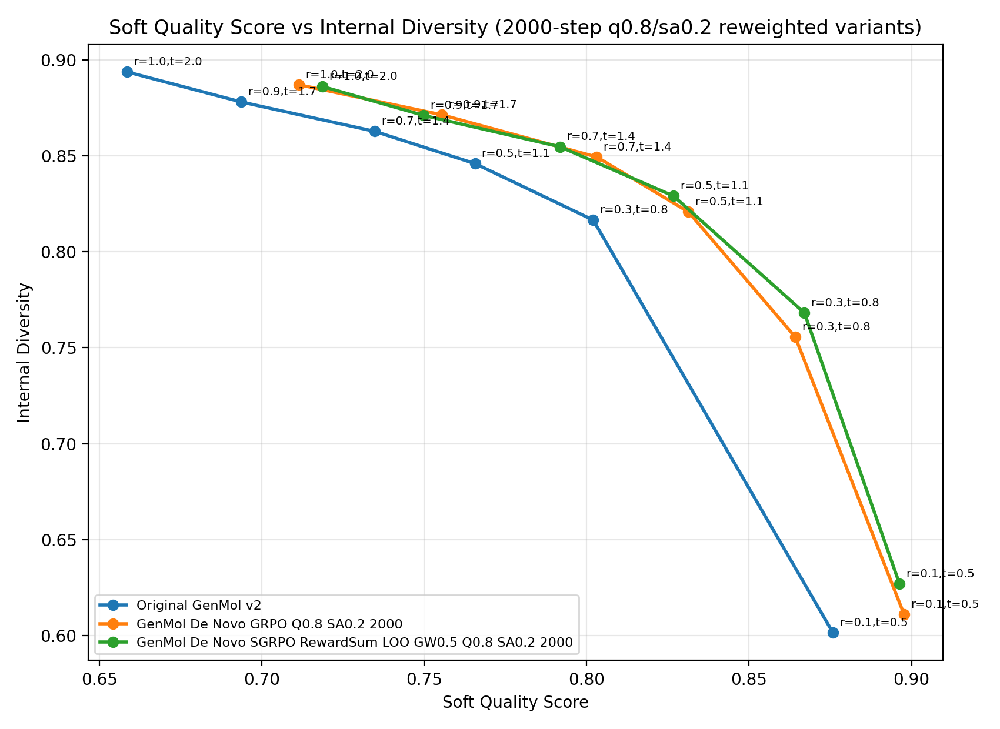

## mmGenMol

### Original

Status: `Verified`

Checkpoint:

```text
/public/home/xinwuye/ai4s-tool-joint-train/runs/pocket_prefix_supervised_8gpu/20260416_151741/checkpoints/5500.ckpt
```

Training config:

```text
configs/base_pocket_prefix_8gpu.yaml
```

Launch Script:

```text
scripts/slurm/train_pocket_prefix_8gpu.sbatch
```

Expected GPU Topology:

```text
8 GPU
```

Invocation:

```text
CONFIG_NAME=base_pocket_prefix_8gpu sbatch scripts/slurm/train_pocket_prefix_8gpu.sbatch
```

Notes:

- This is the current original-model checkpoint selected for the comparison.
- Existing evaluation config already points to this checkpoint:

```text
configs/eval_pocket_prefix_crossdocked_5500ckpt.yaml
```

### GRPO

Status: `Verified`

Checkpoint:

```text
/public/home/xinwuye/ai4s-tool-joint-train/runs/cpgrpo_denovo_pocket_prefix/cpgrpo_denovo_pocket_prefix_ng192_bs384_lr5e-5_beta5e-3_ni1_20260422_110904/checkpoint-001000
```

Training config:

```text
configs/cpgrpo_denovo_pocket_prefix_ng192_bs384_lr5e-5_beta5e-3_ni1.yaml
```

Launch Script:

```text
scripts/slurm/cpgrpo_denovo_pocket_prefix_8gpu_ng192_bs384_ni1.sbatch
```

Expected GPU Topology:

```text
8 GPU
```

Invocation:

```text
CONFIG_PATH=configs/cpgrpo_denovo_pocket_prefix_ng192_bs384_lr5e-5_beta5e-3_ni1.yaml sbatch scripts/slurm/cpgrpo_denovo_pocket_prefix_8gpu_ng192_bs384_ni1.sbatch
```

Notes:

- Stable 1-GPU probe:

```text
/public/home/xinwuye/ai4s-tool-joint-train/runs/cpgrpo_denovo_pocket_prefix/cpgrpo_denovo_pocket_prefix_probe_1gpu_ng256_bs512_lr5e-5_beta5e-3_ni1_20260421_220006
```

- Probe evidence:

```text
job 40942, 1 GPU, COMPLETED, 10 steps, no OOM
```

- Current 8-GPU launch line is reduced below the 1-GPU validated line after the `ng256 / bs512` run hit first-backward OOM on 8 GPUs.
- Completed training job: `41439`
- Completion evidence: `train_results.json` reports `step = 1000`, and `checkpoint-001000/model.ckpt` is present.
- Slurm exit code was not rechecked in this update because `sacct` was unavailable on the reachable admin node and the login nodes timed out during the check.

### GRPO Diversity-Regularizer

Status: `Verified`

Checkpoint:

```text
/public/home/xinwuye/ai4s-tool-joint-train/runs/cpgrpo_denovo_pocket_prefix/cpgrpo_denovo_pocket_prefix_ng192_bs384_lr5e-5_beta5e-3_ni1_divreg005_20260423_013009/checkpoint-001000
```

Training config:

```text
configs/cpgrpo_denovo_pocket_prefix_ng192_bs384_lr5e-5_beta5e-3_ni1_divreg005.yaml
```

Launch Script:

```text
scripts/slurm/cpgrpo_denovo_pocket_prefix_8gpu_ng192_bs384_ni1.sbatch
```

Expected GPU Topology:

```text
8 GPU
```

Invocation:

```text
CONFIG_PATH=configs/cpgrpo_denovo_pocket_prefix_ng192_bs384_lr5e-5_beta5e-3_ni1_divreg005.yaml sbatch scripts/slurm/cpgrpo_denovo_pocket_prefix_8gpu_ng192_bs384_ni1.sbatch
```

Notes:

- This line mirrors the current mmGenMol GRPO 8-GPU setup and only adds:

```text
diversity_regularizer_weight = 0.05
```

- All other rollout, optimizer, and launch settings are intentionally unchanged relative to the current `ng192 / bs384` GRPO line.
- Completed training job: `42630`
- Completion evidence: `train_results.json` reports `step = 1000`, and `checkpoint-001000/model.ckpt` is present.
- Slurm exit code was not rechecked in this update because `sacct` was unavailable on the reachable admin node and the login nodes timed out during the check.

### SGRPO

Status: `Verified`

Checkpoint:

```text
/public/home/xinwuye/ai4s-tool-joint-train/runs/cpgrpo_denovo_pocket_prefix/cpgrpo_denovo_pocket_prefix_sgrpo_ng24_sg8_bs384_lr5e-5_beta5e-3_gw09_20260422_110738/checkpoint-001000
```

Training config:

```text
configs/cpgrpo_denovo_pocket_prefix_sgrpo_ng24_sg8_bs384_lr5e-5_beta5e-3_gw09.yaml
```

Launch Script:

```text
scripts/slurm/cpgrpo_denovo_pocket_prefix_8gpu_sgrpo_ng24_sg8_bs384_gw09.sbatch
```

Expected GPU Topology:

```text
8 GPU
```

Invocation:

```text
CONFIG_PATH=configs/cpgrpo_denovo_pocket_prefix_sgrpo_ng24_sg8_bs384_lr5e-5_beta5e-3_gw09.yaml sbatch scripts/slurm/cpgrpo_denovo_pocket_prefix_8gpu_sgrpo_ng24_sg8_bs384_gw09.sbatch
```

Notes:

- Config family is defined to mirror de novo SGRPO with `num_generations=24`, `supergroup_num_groups=8`, `group_advantage_weight=0.9`, and `per_device_train_batch_size=384`.
- `generation_batch_size` is fixed to `384` to match the current reduced 8-GPU memory line.
- Completed training job: `41440`
- Completion evidence: `train_results.json` reports `step = 1000`, and `checkpoint-001000/model.ckpt` is present.
- Slurm exit code was not rechecked in this update because `sacct` was unavailable on the reachable admin node and the login nodes timed out during the check.

### GRPO + DrugCLIP

Status: `Verified`

Checkpoint:

```text
/public/home/xinwuye/ai4s-tool-joint-train/runs/cpgrpo_denovo_pocket_prefix/cpgrpo_denovo_pocket_prefix_ng192_bs384_lr5e-5_beta5e-3_ni1_q03_sa02_drugclip05_20260428_003423/checkpoint-001000
```

Training config:

```text
configs/cpgrpo_denovo_pocket_prefix_ng192_bs384_lr5e-5_beta5e-3_ni1_q03_sa02_drugclip05.yaml
```

Launch Script:

```text
scripts/slurm/cpgrpo_denovo_pocket_prefix_8gpu_ng192_bs384_drugclip_train.sbatch
```

Expected GPU Topology:

```text
8 GPU
```

Invocation:

```text
CONFIG_PATH=configs/cpgrpo_denovo_pocket_prefix_ng192_bs384_lr5e-5_beta5e-3_ni1_q03_sa02_drugclip05.yaml sbatch scripts/slurm/cpgrpo_denovo_pocket_prefix_8gpu_ng192_bs384_drugclip_train.sbatch
```

Notes:

- This line is the current mmGenMol GRPO `ng192 / bs384` training recipe with rollout-level reward weights changed to:

```text
qed = 0.3
sa_score = 0.2
drugclip_score = 0.5
```

- DrugCLIP runtime assets and reward path were validated in 1-GPU smoke before the 8-GPU launch.
- Completed 8-GPU training job: `49378`
- Completion evidence: the sweep manifests resolve to `checkpoint-001000/model.ckpt`, and `sacct` reports `49378 COMPLETED (0:0)`.

### GRPO + DrugCLIP 2000-Step Variant

Status: `Partial`

Checkpoint:

```text
TODO
```

Training config:

```text
configs/cpgrpo_denovo_pocket_prefix_ng192_bs384_lr5e-5_beta5e-3_ni1_q03_sa02_drugclip05_ms2000.yaml
```

Launch Script:

```text
scripts/slurm/cpgrpo_denovo_pocket_prefix_8gpu_ng192_bs384_drugclip_train.sbatch
```

Expected GPU Topology:

```text
8 GPU
```

Invocation:

```text
CONFIG_PATH=configs/cpgrpo_denovo_pocket_prefix_ng192_bs384_lr5e-5_beta5e-3_ni1_q03_sa02_drugclip05_ms2000.yaml sbatch scripts/slurm/cpgrpo_denovo_pocket_prefix_8gpu_ng192_bs384_drugclip_train.sbatch
```

Notes:

- This line matches `GRPO + DrugCLIP` above except `max_steps = 2000`.
- Current 8-GPU training job: `49379`

### SGRPO + DrugCLIP

Status: `Partial`

Checkpoint:

```text
TODO
```

Training config:

```text
configs/cpgrpo_denovo_pocket_prefix_sgrpo_ng24_sg8_bs384_lr5e-5_beta5e-3_gw09_q03_sa02_drugclip05.yaml
```

Launch Script:

```text
scripts/slurm/cpgrpo_denovo_pocket_prefix_8gpu_sgrpo_ng24_sg8_bs384_drugclip_train.sbatch
```

Expected GPU Topology:

```text
8 GPU
```

Invocation:

```text
CONFIG_PATH=configs/cpgrpo_denovo_pocket_prefix_sgrpo_ng24_sg8_bs384_lr5e-5_beta5e-3_gw09_q03_sa02_drugclip05.yaml sbatch scripts/slurm/cpgrpo_denovo_pocket_prefix_8gpu_sgrpo_ng24_sg8_bs384_drugclip_train.sbatch
```

Notes:

- This line is the current mmGenMol SGRPO `ng24 / sg8 / bs384 / gw09` training recipe with rollout-level reward weights changed to:

```text
qed = 0.3
sa_score = 0.2
drugclip_score = 0.5
```

- Remaining hyperparameters are intentionally unchanged relative to the locked mmGenMol SGRPO main line.

### SGRPO + DrugCLIP 2000-Step Variant

Status: `Partial`

Checkpoint:

```text
TODO
```

Training config:

```text
configs/cpgrpo_denovo_pocket_prefix_sgrpo_ng24_sg8_bs384_lr5e-5_beta5e-3_gw09_q03_sa02_drugclip05_ms2000.yaml
```

Launch Script:

```text
scripts/slurm/cpgrpo_denovo_pocket_prefix_8gpu_sgrpo_ng24_sg8_bs384_drugclip_train.sbatch
```

Expected GPU Topology:

```text
8 GPU
```

Invocation:

```text
CONFIG_PATH=configs/cpgrpo_denovo_pocket_prefix_sgrpo_ng24_sg8_bs384_lr5e-5_beta5e-3_gw09_q03_sa02_drugclip05_ms2000.yaml sbatch scripts/slurm/cpgrpo_denovo_pocket_prefix_8gpu_sgrpo_ng24_sg8_bs384_drugclip_train.sbatch
```

Notes:

- This line matches `SGRPO + DrugCLIP` above except `max_steps = 2000`.

### GRPO + UniDock 500-Step Variant

Status: `TODO`

Checkpoint:

```text
TODO
```

Training config:

```text
configs/cpgrpo_denovo_pocket_prefix_ng192_bs384_lr5e-5_beta5e-3_ni1_q03_sa02_unidock05_ms500.yaml
```

Launch Script:

```text
scripts/slurm/cpgrpo_denovo_pocket_prefix_8gpu_ng192_bs384_unidock_train.sbatch
```

Expected GPU Topology:

```text
8 GPU
```

Invocation:

```text
CONFIG_PATH=configs/cpgrpo_denovo_pocket_prefix_ng192_bs384_lr5e-5_beta5e-3_ni1_q03_sa02_unidock05_ms500.yaml sbatch scripts/slurm/cpgrpo_denovo_pocket_prefix_8gpu_ng192_bs384_unidock_train.sbatch
```

Notes:

- This line mirrors the current mmGenMol GRPO `ng192 / bs384` setup with rollout-level reward weights:

```text
qed = 0.3
sa_score = 0.2
unidock_score = 0.5
```

- UniDock runtime was validated in 2-GPU 10-step smoke jobs `52547` (`bs128`) and `52548` (`bs384`), both `COMPLETED (0:0)`.
- `unidock_batch_size = 384` is the selected training default because it showed no OOM and reduced mean `reward_unidock_score_sec` from `22.10s` to `20.44s` in the smoke comparison.
- Ligand 3D prepare is now parallelized per rank across available CPUs, and the UniDock center definition is aligned to the `vina_dock` sweep geometry by using the native-ligand center of mass.

### GRPO + UniDock

Status: `TODO`

Checkpoint:

```text
TODO
```

Training config:

```text
configs/cpgrpo_denovo_pocket_prefix_ng192_bs384_lr5e-5_beta5e-3_ni1_q03_sa02_unidock05.yaml
```

Launch Script:

```text
scripts/slurm/cpgrpo_denovo_pocket_prefix_8gpu_ng192_bs384_unidock_train.sbatch
```

Expected GPU Topology:

```text
8 GPU
```

Invocation:

```text
CONFIG_PATH=configs/cpgrpo_denovo_pocket_prefix_ng192_bs384_lr5e-5_beta5e-3_ni1_q03_sa02_unidock05.yaml sbatch scripts/slurm/cpgrpo_denovo_pocket_prefix_8gpu_ng192_bs384_unidock_train.sbatch
```

Notes:

- This line matches `GRPO + UniDock 500-Step Variant` above except `max_steps = 1000`.

### GRPO + UniDock 2000-Step Variant

Status: `TODO`

Checkpoint:

```text
TODO
```

Training config:

```text
configs/cpgrpo_denovo_pocket_prefix_ng192_bs384_lr5e-5_beta5e-3_ni1_q03_sa02_unidock05_ms2000.yaml
```

Launch Script:

```text
scripts/slurm/cpgrpo_denovo_pocket_prefix_8gpu_ng192_bs384_unidock_train.sbatch
```

Expected GPU Topology:

```text
8 GPU
```

Invocation:

```text
CONFIG_PATH=configs/cpgrpo_denovo_pocket_prefix_ng192_bs384_lr5e-5_beta5e-3_ni1_q03_sa02_unidock05_ms2000.yaml sbatch scripts/slurm/cpgrpo_denovo_pocket_prefix_8gpu_ng192_bs384_unidock_train.sbatch
```

Notes:

- This line matches `GRPO + UniDock` above except `max_steps = 2000`.

### SGRPO + UniDock 500-Step Variant

Status: `TODO`

Checkpoint:

```text
TODO
```

Training config:

```text
configs/cpgrpo_denovo_pocket_prefix_sgrpo_ng24_sg8_bs384_lr5e-5_beta5e-3_gw09_q03_sa02_unidock05_ms500.yaml
```

Launch Script:

```text
scripts/slurm/cpgrpo_denovo_pocket_prefix_8gpu_sgrpo_ng24_sg8_bs384_unidock_train.sbatch
```

Expected GPU Topology:

```text
8 GPU
```

Invocation:

```text
CONFIG_PATH=configs/cpgrpo_denovo_pocket_prefix_sgrpo_ng24_sg8_bs384_lr5e-5_beta5e-3_gw09_q03_sa02_unidock05_ms500.yaml sbatch scripts/slurm/cpgrpo_denovo_pocket_prefix_8gpu_sgrpo_ng24_sg8_bs384_unidock_train.sbatch
```

Notes:

- This line mirrors the current mmGenMol SGRPO `ng24 / sg8 / bs384 / gw09` setup with rollout-level reward weights:

```text
qed = 0.3
sa_score = 0.2
unidock_score = 0.5
```

- `unidock_batch_size = 384` is locked for this family from the same 2-GPU smoke validation used above.

### SGRPO + UniDock

Status: `TODO`

Checkpoint:

```text
TODO
```

Training config:

```text
configs/cpgrpo_denovo_pocket_prefix_sgrpo_ng24_sg8_bs384_lr5e-5_beta5e-3_gw09_q03_sa02_unidock05.yaml
```

Launch Script:

```text
scripts/slurm/cpgrpo_denovo_pocket_prefix_8gpu_sgrpo_ng24_sg8_bs384_unidock_train.sbatch
```

Expected GPU Topology:

```text
8 GPU
```

Invocation:

```text
CONFIG_PATH=configs/cpgrpo_denovo_pocket_prefix_sgrpo_ng24_sg8_bs384_lr5e-5_beta5e-3_gw09_q03_sa02_unidock05.yaml sbatch scripts/slurm/cpgrpo_denovo_pocket_prefix_8gpu_sgrpo_ng24_sg8_bs384_unidock_train.sbatch
```

Notes:

- This line matches `SGRPO + UniDock 500-Step Variant` above except `max_steps = 1000`.

### SGRPO + UniDock 2000-Step Variant

Status: `TODO`

Checkpoint:

```text
TODO
```

Training config:

```text
configs/cpgrpo_denovo_pocket_prefix_sgrpo_ng24_sg8_bs384_lr5e-5_beta5e-3_gw09_q03_sa02_unidock05_ms2000.yaml
```

Launch Script:

```text
scripts/slurm/cpgrpo_denovo_pocket_prefix_8gpu_sgrpo_ng24_sg8_bs384_unidock_train.sbatch
```

Expected GPU Topology:

```text
8 GPU
```

Invocation:

```text
CONFIG_PATH=configs/cpgrpo_denovo_pocket_prefix_sgrpo_ng24_sg8_bs384_lr5e-5_beta5e-3_gw09_q03_sa02_unidock05_ms2000.yaml sbatch scripts/slurm/cpgrpo_denovo_pocket_prefix_8gpu_sgrpo_ng24_sg8_bs384_unidock_train.sbatch
```

Notes:

- This line matches `SGRPO + UniDock` above except `max_steps = 2000`.

### Pareto Curves To Maintain

Generation task manifest for the current randomness sweep:

```text
sgrpo-main-results/mmgenmol/generation_sweep_tasks_20260423.tsv
```

Generation task manifest for the updated temperature sweep:

```text
sgrpo-main-results/mmgenmol/generation_temperature_sweep_tasks_20260425.tsv
```

Generation launch script:

```text
scripts/slurm/generate_mmgenmol_sweep_array_1gpu.sbatch
```

Generation invocation for the randomness sweep:

```text
sbatch scripts/slurm/generate_mmgenmol_sweep_array_1gpu.sbatch
```

Generation invocation for the updated temperature sweep:

```text
TASKS_PATH=/public/home/xinwuye/ai4s-tool-joint-train/genmol/sgrpo-main-results/mmgenmol/generation_temperature_sweep_tasks_20260425.tsv MEMLOG_DIR=/public/home/xinwuye/ai4s-tool-joint-train/runs/pocket_prefix_eval/mmgenmol_temperature_sweep_generation_20260425/logs sbatch --array=0-15 scripts/slurm/generate_mmgenmol_sweep_array_1gpu.sbatch
```

Generation output root for the randomness sweep:

```text
/public/home/xinwuye/ai4s-tool-joint-train/runs/pocket_prefix_eval/mmgenmol_sweep_generation_20260423
```

Generation output root for the updated temperature sweep:

```text
/public/home/xinwuye/ai4s-tool-joint-train/runs/pocket_prefix_eval/mmgenmol_temperature_sweep_generation_20260425
```

Vina docking launch script:

```text
scripts/slurm/dock_mmgenmol_sweep_vina_array_64cpu.sbatch
```

Vina docking invocation for the randomness sweep:

```text
sbatch scripts/slurm/dock_mmgenmol_sweep_vina_array_64cpu.sbatch
```

Vina docking invocation for the updated temperature sweep:

```text
TASKS_PATH=/public/home/xinwuye/ai4s-tool-joint-train/genmol/sgrpo-main-results/mmgenmol/generation_temperature_sweep_tasks_20260425.tsv OUTPUT_ROOT=/public/home/xinwuye/ai4s-tool-joint-train/runs/pocket_prefix_eval/mmgenmol_temperature_sweep_vina_dock_20260425 sbatch --array=0-15 scripts/slurm/dock_mmgenmol_sweep_vina_array_64cpu.sbatch
```

Vina docking output root for the randomness sweep:

```text
/public/home/xinwuye/ai4s-tool-joint-train/runs/pocket_prefix_eval/mmgenmol_sweep_vina_dock_20260423
```

Vina docking output root for the updated temperature sweep:

```text
/public/home/xinwuye/ai4s-tool-joint-train/runs/pocket_prefix_eval/mmgenmol_temperature_sweep_vina_dock_20260425
```

Aggregation invocation for the updated temperature sweep:

```text
python scripts/aggregate_mmgenmol_sweep_results.py --tasks_path sgrpo-main-results/mmgenmol/generation_temperature_sweep_tasks_20260425.tsv --docking_root /public/home/xinwuye/ai4s-tool-joint-train/runs/pocket_prefix_eval/mmgenmol_temperature_sweep_vina_dock_20260425 --output_dir sgrpo-main-results/mmgenmol --output_prefix mmgenmol_temperature_sweep_results_20260425 --expected_num_tasks 16
```

Aggregated result files for the current randomness sweep:

```text
sgrpo-main-results/mmgenmol/mmgenmol_sweep_results_20260423.json
sgrpo-main-results/mmgenmol/mmgenmol_sweep_results_20260423.rows.jsonl
sgrpo-main-results/mmgenmol/mmgenmol_sweep_results_20260423.md
```

Aggregated result files for the updated temperature sweep:

```text
sgrpo-main-results/mmgenmol/mmgenmol_temperature_sweep_results_20260425.json
sgrpo-main-results/mmgenmol/mmgenmol_temperature_sweep_results_20260425.rows.jsonl
sgrpo-main-results/mmgenmol/mmgenmol_temperature_sweep_results_20260425.md
```

Diversity definition:

```text
For each model and sweep point, group generated molecules by source_index. Compute internal diversity within each pocket's 16 generated molecules, then report the mean over the 100 pockets.
```

#### Randomness Sweep

- Aggregation/replot job: `45936`
- Sweep grid: `randomness = 0.1, 0.3, 0.6, 1.0`
- Docking mode for the main sweep: `vina_dock` only
- `vina_dock_mean` is reported as raw Vina dock affinity; lower is better.
- `soft_reward_mean` is the rollout-level quality reward: `0.6 * qed_mean + 0.4 * sa_score_mean`.

##### `qed_mean` vs `diversity`

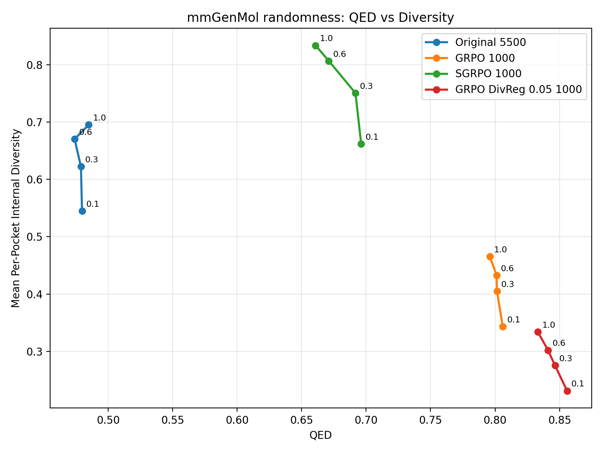

##### `sa_score_mean` vs `diversity`

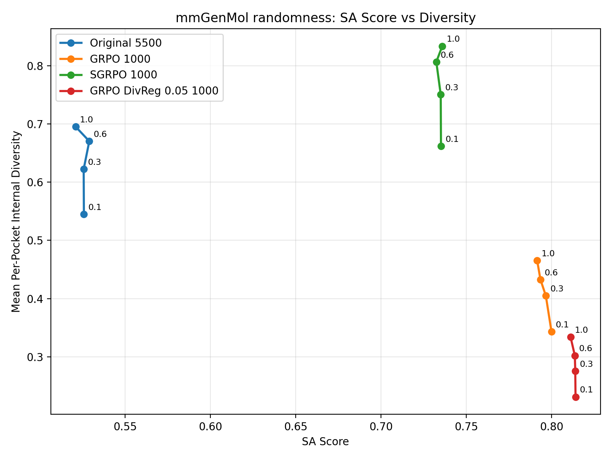

##### `soft_reward_mean` vs `diversity`

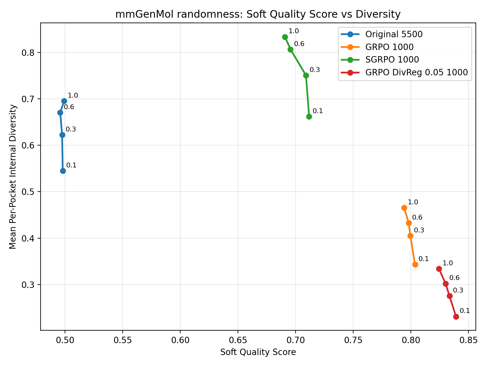

##### `vina_dock_mean` vs `diversity`

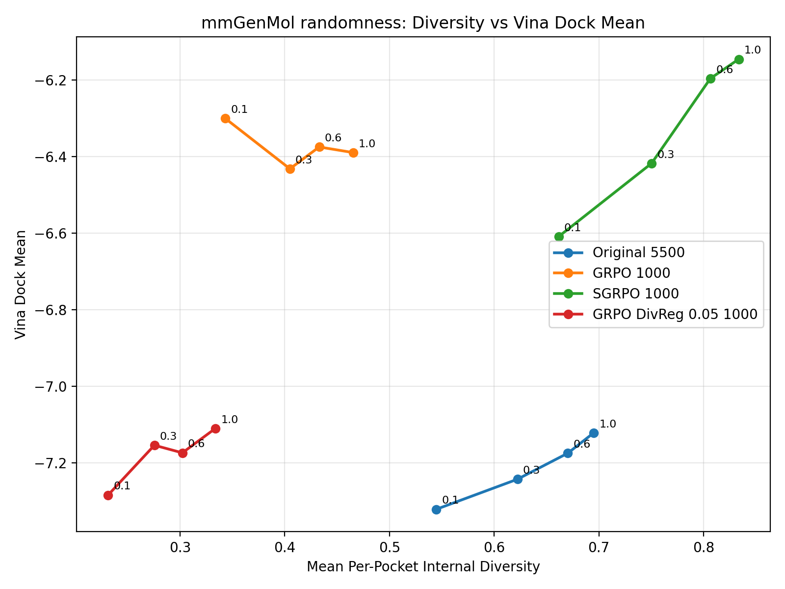

#### Temperature Sweep

- Generation job: `44517`
- Vina docking job: `44534`
- Aggregation/replot job: `45937`
- Previous plotted results used the retired grid `temperature = 0.1, 0.3, 0.6, 1.0`.
- Sweep grid: `temperature = 0.5, 1.0, 5.0`
- Docking mode for the main sweep: `vina_dock` only
- `vina_dock_mean` is reported as raw Vina dock affinity; lower is better.
- `soft_reward_mean` is the rollout-level quality reward: `0.6 * qed_mean + 0.4 * sa_score_mean`.

##### `qed_mean` vs `diversity`

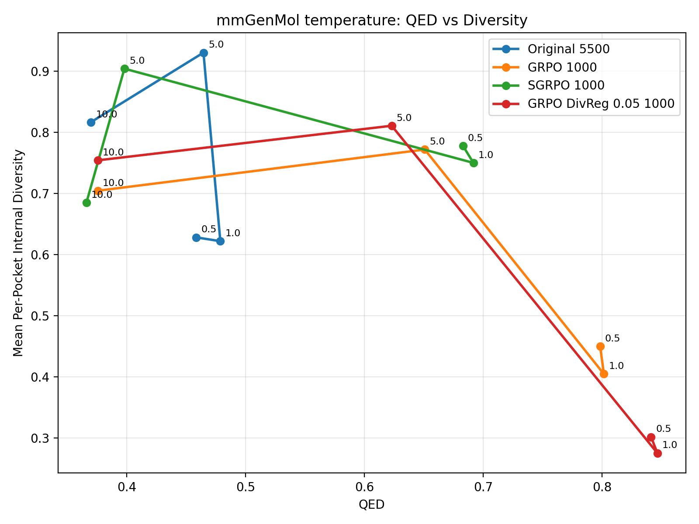

##### `sa_score_mean` vs `diversity`

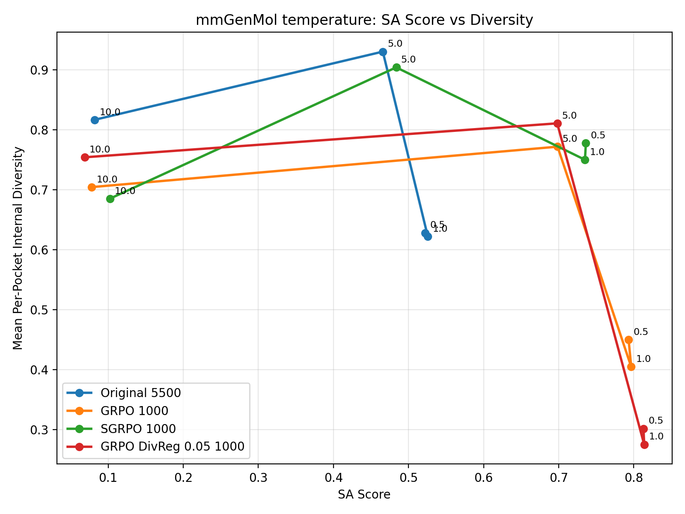

##### `soft_reward_mean` vs `diversity`

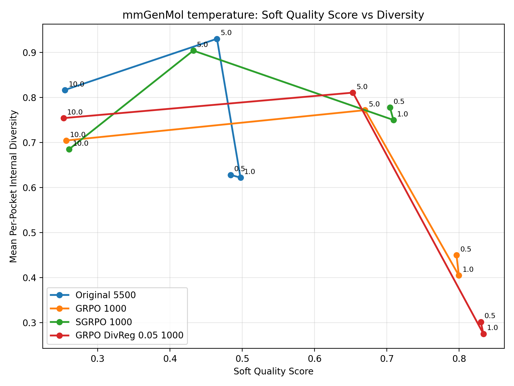

##### `vina_dock_mean` vs `diversity`

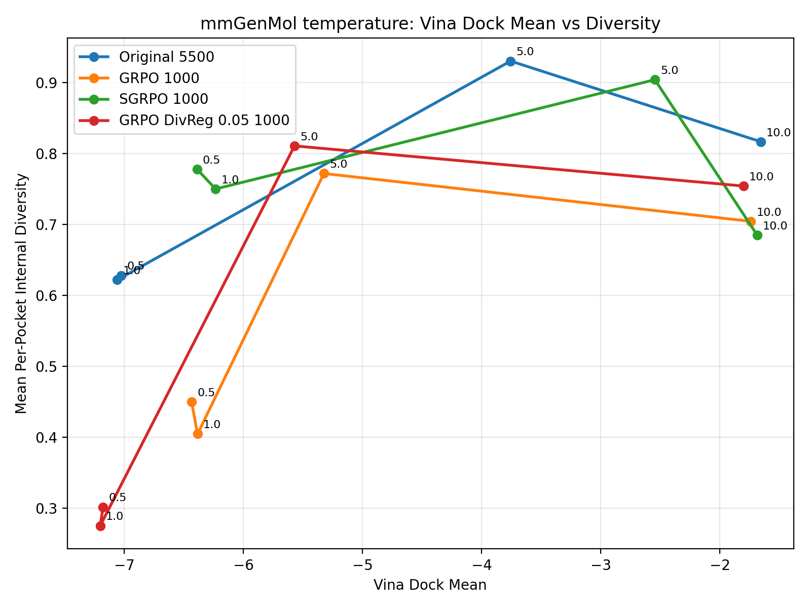

#### Paired Randomness-Temperature Sweep

- Sweep grid: `(randomness, temperature) = (0.1, 0.5), (0.3, 0.8), (0.5, 1.1), (0.7, 1.4), (0.9, 1.7), (1.0, 2.0)`
- Docking mode for the main paired sweep: `vina_dock` only
- Aggregated result files: `TODO`
- Plot files: `TODO`

#### GRPO + DrugCLIP 1000 Sweep Results

- Generation task manifests:

```text
sgrpo-main-results/mmgenmol/generation_drugclip_grpo1000_randomness_tasks_20260428.tsv
sgrpo-main-results/mmgenmol/generation_drugclip_grpo1000_temperature_tasks_20260428.tsv
sgrpo-main-results/mmgenmol/generation_drugclip_grpo1000_paired_tasks_20260428.tsv
```

- Aggregation jobs:

```text
50634  randomness
50636  temperature
50635  paired
```

- Aggregated result files:

```text
sgrpo-main-results/mmgenmol/mmgenmol_drugclip_grpo1000_randomness_results_20260428.json
sgrpo-main-results/mmgenmol/mmgenmol_drugclip_grpo1000_temperature_results_20260428.json
sgrpo-main-results/mmgenmol/mmgenmol_drugclip_grpo1000_paired_results_20260428.json
```

- Plot files:

```text
sgrpo-main-results/mmgenmol/mmgenmol_drugclip_grpo1000_randomness_diversity_vs_qed_mean_20260428.png
sgrpo-main-results/mmgenmol/mmgenmol_drugclip_grpo1000_randomness_diversity_vs_sa_score_mean_20260428.png
sgrpo-main-results/mmgenmol/mmgenmol_drugclip_grpo1000_randomness_diversity_vs_soft_reward_mean_20260428.png
sgrpo-main-results/mmgenmol/mmgenmol_drugclip_grpo1000_randomness_diversity_vs_vina_dock_mean_20260428.png
sgrpo-main-results/mmgenmol/mmgenmol_drugclip_grpo1000_temperature_diversity_vs_qed_mean_20260428.png
sgrpo-main-results/mmgenmol/mmgenmol_drugclip_grpo1000_temperature_diversity_vs_sa_score_mean_20260428.png
sgrpo-main-results/mmgenmol/mmgenmol_drugclip_grpo1000_temperature_diversity_vs_soft_reward_mean_20260428.png
sgrpo-main-results/mmgenmol/mmgenmol_drugclip_grpo1000_temperature_diversity_vs_vina_dock_mean_20260428.png
sgrpo-main-results/mmgenmol/mmgenmol_drugclip_grpo1000_paired_diversity_vs_qed_mean_20260428.png
sgrpo-main-results/mmgenmol/mmgenmol_drugclip_grpo1000_paired_diversity_vs_sa_score_mean_20260428.png
sgrpo-main-results/mmgenmol/mmgenmol_drugclip_grpo1000_paired_diversity_vs_soft_reward_mean_20260428.png
sgrpo-main-results/mmgenmol/mmgenmol_drugclip_grpo1000_paired_diversity_vs_vina_dock_mean_20260428.png
```

- Rollout-level reward used in these plots:

```text
0.3 * qed_mean + 0.2 * sa_score_mean + 0.5 * drugclip_score_mean
```

- Aggregation semantics:

```text
DrugCLIP offline rescore failures are excluded from the final-valid set for metric aggregation. The observed failure counts were small (1-8 molecules out of 1600, depending on sweep point).
```

##### Randomness Sweep

- Sweep grid: `randomness = 0.1, 0.3, 0.6, 1.0`
- Valid fraction stayed in `0.991875-0.997500`.
- Diversity increased from `0.342951` to `0.469721` as randomness increased.
- `vina_dock_mean` stayed around `-6.33` to `-6.23`.


##### Temperature Sweep

- Sweep grid: `temperature = 0.5, 1.0, 5.0`
- `temperature = 5.0` is the clear high-diversity / low-quality corner:

```text
valid_fraction = 0.914375
diversity = 0.816738
soft_reward_mean = 0.290015
vina_dock_mean = -4.685111
```


##### Paired Randomness-Temperature Sweep

- Sweep grid: `(0.1, 0.5), (0.3, 0.8), (0.5, 1.1), (0.7, 1.4), (0.9, 1.7), (1.0, 2.0)`
- Diversity increased monotonically from `0.395369` to `0.509445`.
- `vina_dock_mean` degraded from `-6.310648` to `-6.096635`, showing the expected quality-diversity tradeoff.


## ProGen2

### Original

Status: `Verified`

Checkpoint:

```text
/public/home/xinwuye/ai4s-tool-joint-train/runs/progen2_official/checkpoints/progen2-small
```

Tokenizer:

```text
/public/home/xinwuye/ai4s-tool-joint-train/runs/progen2_official/tokenizer.json
```

Training config:

```text
N/A in this repo for the current comparison campaign
```

Launch Script:

```text
N/A
```

Expected GPU Topology:

```text
N/A
```

Invocation:

```text
N/A
```

Notes:

- This is the official `progen2-small` baseline asset.

### GRPO

Status: `Partial`

Checkpoint:

```text
TODO
```

Training config:

```text
configs/progen2_grpo_ng96_bs2_len256_rbs16.yaml
```

Launch Script:

```text
scripts/slurm/train_progen2_grpo_8gpu.sbatch
```

Expected GPU Topology:

```text
8 GPU
```

Invocation:

```text
CONFIG_PATH=configs/progen2_grpo_ng96_bs2_len256_rbs16.yaml sbatch scripts/slurm/train_progen2_grpo_8gpu.sbatch
```

Notes:

- Planned 8-GPU DDP main-result line:

```text
max_new_tokens = 256
per_device_prompt_batch_size = 2
num_generations = 96
reward_calibration_size = 1024
reward_calibration_prompt_batch_size = 128
reward batch_size = 256 / 64 / 256 / 24 for naturalness / foldability / stability / developability
reward_compute_every_n_steps = {naturalness: 1, foldability: 4, stability: 1, developability: 1}
report_to = [wandb]
```

- Unverified assumption: `ng96` is the intended GRPO companion line because it rollout-count matches the SGRPO line (`12 * 8 = 96`) while keeping `len256 / bs2 / rbs16` fixed.
- No verified ProGen2 `grpo` training run has been locked into this comparison index yet.
- Verified implementation note: current `grpo` code path does not consume `group_advantage_weight`; the field remains in the shared config schema, but changing it alone is algorithmically inert for GRPO under the present trainer implementation.
- Provisional training defaults in the config are `max_steps = 200`, `learning_rate = 5e-5`, `save_steps = 20`, and `report_to = [wandb]`.

### SGRPO

Status: `Partial`

Checkpoint:

```text
TODO
```

Training config:

```text
configs/progen2_sgrpo_ng12_sg8_bs2_len256_rbs16.yaml
```

Launch Script:

```text
scripts/slurm/train_progen2_sgrpo_8gpu.sbatch
```

Expected GPU Topology:

```text
8 GPU
```

Invocation:

```text
CONFIG_PATH=configs/progen2_sgrpo_ng12_sg8_bs2_len256_rbs16.yaml sbatch scripts/slurm/train_progen2_sgrpo_8gpu.sbatch
```

Notes:

- Current main-result checkpoint is not locked yet.
- Planned 8-GPU DDP main-result line:

```text
max_new_tokens = 256
per_device_prompt_batch_size = 2
num_generations = 12
supergroup_num_groups = 8
group_advantage_weight = 0.5
reward_calibration_size = 1024
reward_calibration_prompt_batch_size = 128
reward batch_size = 256 / 64 / 256 / 24 for naturalness / foldability / stability / developability
reward_compute_every_n_steps = {naturalness: 1, foldability: 4, stability: 1, developability: 1}
report_to = [wandb]
```

- Latest successful 1-GPU training-feasibility probe:

```text
/public/home/xinwuye/ai4s-tool-joint-train/runs/progen2_batch_probe/len256_ng16_sg8_bs2_rbs16/summary.md
status = success
recommended_batch_size = 2
recommendation_reason = largest_success_exceeds_target_reserved_ratio
training peak allocated = 115.450734 GiB
reward peak allocated = 33.102311 GiB
```

- The main-result SGRPO line is intentionally set below the successful `ng16` 1-GPU probe to keep the first 8-GPU training asset conservative.
- Provisional training defaults in the config are `max_steps = 200`, `learning_rate = 5e-5`, `save_steps = 20`, and `report_to = [wandb]`.

### GRPO + `group_advantage_weight = 0.8`

Status: `TODO`

Checkpoint:

```text
TODO
```

Training config:

```text
configs/progen2_grpo_ng96_bs2_len256_rbs16_gw08.yaml
```

Launch Script:

```text
scripts/slurm/train_progen2_grpo_8gpu.sbatch
```

Expected GPU Topology:

```text
8 GPU
```

Invocation:

```text
CONFIG_PATH=configs/progen2_grpo_ng96_bs2_len256_rbs16_gw08.yaml sbatch scripts/slurm/train_progen2_grpo_8gpu.sbatch
```

Notes:

- This line matches the current ProGen2 GRPO config except `group_advantage_weight = 0.8`.
- Verified implementation note: current `grpo` code path does not consume `group_advantage_weight`, so this config difference is intentionally recorded but algorithmically inert unless the trainer logic changes.

### SGRPO + `group_advantage_weight = 0.8`

Status: `TODO`

Checkpoint:

```text
TODO
```

Training config:

```text
configs/progen2_sgrpo_ng12_sg8_bs2_len256_rbs16_gw08.yaml
```

Launch Script:

```text
scripts/slurm/train_progen2_sgrpo_8gpu.sbatch
```

Expected GPU Topology:

```text
8 GPU
```

Invocation:

```text
CONFIG_PATH=configs/progen2_sgrpo_ng12_sg8_bs2_len256_rbs16_gw08.yaml sbatch scripts/slurm/train_progen2_sgrpo_8gpu.sbatch
```

Notes:

- This line matches the current ProGen2 SGRPO config except `group_advantage_weight = 0.8`.

### Pareto Curves To Maintain

- TODO: `diversity` vs `naturalness`
- TODO: `diversity` vs `foldability`
- TODO: `diversity` vs `stability`
- TODO: `diversity` vs `developability`

## Global Open Items

- `mmgenmol`: missing narrowed 4-point sweep artifacts for the locked Original / GRPO / SGRPO / GRPO Diversity-Regularizer checkpoints.
- `progen2`: missing GRPO checkpoint and final SGRPO checkpoint

## Update Rule

Whenever a new comparison asset is adopted, update this file immediately with:

1. the checkpoint path
2. the training config path
3. the raw result file path
4. the rendered plot path

Do not overwrite a previously listed path silently. If a checkpoint selection changes, record the replacement explicitly in the relevant section.
