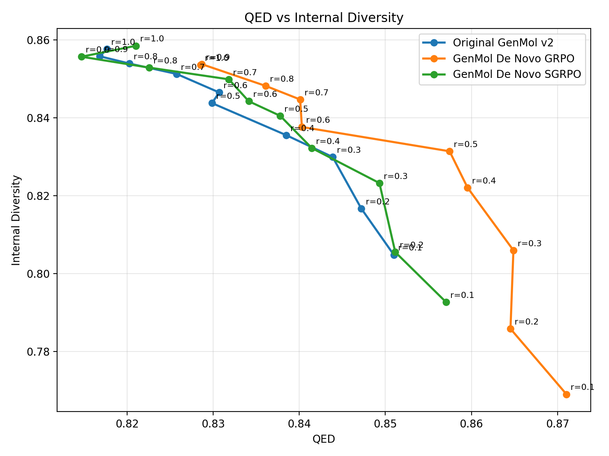
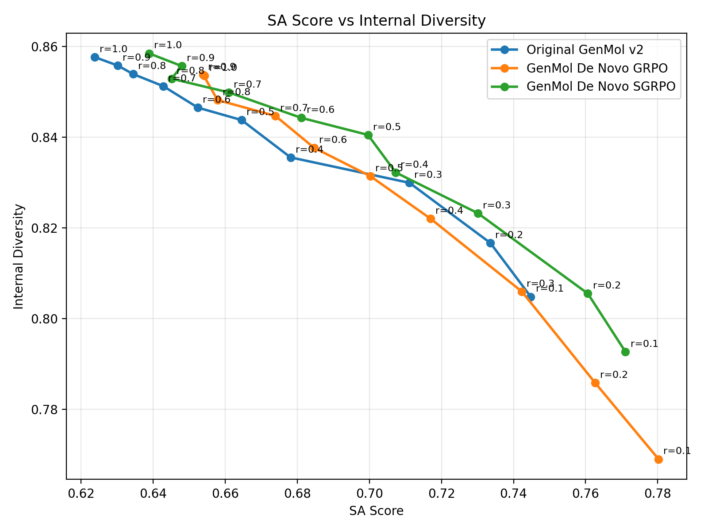
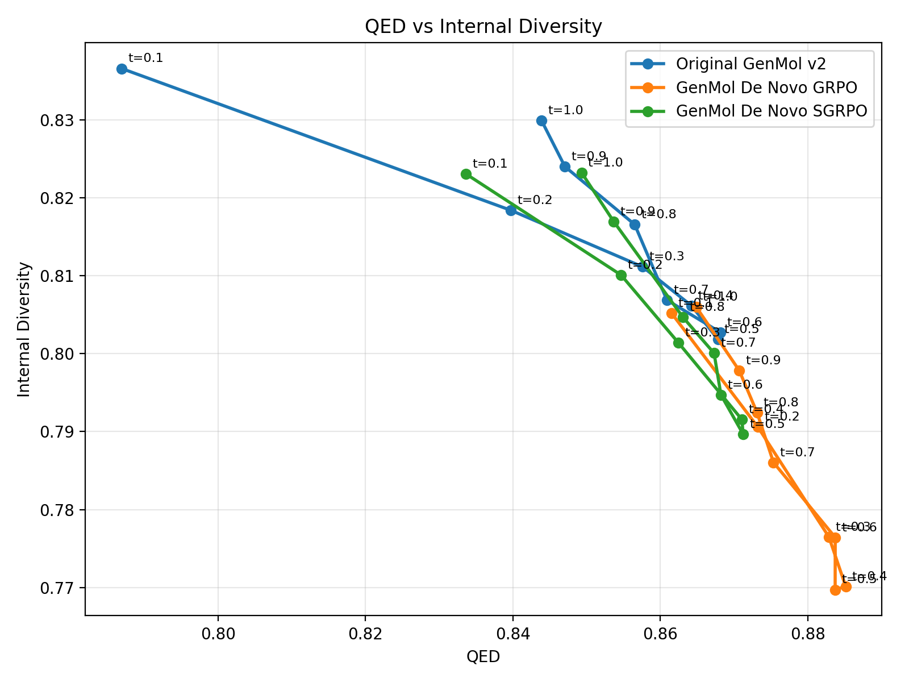
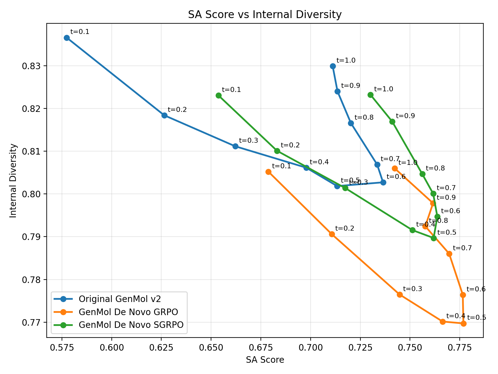

# SGRPO Main Results

This directory is the repo-local index for the main `original` vs `GRPO` vs `SGRPO` comparison assets across:

- `genmol de novo`
- `mmgenmol`
- `progen2`

The intent is to keep three things in one place:

1. the exact weight paths used in the comparison
2. the exact training config paths used to produce those weights
3. the output locations for diversity-property Pareto sweeps and their raw result files

## Conventions

- Config paths below are repo-root-relative inside the `genmol` git repo.
- Checkpoint paths below are the current verified cluster absolute paths.
- `Invocation` is recorded because several Slurm wrappers have their own default `CONFIG_PATH` or `CONFIG_NAME`; the required override is part of the actual experiment identity.
- `Verified` means the path was confirmed from a repo config or an already-used run artifact.
- `Partial` means an artifact exists, but it is not yet the locked main comparison asset.
- `TODO` means the comparison asset is not selected or not generated yet.
- Any unverifiable statement is explicitly labeled as an `Unverified assumption`.

## Sweep Policy

- `genmol de novo`: sweep `randomness = 0.1, 0.2, ..., 1.0`
- `genmol de novo`: sweep `temperature = 0.1, 0.2, ..., 1.0`
- `mmgenmol`: sweep `randomness = 0.1, 0.2, ..., 1.0`
- `mmgenmol`: sweep `temperature = 0.1, 0.2, ..., 1.0`
- `progen2`: sweep `temperature = 0.1, 0.2, ..., 1.0`

For every family and every property curve, save:

- raw sweep rows
- aggregated summary JSON
- rendered plot files

Planned local layout under this directory:

- `genmol-denovo/`
- `mmgenmol/`
- `progen2/`

## GenMol De Novo

### Original

Status: `Verified`

Checkpoint:

```text
/public/home/xinwuye/ai4s-tool-joint-train/genmol/checkpoints/genmol_v2_v1.0/model_v2.ckpt
```

Training config:

```text
N/A in this repo for the current comparison campaign
```

Launch Script:

```text
N/A
```

Expected GPU Topology:

```text
N/A
```

Invocation:

```text
N/A
```

Notes:

- This is the pretrained `GenMol v2` weight used as the original model baseline.

### GRPO

Status: `Verified`

Checkpoint:

```text
/public/home/xinwuye/ai4s-tool-joint-train/runs/cpgrpo_denovo/cpgrpo_denovo_ng512_bs1024_lr5e-5_beta5e-3_ni1_20260422_025828/checkpoint-001000
```

Training config:

```text
configs/cpgrpo_denovo_ng512_bs1024_lr5e-5_beta5e-3_ni1.yaml
```

Launch Script:

```text
scripts/slurm/cpgrpo_denovo_8gpu_ng512_bs1024_ni1.sbatch
```

Expected GPU Topology:

```text
8 GPU
```

Invocation:

```text
CONFIG_PATH=configs/cpgrpo_denovo_ng512_bs1024_lr5e-5_beta5e-3_ni1.yaml sbatch scripts/slurm/cpgrpo_denovo_8gpu_ng512_bs1024_ni1.sbatch
```

Notes:

- Locked main comparison asset produced by the 8-GPU GRPO run completed on 2026-04-22.
- Training job: `41260`

### GRPO 2000-Step Variant

Status: `TODO`

Checkpoint:

```text
TODO
```

Training config:

```text
configs/cpgrpo_denovo_ng512_bs1024_lr5e-5_beta5e-3_ni1_ms2000.yaml
```

Launch Script:

```text
scripts/slurm/cpgrpo_denovo_8gpu_ng512_bs1024_ni1.sbatch
```

Expected GPU Topology:

```text
8 GPU
```

Invocation:

```text
CONFIG_PATH=configs/cpgrpo_denovo_ng512_bs1024_lr5e-5_beta5e-3_ni1_ms2000.yaml sbatch scripts/slurm/cpgrpo_denovo_8gpu_ng512_bs1024_ni1.sbatch
```

Notes:

- Planned rerun with `max_steps = 2000`.
- All other hyperparameters and launch topology are intentionally unchanged relative to the locked 1000-step GRPO run.

### SGRPO

Status: `Verified`

Checkpoint:

```text
/public/home/xinwuye/ai4s-tool-joint-train/runs/cpgrpo_denovo/cpgrpo_denovo_sgrpo_ng64_sg8_bs1024_lr5e-5_beta5e-3_gw09_20260422_030845/checkpoint-001000
```

Training config:

```text
configs/cpgrpo_denovo_sgrpo_ng64_sg8_bs1024_lr5e-5_beta5e-3_gw09.yaml
```

Launch Script:

```text
scripts/slurm/cpgrpo_denovo_8gpu_ng64_bs1024.sbatch
```

Expected GPU Topology:

```text
8 GPU
```

Invocation:

```text
CONFIG_PATH=configs/cpgrpo_denovo_sgrpo_ng64_sg8_bs1024_lr5e-5_beta5e-3_gw09.yaml sbatch scripts/slurm/cpgrpo_denovo_8gpu_ng64_bs1024.sbatch
```

Notes:

- Locked main comparison asset produced by the 8-GPU SGRPO run completed on 2026-04-22.
- Training job: `41262`

### SGRPO 2000-Step Variant

Status: `TODO`

Checkpoint:

```text
TODO
```

Training config:

```text
configs/cpgrpo_denovo_sgrpo_ng64_sg8_bs1024_lr5e-5_beta5e-3_gw09_ms2000.yaml
```

Launch Script:

```text
scripts/slurm/cpgrpo_denovo_8gpu_ng64_bs1024.sbatch
```

Expected GPU Topology:

```text
8 GPU
```

Invocation:

```text
CONFIG_PATH=configs/cpgrpo_denovo_sgrpo_ng64_sg8_bs1024_lr5e-5_beta5e-3_gw09_ms2000.yaml sbatch scripts/slurm/cpgrpo_denovo_8gpu_ng64_bs1024.sbatch
```

Notes:

- Planned rerun with `max_steps = 2000`.
- All other hyperparameters and launch topology are intentionally unchanged relative to the locked 1000-step SGRPO run.

### Pareto Curves To Maintain

#### Pending 2000-Step Variants

- TODO: add full de novo Pareto assets for `GRPO 2000-Step Variant`, including both the `randomness = 0.1, 0.2, ..., 1.0` sweep and the `temperature = 0.1, 0.2, ..., 1.0` sweep
- TODO: add full de novo Pareto assets for `SGRPO 2000-Step Variant`, including both the `randomness = 0.1, 0.2, ..., 1.0` sweep and the `temperature = 0.1, 0.2, ..., 1.0` sweep

#### Randomness Sweep

Sweep config:

```text
configs/eval_denovo_main_results_randomness_sweep_20260422.yaml
```

Generated artifacts:

```text
genmol-denovo/denovo_main_results_randomness_sweep_20260422.md
genmol-denovo/denovo_main_results_randomness_sweep_20260422.json
genmol-denovo/denovo_main_results_randomness_sweep_20260422.rows.jsonl
```

Notes:

- Completed by eval job `41496`.
- Sweep grid: `randomness = 0.1, 0.2, ..., 1.0`
- Sample budget: `1000` molecules per model per randomness

#### `diversity` vs `qed`

Plot:

```text
genmol-denovo/qed_vs_diversity_20260422.png
```



#### `diversity` vs `sa_score`

Plot:

```text
genmol-denovo/sa_score_vs_diversity_20260422.png
```



#### Temperature Sweep

Sweep config:

```text
configs/eval_denovo_main_results_temperature_sweep_20260422.yaml
```

Generated artifacts:

```text
genmol-denovo/denovo_main_results_temperature_sweep_20260422.md
genmol-denovo/denovo_main_results_temperature_sweep_20260422.json
genmol-denovo/denovo_main_results_temperature_sweep_20260422.rows.jsonl
```

Notes:

- Completed by eval job `41546`.
- Sweep grid: `temperature = 0.1, 0.2, ..., 1.0`
- Fixed `randomness = 0.3`
- Sample budget: `1000` molecules per model per temperature

#### `diversity` vs `qed` for temperature sweep

Plot:

```text
genmol-denovo/qed_vs_diversity_temperature_20260422.png
```



#### `diversity` vs `sa_score` for temperature sweep

Plot:

```text
genmol-denovo/sa_score_vs_diversity_temperature_20260422.png
```



## mmGenMol

### Original

Status: `Verified`

Checkpoint:

```text
/public/home/xinwuye/ai4s-tool-joint-train/runs/pocket_prefix_supervised_8gpu/20260416_151741/checkpoints/5500.ckpt
```

Training config:

```text
configs/base_pocket_prefix_8gpu.yaml
```

Launch Script:

```text
scripts/slurm/train_pocket_prefix_8gpu.sbatch
```

Expected GPU Topology:

```text
8 GPU
```

Invocation:

```text
CONFIG_NAME=base_pocket_prefix_8gpu sbatch scripts/slurm/train_pocket_prefix_8gpu.sbatch
```

Notes:

- This is the current original-model checkpoint selected for the comparison.
- Existing evaluation config already points to this checkpoint:

```text
configs/eval_pocket_prefix_crossdocked_5500ckpt.yaml
```

### GRPO

Status: `Partial`

Checkpoint:

```text
TODO: lock the main mmGenMol GRPO checkpoint for the comparison
```

Training config:

```text
configs/cpgrpo_denovo_pocket_prefix_ng192_bs384_lr5e-5_beta5e-3_ni1.yaml
```

Launch Script:

```text
scripts/slurm/cpgrpo_denovo_pocket_prefix_8gpu_ng192_bs384_ni1.sbatch
```

Expected GPU Topology:

```text
8 GPU
```

Invocation:

```text
CONFIG_PATH=configs/cpgrpo_denovo_pocket_prefix_ng192_bs384_lr5e-5_beta5e-3_ni1.yaml sbatch scripts/slurm/cpgrpo_denovo_pocket_prefix_8gpu_ng192_bs384_ni1.sbatch
```

Notes:

- Stable 1-GPU probe:

```text
/public/home/xinwuye/ai4s-tool-joint-train/runs/cpgrpo_denovo_pocket_prefix/cpgrpo_denovo_pocket_prefix_probe_1gpu_ng256_bs512_lr5e-5_beta5e-3_ni1_20260421_220006
```

- Probe evidence:

```text
job 40942, 1 GPU, COMPLETED, 10 steps, no OOM
```

- Current 8-GPU launch line is reduced below the 1-GPU validated line after the `ng256 / bs512` run hit first-backward OOM on 8 GPUs.

### SGRPO

Status: `Partial`

Checkpoint:

```text
TODO
```

Training config:

```text
configs/cpgrpo_denovo_pocket_prefix_sgrpo_ng24_sg8_bs384_lr5e-5_beta5e-3_gw09.yaml
```

Launch Script:

```text
scripts/slurm/cpgrpo_denovo_pocket_prefix_8gpu_sgrpo_ng24_sg8_bs384_gw09.sbatch
```

Expected GPU Topology:

```text
8 GPU
```

Invocation:

```text
CONFIG_PATH=configs/cpgrpo_denovo_pocket_prefix_sgrpo_ng24_sg8_bs384_lr5e-5_beta5e-3_gw09.yaml sbatch scripts/slurm/cpgrpo_denovo_pocket_prefix_8gpu_sgrpo_ng24_sg8_bs384_gw09.sbatch
```

Notes:

- Config family is defined to mirror de novo SGRPO with `num_generations=24`, `supergroup_num_groups=8`, `group_advantage_weight=0.9`, and `per_device_train_batch_size=384`.
- `generation_batch_size` is fixed to `384` to match the current reduced 8-GPU memory line.

### Pareto Curves To Maintain

#### Randomness Sweep

- TODO: `diversity` vs `qed_mean`
- TODO: `diversity` vs `sa_score_mean`
- TODO: `diversity` vs `qvina_mean`
- TODO: `diversity` vs `vina_dock_mean`

#### Temperature Sweep

- TODO: `diversity` vs `qed_mean`
- TODO: `diversity` vs `sa_score_mean`
- TODO: `diversity` vs `qvina_mean`
- TODO: `diversity` vs `vina_dock_mean`

## ProGen2

### Original

Status: `Verified`

Checkpoint:

```text
/public/home/xinwuye/ai4s-tool-joint-train/runs/progen2_official/checkpoints/progen2-small
```

Tokenizer:

```text
/public/home/xinwuye/ai4s-tool-joint-train/runs/progen2_official/tokenizer.json
```

Training config:

```text
N/A in this repo for the current comparison campaign
```

Launch Script:

```text
N/A
```

Expected GPU Topology:

```text
N/A
```

Invocation:

```text
N/A
```

Notes:

- This is the official `progen2-small` baseline asset.

### GRPO

Status: `TODO`

Checkpoint:

```text
TODO
```

Training config:

```text
TODO
```

Launch Script:

```text
TODO
```

Expected GPU Topology:

```text
TODO
```

Invocation:

```text
TODO
```

Notes:

- No verified ProGen2 `grpo` training run has been locked into this comparison index yet.

### SGRPO

Status: `Partial`

Checkpoint:

```text
TODO
```

Training config:

```text
TODO
```

Launch Script:

```text
TODO
```

Expected GPU Topology:

```text
8 GPU
```

Invocation:

```text
TODO
```

Notes:

- Current main-result checkpoint and 8-GPU training config are not locked yet.
- Latest 1-GPU long-context probe status:

```text
/public/home/xinwuye/ai4s-tool-joint-train/runs/progen2_batch_probe/len512_ng32_sg8_bs2_rbs16/summary.md
status = oom
recommended_batch_size = None
reason = no_successful_candidate
config = genmol/configs/progen2_sgrpo_1gpu_probe_ng32_sg8_bs2_len512_rbs16.yaml
per_device_prompt_batch_size = 2
num_generations = 32
supergroup_num_groups = 8
max_new_tokens = 512
reward batch_size = 16 for naturalness / foldability / stability / developability
```

- Latest failure mode:

```text
OOM at train step 1 inside foldability / ESMFold reward evaluation.
The failing allocation was 32.00 GiB with only 15.05 GiB free on a 139.80 GiB GPU.
At failure time, PyTorch had 75.47 GiB allocated and 48.60 GiB reserved but unallocated.
```

- Last successful 1-GPU baseline probe conclusion:

```text
/public/home/xinwuye/ai4s-tool-joint-train/runs/progen2_batch_probe/phase_peaks_bs64_10step/summary.md
recommended per_device_prompt_batch_size = 64
config = genmol/configs/progen2_sgrpo_1gpu_memprobe_10steps.yaml
per_device_prompt_batch_size = 1
num_generations = 4
supergroup_num_groups = 2
max_new_tokens = 64
```

- Supporting probe artifacts:

```text
/public/home/xinwuye/ai4s-tool-joint-train/runs/progen2_batch_probe/phase_peaks_bs64_10step/summary.md
/public/home/xinwuye/ai4s-tool-joint-train/runs/progen2_batch_probe/len512_ng32_sg8_bs2/summary.md
/public/home/xinwuye/ai4s-tool-joint-train/runs/progen2_batch_probe/len512_ng32_sg8_bs2_rbs128/summary.md
/public/home/xinwuye/ai4s-tool-joint-train/runs/progen2_batch_probe/len512_ng32_sg8_bs2_rbs64/summary.md
/public/home/xinwuye/ai4s-tool-joint-train/runs/progen2_batch_probe/len512_ng32_sg8_bs2_rbs16/summary.md
```

### Pareto Curves To Maintain

- TODO: `diversity` vs `naturalness`
- TODO: `diversity` vs `foldability`
- TODO: `diversity` vs `stability`
- TODO: `diversity` vs `developability`

## Global Open Items

- `genmol de novo`: missing the unified 3-way full-grid sweep result under this directory
- `mmgenmol`: missing locked GRPO and SGRPO comparison checkpoints
- `progen2`: missing GRPO checkpoint and final SGRPO checkpoint

## Update Rule

Whenever a new comparison asset is adopted, update this file immediately with:

1. the checkpoint path
2. the training config path
3. the raw result file path
4. the rendered plot path

Do not overwrite a previously listed path silently. If a checkpoint selection changes, record the replacement explicitly in the relevant section.
