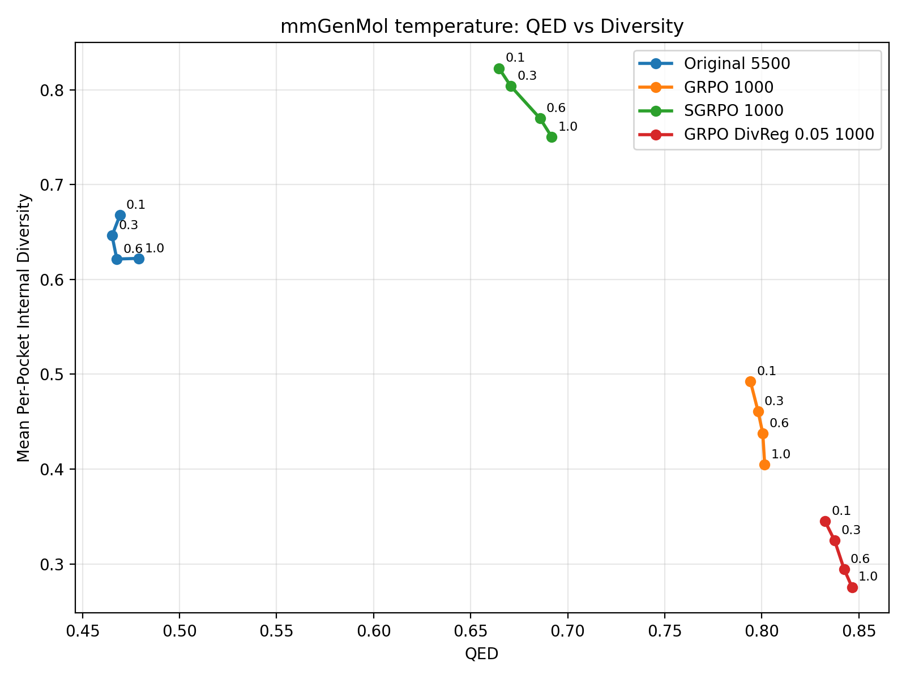
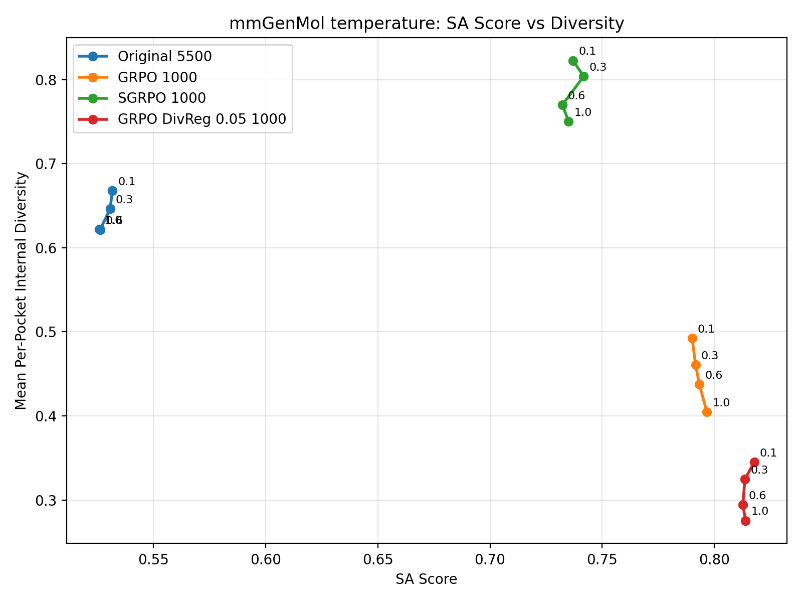
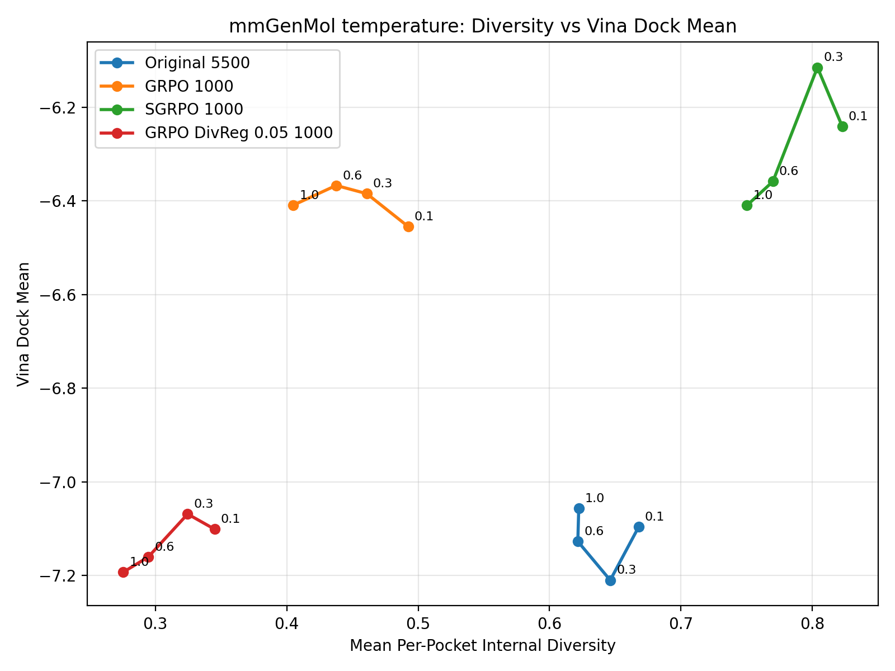

# SGRPO Main Results

This directory is the repo-local index for the main `original` vs `GRPO` vs `SGRPO` comparison assets across:

- `genmol de novo`
- `mmgenmol`
- `progen2`

The intent is to keep three things in one place:

1. the exact weight paths used in the comparison
2. the exact training config paths used to produce those weights
3. the output locations for diversity-property Pareto sweeps and their raw result files

## Conventions

- Config paths below are repo-root-relative inside the `genmol` git repo.
- Checkpoint paths below are the current verified cluster absolute paths.
- `Invocation` is recorded because several Slurm wrappers have their own default `CONFIG_PATH` or `CONFIG_NAME`; the required override is part of the actual experiment identity.
- `Verified` means the path was confirmed from a repo config or an already-used run artifact.
- `Partial` means an artifact exists, but it is not yet the locked main comparison asset.
- `TODO` means the comparison asset is not selected or not generated yet.
- Any unverifiable statement is explicitly labeled as an `Unverified assumption`.

## Sweep Policy

- `genmol de novo`: sweep `randomness = 0.1, 0.2, ..., 1.0`
- `genmol de novo`: sweep `temperature = 0.1, 0.2, ..., 1.0`
- `mmgenmol`: sweep `randomness = 0.1, 0.3, 0.6, 1.0`
- `mmgenmol`: sweep `temperature = 0.1, 0.3, 0.6, 1.0`
- `mmgenmol`: report docking with `vina_dock` only for the main sweep; `qvina` is excluded from the current main-result plan.
- `progen2`: sweep `temperature = 0.1, 0.2, ..., 1.0`

For every family and every property curve, save:

- raw sweep rows
- aggregated summary JSON
- rendered plot files

Planned local layout under this directory:

- `genmol-denovo/`
- `mmgenmol/`
- `progen2/`

## GenMol De Novo

### Original

Status: `Verified`

Checkpoint:

```text
/public/home/xinwuye/ai4s-tool-joint-train/genmol/checkpoints/genmol_v2_v1.0/model_v2.ckpt
```

Training config:

```text
N/A in this repo for the current comparison campaign
```

Launch Script:

```text
N/A
```

Expected GPU Topology:

```text
N/A
```

Invocation:

```text
N/A
```

Notes:

- This is the pretrained `GenMol v2` weight used as the original model baseline.

### GRPO

Status: `Verified`

Checkpoint:

```text
/public/home/xinwuye/ai4s-tool-joint-train/runs/cpgrpo_denovo/cpgrpo_denovo_ng512_bs1024_lr5e-5_beta5e-3_ni1_20260422_025828/checkpoint-001000
```

Training config:

```text
configs/cpgrpo_denovo_ng512_bs1024_lr5e-5_beta5e-3_ni1.yaml
```

Launch Script:

```text
scripts/slurm/cpgrpo_denovo_8gpu_ng512_bs1024_ni1.sbatch
```

Expected GPU Topology:

```text
8 GPU
```

Invocation:

```text
CONFIG_PATH=configs/cpgrpo_denovo_ng512_bs1024_lr5e-5_beta5e-3_ni1.yaml sbatch scripts/slurm/cpgrpo_denovo_8gpu_ng512_bs1024_ni1.sbatch
```

Notes:

- Locked main comparison asset produced by the 8-GPU GRPO run completed on 2026-04-22.
- Training job: `41260`

### GRPO 2000-Step Variant

Status: `Verified`

Checkpoint:

```text
/public/home/xinwuye/ai4s-tool-joint-train/runs/cpgrpo_denovo/cpgrpo_denovo_ng512_bs1024_lr5e-5_beta5e-3_ni1_ms2000_20260422_161812/checkpoint-002000
```

Training config:

```text
configs/cpgrpo_denovo_ng512_bs1024_lr5e-5_beta5e-3_ni1_ms2000.yaml
```

Launch Script:

```text
scripts/slurm/cpgrpo_denovo_8gpu_ng512_bs1024_ni1.sbatch
```

Expected GPU Topology:

```text
8 GPU
```

Invocation:

```text
CONFIG_PATH=configs/cpgrpo_denovo_ng512_bs1024_lr5e-5_beta5e-3_ni1_ms2000.yaml sbatch scripts/slurm/cpgrpo_denovo_8gpu_ng512_bs1024_ni1.sbatch
```

Notes:

- Completed rerun with `max_steps = 2000`.
- All other hyperparameters and launch topology are intentionally unchanged relative to the locked 1000-step GRPO run.
- Training job: `41711`

### GRPO Diversity-Regularizer 2000-Step

Status: `Verified`

Checkpoint:

```text
/public/home/xinwuye/ai4s-tool-joint-train/runs/cpgrpo_denovo/cpgrpo_denovo_ng512_bs1024_lr5e-5_beta5e-3_ni1_ms2000_divreg005_20260422_203200/checkpoint-002000
```

Training config:

```text
configs/cpgrpo_denovo_ng512_bs1024_lr5e-5_beta5e-3_ni1_ms2000_divreg005.yaml
```

Launch Script:

```text
scripts/slurm/cpgrpo_denovo_8gpu_ng512_bs1024_ni1.sbatch
```

Expected GPU Topology:

```text
8 GPU
```

Invocation:

```text
CONFIG_PATH=configs/cpgrpo_denovo_ng512_bs1024_lr5e-5_beta5e-3_ni1_ms2000_divreg005.yaml sbatch scripts/slurm/cpgrpo_denovo_8gpu_ng512_bs1024_ni1.sbatch
```

Notes:

- Completed rerun with `max_steps = 2000`.
- All other hyperparameters and launch topology are intentionally unchanged relative to the locked 1000-step GRPO run.
- `diversity_regularizer_weight = 0.05`.
- Training job: `42249`
- The sibling timestamp directory ending in `_203159` is not the locked artifact; it does not contain the complete `checkpoint-002000/model.ckpt`.

### SGRPO

Status: `Verified`

Checkpoint:

```text
/public/home/xinwuye/ai4s-tool-joint-train/runs/cpgrpo_denovo/cpgrpo_denovo_sgrpo_ng64_sg8_bs1024_lr5e-5_beta5e-3_gw09_20260422_030845/checkpoint-001000
```

Training config:

```text
configs/cpgrpo_denovo_sgrpo_ng64_sg8_bs1024_lr5e-5_beta5e-3_gw09.yaml
```

Launch Script:

```text
scripts/slurm/cpgrpo_denovo_8gpu_ng64_bs1024.sbatch
```

Expected GPU Topology:

```text
8 GPU
```

Invocation:

```text
CONFIG_PATH=configs/cpgrpo_denovo_sgrpo_ng64_sg8_bs1024_lr5e-5_beta5e-3_gw09.yaml sbatch scripts/slurm/cpgrpo_denovo_8gpu_ng64_bs1024.sbatch
```

Notes:

- Locked main comparison asset produced by the 8-GPU SGRPO run completed on 2026-04-22.
- Training job: `41262`

### SGRPO 2000-Step Variant

Status: `Verified`

Checkpoint:

```text
/public/home/xinwuye/ai4s-tool-joint-train/runs/cpgrpo_denovo/cpgrpo_denovo_sgrpo_ng64_sg8_bs1024_lr5e-5_beta5e-3_gw09_ms2000_20260422_162050/checkpoint-002000
```

Training config:

```text
configs/cpgrpo_denovo_sgrpo_ng64_sg8_bs1024_lr5e-5_beta5e-3_gw09_ms2000.yaml
```

Launch Script:

```text
scripts/slurm/cpgrpo_denovo_8gpu_ng64_bs1024.sbatch
```

Expected GPU Topology:

```text
8 GPU
```

Invocation:

```text
CONFIG_PATH=configs/cpgrpo_denovo_sgrpo_ng64_sg8_bs1024_lr5e-5_beta5e-3_gw09_ms2000.yaml sbatch scripts/slurm/cpgrpo_denovo_8gpu_ng64_bs1024.sbatch
```

Notes:

- Completed rerun with `max_steps = 2000`.
- All other hyperparameters and launch topology are intentionally unchanged relative to the locked 1000-step SGRPO run.
- Training job: `41712`

### SGRPO Thresholded (`qed > 0.85`, `sa_score > 0.72`)

Status: `Verified`

Checkpoint:

```text
/public/home/xinwuye/ai4s-tool-joint-train/runs/cpgrpo_denovo/cpgrpo_denovo_sgrpo_ng64_sg8_bs1024_lr5e-5_beta5e-3_gw09_thr_q085_sa072_20260424_012813/checkpoint-001000/model.ckpt
```

Training config:

```text
configs/cpgrpo_denovo_sgrpo_ng64_sg8_bs1024_lr5e-5_beta5e-3_gw09_thr_q085_sa072.yaml
```

Launch Script:

```text
scripts/slurm/cpgrpo_denovo_8gpu_ng64_bs1024.sbatch
```

Expected GPU Topology:

```text
8 GPU
```

Invocation:

```text
CONFIG_PATH=configs/cpgrpo_denovo_sgrpo_ng64_sg8_bs1024_lr5e-5_beta5e-3_gw09_thr_q085_sa072.yaml sbatch scripts/slurm/cpgrpo_denovo_8gpu_ng64_bs1024.sbatch
```

Notes:

- Baseline is the locked 1000-step SGRPO configuration.
- Only added `individual_reward_thresholds.qed = 0.85` and `individual_reward_thresholds.sa_score = 0.72`.
- Smoke job `43314` completed successfully.
- Formal training job `43326` completed successfully.
- Smoke config:

```text
configs/cpgrpo_denovo_sgrpo_ng64_sg8_bs1024_lr5e-5_beta5e-3_gw09_thr_q085_sa072_smoke20.yaml
```

### SGRPO Reward-Sum Hierarchy

Status: `Verified`

Checkpoint:

```text
/public/home/xinwuye/ai4s-tool-joint-train/runs/cpgrpo_denovo/cpgrpo_denovo_sgrpo_ng64_sg8_bs1024_lr5e-5_beta5e-3_gw09_rewardsum_20260424_013430/checkpoint-001000/model.ckpt
```

Training config:

```text
configs/cpgrpo_denovo_sgrpo_ng64_sg8_bs1024_lr5e-5_beta5e-3_gw09_rewardsum.yaml
```

Launch Script:

```text
scripts/slurm/cpgrpo_denovo_8gpu_ng64_bs1024.sbatch
```

Expected GPU Topology:

```text
8 GPU
```

Invocation:

```text
CONFIG_PATH=configs/cpgrpo_denovo_sgrpo_ng64_sg8_bs1024_lr5e-5_beta5e-3_gw09_rewardsum.yaml sbatch scripts/slurm/cpgrpo_denovo_8gpu_ng64_bs1024.sbatch
```

Notes:

- Baseline is the locked 1000-step SGRPO configuration.
- Only changed `hierarchy = reward_sum`.
- Smoke job `43318` completed successfully.
- Formal training job `43327` completed successfully.
- Smoke config:

```text
configs/cpgrpo_denovo_sgrpo_ng64_sg8_bs1024_lr5e-5_beta5e-3_gw09_rewardsum_smoke20.yaml
```

### SGRPO Hierarchical-Sum Hierarchy

Status: `Verified`

Checkpoint:

```text
/public/home/xinwuye/ai4s-tool-joint-train/runs/cpgrpo_denovo/cpgrpo_denovo_sgrpo_ng64_sg8_bs1024_lr5e-5_beta5e-3_gw09_hierarchicalsum_20260424_204857/checkpoint-001000/model.ckpt
```

Training config:

```text
configs/cpgrpo_denovo_sgrpo_ng64_sg8_bs1024_lr5e-5_beta5e-3_gw09_hierarchicalsum.yaml
```

Launch Script:

```text
scripts/slurm/cpgrpo_denovo_8gpu_ng64_bs1024.sbatch
```

Expected GPU Topology:

```text
8 GPU
```

Invocation:

```text
CONFIG_PATH=configs/cpgrpo_denovo_sgrpo_ng64_sg8_bs1024_lr5e-5_beta5e-3_gw09_hierarchicalsum.yaml WANDB_NAME=denovo-sgrpo-hierarchicalsum sbatch --exclude=server13 scripts/slurm/cpgrpo_denovo_8gpu_ng64_bs1024.sbatch
```

Notes:

- Baseline is the locked 1000-step reward-sum SGRPO configuration.
- Only changed `hierarchy = hierarchical_sum`.
- Smoke config:

```text
configs/cpgrpo_denovo_sgrpo_ng64_sg8_bs1024_lr5e-5_beta5e-3_gw09_hierarchicalsum_smoke20.yaml
```

- Smoke job: `44015`
- Formal training job: `44080`
- Training completed successfully.

### SGRPO Thresholded + Reward-Sum Hierarchy

Status: `Verified`

Checkpoint:

```text
/public/home/xinwuye/ai4s-tool-joint-train/runs/cpgrpo_denovo/cpgrpo_denovo_sgrpo_ng64_sg8_bs1024_lr5e-5_beta5e-3_gw09_thr_q085_sa072_rewardsum_20260424_013817/checkpoint-001000/model.ckpt
```

Training config:

```text
configs/cpgrpo_denovo_sgrpo_ng64_sg8_bs1024_lr5e-5_beta5e-3_gw09_thr_q085_sa072_rewardsum.yaml
```

Launch Script:

```text
scripts/slurm/cpgrpo_denovo_8gpu_ng64_bs1024.sbatch
```

Expected GPU Topology:

```text
8 GPU
```

Invocation:

```text
CONFIG_PATH=configs/cpgrpo_denovo_sgrpo_ng64_sg8_bs1024_lr5e-5_beta5e-3_gw09_thr_q085_sa072_rewardsum.yaml sbatch scripts/slurm/cpgrpo_denovo_8gpu_ng64_bs1024.sbatch
```

Notes:

- Baseline is the locked 1000-step SGRPO configuration.
- Added `individual_reward_thresholds.qed = 0.85` and `individual_reward_thresholds.sa_score = 0.72`.
- Changed `hierarchy = reward_sum`.
- Smoke job `43319` completed successfully.
- Formal training job `43331` completed successfully.
- Smoke config:

```text
configs/cpgrpo_denovo_sgrpo_ng64_sg8_bs1024_lr5e-5_beta5e-3_gw09_thr_q085_sa072_rewardsum_smoke20.yaml
```

### SGRPO Thresholded 2000-Step Variant (`qed > 0.85`, `sa_score > 0.72`)

Status: `Verified`

Checkpoint:

```text
/public/home/xinwuye/ai4s-tool-joint-train/runs/cpgrpo_denovo/cpgrpo_denovo_sgrpo_ng64_sg8_bs1024_lr5e-5_beta5e-3_gw09_thr_q085_sa072_ms2000_20260424_120030/checkpoint-002000/model.ckpt
```

Training config:

```text
configs/cpgrpo_denovo_sgrpo_ng64_sg8_bs1024_lr5e-5_beta5e-3_gw09_thr_q085_sa072_ms2000.yaml
```

Launch Script:

```text
scripts/slurm/cpgrpo_denovo_8gpu_ng64_bs1024.sbatch
```

Expected GPU Topology:

```text
8 GPU
```

Invocation:

```text
CONFIG_PATH=configs/cpgrpo_denovo_sgrpo_ng64_sg8_bs1024_lr5e-5_beta5e-3_gw09_thr_q085_sa072_ms2000.yaml sbatch scripts/slurm/cpgrpo_denovo_8gpu_ng64_bs1024.sbatch
```

Notes:

- Baseline is the 1000-step thresholded SGRPO configuration.
- Only changed `max_steps = 2000`.
- Training job: `43478`
- Training completed successfully.
- Superseded failed job `43474` because `server13` could not initialize CUDA/NVML.

### SGRPO Reward-Sum Hierarchy 2000-Step Variant

Status: `Verified`

Checkpoint:

```text
/public/home/xinwuye/ai4s-tool-joint-train/runs/cpgrpo_denovo/cpgrpo_denovo_sgrpo_ng64_sg8_bs1024_lr5e-5_beta5e-3_gw09_rewardsum_ms2000_20260424_115413/checkpoint-002000/model.ckpt
```

Training config:

```text
configs/cpgrpo_denovo_sgrpo_ng64_sg8_bs1024_lr5e-5_beta5e-3_gw09_rewardsum_ms2000.yaml
```

Launch Script:

```text
scripts/slurm/cpgrpo_denovo_8gpu_ng64_bs1024.sbatch
```

Expected GPU Topology:

```text
8 GPU
```

Invocation:

```text
CONFIG_PATH=configs/cpgrpo_denovo_sgrpo_ng64_sg8_bs1024_lr5e-5_beta5e-3_gw09_rewardsum_ms2000.yaml sbatch scripts/slurm/cpgrpo_denovo_8gpu_ng64_bs1024.sbatch
```

Notes:

- Baseline is the 1000-step reward-sum SGRPO configuration.
- Only changed `max_steps = 2000`.
- Training job: `43475`
- Training completed successfully.

### SGRPO Hierarchical-Sum Hierarchy 2000-Step Variant

Status: `Verified`

Checkpoint:

```text
/public/home/xinwuye/ai4s-tool-joint-train/runs/cpgrpo_denovo/cpgrpo_denovo_sgrpo_ng64_sg8_bs1024_lr5e-5_beta5e-3_gw09_hierarchicalsum_ms2000_20260424_211108/checkpoint-002000/model.ckpt
```

Training config:

```text
configs/cpgrpo_denovo_sgrpo_ng64_sg8_bs1024_lr5e-5_beta5e-3_gw09_hierarchicalsum_ms2000.yaml
```

Launch Script:

```text
scripts/slurm/cpgrpo_denovo_8gpu_ng64_bs1024.sbatch
```

Expected GPU Topology:

```text
8 GPU
```

Invocation:

```text
CONFIG_PATH=configs/cpgrpo_denovo_sgrpo_ng64_sg8_bs1024_lr5e-5_beta5e-3_gw09_hierarchicalsum_ms2000.yaml WANDB_NAME=denovo-sgrpo-hierarchicalsum-ms2000 sbatch --exclude=server13 scripts/slurm/cpgrpo_denovo_8gpu_ng64_bs1024.sbatch
```

Notes:

- Baseline is the 2000-step reward-sum SGRPO configuration.
- Only changed `hierarchy = hierarchical_sum`.
- Formal training job: `44081`
- Training completed successfully.

### SGRPO Thresholded + Reward-Sum Hierarchy 2000-Step Variant

Status: `Verified`

Checkpoint:

```text
/public/home/xinwuye/ai4s-tool-joint-train/runs/cpgrpo_denovo/cpgrpo_denovo_sgrpo_ng64_sg8_bs1024_lr5e-5_beta5e-3_gw09_thr_q085_sa072_rewardsum_ms2000_20260424_115503/checkpoint-002000/model.ckpt
```

Training config:

```text
configs/cpgrpo_denovo_sgrpo_ng64_sg8_bs1024_lr5e-5_beta5e-3_gw09_thr_q085_sa072_rewardsum_ms2000.yaml
```

Launch Script:

```text
scripts/slurm/cpgrpo_denovo_8gpu_ng64_bs1024.sbatch
```

Expected GPU Topology:

```text
8 GPU
```

Invocation:

```text
CONFIG_PATH=configs/cpgrpo_denovo_sgrpo_ng64_sg8_bs1024_lr5e-5_beta5e-3_gw09_thr_q085_sa072_rewardsum_ms2000.yaml sbatch scripts/slurm/cpgrpo_denovo_8gpu_ng64_bs1024.sbatch
```

Notes:

- Baseline is the 1000-step thresholded reward-sum SGRPO configuration.
- Only changed `max_steps = 2000`.
- Training job: `43476`
- Training completed successfully.

### Pareto Curves To Maintain

#### Randomness Sweep

Sweep config:

```text
configs/eval_denovo_main_results_randomness_sweep_20260425.yaml
```

Generated artifacts:

```text
genmol-denovo/denovo_main_results_randomness_sweep_20260425.md
genmol-denovo/denovo_main_results_randomness_sweep_20260425.json
```

Notes:

- Completed by eval job `44457`.
- Sweep grid: `randomness = 0.1, 0.2, ..., 1.0`
- Sample budget: `1000` molecules per model per randomness
- Included models: Original, GRPO 1000, SGRPO 1000, GRPO 2000, SGRPO 2000, GRPO DivReg0.05 2000, SGRPO Thresholded 1000, SGRPO RewardSum 1000, SGRPO Thresholded+RewardSum 1000, SGRPO Thresholded 2000, SGRPO RewardSum 2000, SGRPO Thresholded+RewardSum 2000, SGRPO HierarchicalSum 1000, SGRPO HierarchicalSum 2000
- Plots are split into 1000-step and 2000-step model groups to avoid color reuse. Original GenMol v2 is included in both groups.
- Remote raw rows: `/public/home/xinwuye/ai4s-tool-joint-train/genmol/sgrpo-main-results/genmol-denovo/denovo_main_results_randomness_sweep_20260425.rows.jsonl`

#### `diversity` vs `qed` for 1000-step models

Plot:

```text
genmol-denovo/qed_vs_diversity_randomness_1000_20260425.png
```


#### `diversity` vs `qed` for 2000-step models

Plot:

```text
genmol-denovo/qed_vs_diversity_randomness_2000_20260425.png
```


#### `diversity` vs `sa_score` for 1000-step models

Plot:

```text
genmol-denovo/sa_score_vs_diversity_randomness_1000_20260425.png
```


#### `diversity` vs `sa_score` for 2000-step models

Plot:

```text
genmol-denovo/sa_score_vs_diversity_randomness_2000_20260425.png
```


#### Temperature Sweep

Sweep config:

```text
configs/eval_denovo_main_results_temperature_sweep_20260425.yaml
```

Generated artifacts:

```text
genmol-denovo/denovo_main_results_temperature_sweep_20260425.md
genmol-denovo/denovo_main_results_temperature_sweep_20260425.json
```

Notes:

- Completed by eval job `44458`.
- Sweep grid: `temperature = 0.1, 0.2, ..., 1.0`
- Fixed `randomness = 0.3`
- Sample budget: `1000` molecules per model per temperature
- Included models: Original, GRPO 1000, SGRPO 1000, GRPO 2000, SGRPO 2000, GRPO DivReg0.05 2000, SGRPO Thresholded 1000, SGRPO RewardSum 1000, SGRPO Thresholded+RewardSum 1000, SGRPO Thresholded 2000, SGRPO RewardSum 2000, SGRPO Thresholded+RewardSum 2000, SGRPO HierarchicalSum 1000, SGRPO HierarchicalSum 2000
- Plots are split into 1000-step and 2000-step model groups to avoid color reuse. Original GenMol v2 is included in both groups.
- Remote raw rows: `/public/home/xinwuye/ai4s-tool-joint-train/genmol/sgrpo-main-results/genmol-denovo/denovo_main_results_temperature_sweep_20260425.rows.jsonl`

#### `diversity` vs `qed` for temperature sweep, 1000-step models

Plot:

```text
genmol-denovo/qed_vs_diversity_temperature_1000_20260425.png
```


#### `diversity` vs `qed` for temperature sweep, 2000-step models

Plot:

```text
genmol-denovo/qed_vs_diversity_temperature_2000_20260425.png
```


#### `diversity` vs `sa_score` for temperature sweep, 1000-step models

Plot:

```text
genmol-denovo/sa_score_vs_diversity_temperature_1000_20260425.png
```


#### `diversity` vs `sa_score` for temperature sweep, 2000-step models

Plot:

```text
genmol-denovo/sa_score_vs_diversity_temperature_2000_20260425.png
```


## mmGenMol

### Original

Status: `Verified`

Checkpoint:

```text
/public/home/xinwuye/ai4s-tool-joint-train/runs/pocket_prefix_supervised_8gpu/20260416_151741/checkpoints/5500.ckpt
```

Training config:

```text
configs/base_pocket_prefix_8gpu.yaml
```

Launch Script:

```text
scripts/slurm/train_pocket_prefix_8gpu.sbatch
```

Expected GPU Topology:

```text
8 GPU
```

Invocation:

```text
CONFIG_NAME=base_pocket_prefix_8gpu sbatch scripts/slurm/train_pocket_prefix_8gpu.sbatch
```

Notes:

- This is the current original-model checkpoint selected for the comparison.
- Existing evaluation config already points to this checkpoint:

```text
configs/eval_pocket_prefix_crossdocked_5500ckpt.yaml
```

### GRPO

Status: `Verified`

Checkpoint:

```text
/public/home/xinwuye/ai4s-tool-joint-train/runs/cpgrpo_denovo_pocket_prefix/cpgrpo_denovo_pocket_prefix_ng192_bs384_lr5e-5_beta5e-3_ni1_20260422_110904/checkpoint-001000
```

Training config:

```text
configs/cpgrpo_denovo_pocket_prefix_ng192_bs384_lr5e-5_beta5e-3_ni1.yaml
```

Launch Script:

```text
scripts/slurm/cpgrpo_denovo_pocket_prefix_8gpu_ng192_bs384_ni1.sbatch
```

Expected GPU Topology:

```text
8 GPU
```

Invocation:

```text
CONFIG_PATH=configs/cpgrpo_denovo_pocket_prefix_ng192_bs384_lr5e-5_beta5e-3_ni1.yaml sbatch scripts/slurm/cpgrpo_denovo_pocket_prefix_8gpu_ng192_bs384_ni1.sbatch
```

Notes:

- Stable 1-GPU probe:

```text
/public/home/xinwuye/ai4s-tool-joint-train/runs/cpgrpo_denovo_pocket_prefix/cpgrpo_denovo_pocket_prefix_probe_1gpu_ng256_bs512_lr5e-5_beta5e-3_ni1_20260421_220006
```

- Probe evidence:

```text
job 40942, 1 GPU, COMPLETED, 10 steps, no OOM
```

- Current 8-GPU launch line is reduced below the 1-GPU validated line after the `ng256 / bs512` run hit first-backward OOM on 8 GPUs.
- Completed training job: `41439`
- Completion evidence: `train_results.json` reports `step = 1000`, and `checkpoint-001000/model.ckpt` is present.
- Slurm exit code was not rechecked in this update because `sacct` was unavailable on the reachable admin node and the login nodes timed out during the check.

### GRPO Diversity-Regularizer

Status: `Verified`

Checkpoint:

```text
/public/home/xinwuye/ai4s-tool-joint-train/runs/cpgrpo_denovo_pocket_prefix/cpgrpo_denovo_pocket_prefix_ng192_bs384_lr5e-5_beta5e-3_ni1_divreg005_20260423_013009/checkpoint-001000
```

Training config:

```text
configs/cpgrpo_denovo_pocket_prefix_ng192_bs384_lr5e-5_beta5e-3_ni1_divreg005.yaml
```

Launch Script:

```text
scripts/slurm/cpgrpo_denovo_pocket_prefix_8gpu_ng192_bs384_ni1.sbatch
```

Expected GPU Topology:

```text
8 GPU
```

Invocation:

```text
CONFIG_PATH=configs/cpgrpo_denovo_pocket_prefix_ng192_bs384_lr5e-5_beta5e-3_ni1_divreg005.yaml sbatch scripts/slurm/cpgrpo_denovo_pocket_prefix_8gpu_ng192_bs384_ni1.sbatch
```

Notes:

- This line mirrors the current mmGenMol GRPO 8-GPU setup and only adds:

```text
diversity_regularizer_weight = 0.05
```

- All other rollout, optimizer, and launch settings are intentionally unchanged relative to the current `ng192 / bs384` GRPO line.
- Completed training job: `42630`
- Completion evidence: `train_results.json` reports `step = 1000`, and `checkpoint-001000/model.ckpt` is present.
- Slurm exit code was not rechecked in this update because `sacct` was unavailable on the reachable admin node and the login nodes timed out during the check.

### SGRPO

Status: `Verified`

Checkpoint:

```text
/public/home/xinwuye/ai4s-tool-joint-train/runs/cpgrpo_denovo_pocket_prefix/cpgrpo_denovo_pocket_prefix_sgrpo_ng24_sg8_bs384_lr5e-5_beta5e-3_gw09_20260422_110738/checkpoint-001000
```

Training config:

```text
configs/cpgrpo_denovo_pocket_prefix_sgrpo_ng24_sg8_bs384_lr5e-5_beta5e-3_gw09.yaml
```

Launch Script:

```text
scripts/slurm/cpgrpo_denovo_pocket_prefix_8gpu_sgrpo_ng24_sg8_bs384_gw09.sbatch
```

Expected GPU Topology:

```text
8 GPU
```

Invocation:

```text
CONFIG_PATH=configs/cpgrpo_denovo_pocket_prefix_sgrpo_ng24_sg8_bs384_lr5e-5_beta5e-3_gw09.yaml sbatch scripts/slurm/cpgrpo_denovo_pocket_prefix_8gpu_sgrpo_ng24_sg8_bs384_gw09.sbatch
```

Notes:

- Config family is defined to mirror de novo SGRPO with `num_generations=24`, `supergroup_num_groups=8`, `group_advantage_weight=0.9`, and `per_device_train_batch_size=384`.
- `generation_batch_size` is fixed to `384` to match the current reduced 8-GPU memory line.
- Completed training job: `41440`
- Completion evidence: `train_results.json` reports `step = 1000`, and `checkpoint-001000/model.ckpt` is present.
- Slurm exit code was not rechecked in this update because `sacct` was unavailable on the reachable admin node and the login nodes timed out during the check.

### Pareto Curves To Maintain

Generation task manifest:

```text
sgrpo-main-results/mmgenmol/generation_sweep_tasks_20260423.tsv
```

Generation launch script:

```text
scripts/slurm/generate_mmgenmol_sweep_array_1gpu.sbatch
```

Generation invocation:

```text
sbatch scripts/slurm/generate_mmgenmol_sweep_array_1gpu.sbatch
```

Generation output root:

```text
/public/home/xinwuye/ai4s-tool-joint-train/runs/pocket_prefix_eval/mmgenmol_sweep_generation_20260423
```

Vina docking launch script:

```text
scripts/slurm/dock_mmgenmol_sweep_vina_array_64cpu.sbatch
```

Vina docking invocation:

```text
sbatch scripts/slurm/dock_mmgenmol_sweep_vina_array_64cpu.sbatch
```

Vina docking output root:

```text
/public/home/xinwuye/ai4s-tool-joint-train/runs/pocket_prefix_eval/mmgenmol_sweep_vina_dock_20260423
```

Aggregated result files:

```text
sgrpo-main-results/mmgenmol/mmgenmol_sweep_results_20260423.json
sgrpo-main-results/mmgenmol/mmgenmol_sweep_results_20260423.rows.jsonl
sgrpo-main-results/mmgenmol/mmgenmol_sweep_results_20260423.md
```

Diversity definition:

```text
For each model and sweep point, group generated molecules by source_index. Compute internal diversity within each pocket's 16 generated molecules, then report the mean over the 100 pockets.
```

#### Randomness Sweep

- Sweep grid: `randomness = 0.1, 0.3, 0.6, 1.0`
- Docking mode for the main sweep: `vina_dock` only
- `vina_dock_mean` is reported as raw Vina dock affinity; lower is better.

##### `qed_mean` vs `diversity`


##### `sa_score_mean` vs `diversity`


##### `vina_dock_mean` vs `diversity`


#### Temperature Sweep

- Sweep grid: `temperature = 0.1, 0.3, 0.6, 1.0`
- Docking mode for the main sweep: `vina_dock` only
- `vina_dock_mean` is reported as raw Vina dock affinity; lower is better.

##### `qed_mean` vs `diversity`



##### `sa_score_mean` vs `diversity`



##### `vina_dock_mean` vs `diversity`



## ProGen2

### Original

Status: `Verified`

Checkpoint:

```text
/public/home/xinwuye/ai4s-tool-joint-train/runs/progen2_official/checkpoints/progen2-small
```

Tokenizer:

```text
/public/home/xinwuye/ai4s-tool-joint-train/runs/progen2_official/tokenizer.json
```

Training config:

```text
N/A in this repo for the current comparison campaign
```

Launch Script:

```text
N/A
```

Expected GPU Topology:

```text
N/A
```

Invocation:

```text
N/A
```

Notes:

- This is the official `progen2-small` baseline asset.

### GRPO

Status: `Partial`

Checkpoint:

```text
TODO
```

Training config:

```text
configs/progen2_grpo_ng96_bs2_len256_rbs16.yaml
```

Launch Script:

```text
scripts/slurm/train_progen2_grpo_8gpu.sbatch
```

Expected GPU Topology:

```text
8 GPU
```

Invocation:

```text
CONFIG_PATH=configs/progen2_grpo_ng96_bs2_len256_rbs16.yaml sbatch scripts/slurm/train_progen2_grpo_8gpu.sbatch
```

Notes:

- Planned 8-GPU DDP main-result line:

```text
max_new_tokens = 256
per_device_prompt_batch_size = 2
num_generations = 96
reward batch_size = 16 for naturalness / foldability / stability / developability
reward_compute_every_n_steps = {naturalness: 1, foldability: 4, stability: 1, developability: 1}
```

- Unverified assumption: `ng96` is the intended GRPO companion line because it rollout-count matches the SGRPO line (`12 * 8 = 96`) while keeping `len256 / bs2 / rbs16` fixed.
- No verified ProGen2 `grpo` training run has been locked into this comparison index yet.
- Provisional training defaults in the config are `max_steps = 200`, `learning_rate = 5e-5`, `save_steps = 20`, and `report_to = []`.

### SGRPO

Status: `Partial`

Checkpoint:

```text
TODO
```

Training config:

```text
configs/progen2_sgrpo_ng12_sg8_bs2_len256_rbs16.yaml
```

Launch Script:

```text
scripts/slurm/train_progen2_sgrpo_8gpu.sbatch
```

Expected GPU Topology:

```text
8 GPU
```

Invocation:

```text
CONFIG_PATH=configs/progen2_sgrpo_ng12_sg8_bs2_len256_rbs16.yaml sbatch scripts/slurm/train_progen2_sgrpo_8gpu.sbatch
```

Notes:

- Current main-result checkpoint is not locked yet.
- Planned 8-GPU DDP main-result line:

```text
max_new_tokens = 256
per_device_prompt_batch_size = 2
num_generations = 12
supergroup_num_groups = 8
reward batch_size = 16 for naturalness / foldability / stability / developability
reward_compute_every_n_steps = {naturalness: 1, foldability: 4, stability: 1, developability: 1}
```

- Latest successful 1-GPU training-feasibility probe:

```text
/public/home/xinwuye/ai4s-tool-joint-train/runs/progen2_batch_probe/len256_ng16_sg8_bs2_rbs16/summary.md
status = success
recommended_batch_size = 2
recommendation_reason = largest_success_exceeds_target_reserved_ratio
training peak allocated = 115.450734 GiB
reward peak allocated = 33.102311 GiB
```

- The main-result SGRPO line is intentionally set below the successful `ng16` 1-GPU probe to keep the first 8-GPU training asset conservative.
- Provisional training defaults in the config are `max_steps = 200`, `learning_rate = 5e-5`, `save_steps = 20`, and `report_to = []`.

### Pareto Curves To Maintain

- TODO: `diversity` vs `naturalness`
- TODO: `diversity` vs `foldability`
- TODO: `diversity` vs `stability`
- TODO: `diversity` vs `developability`

## Global Open Items

- `mmgenmol`: missing narrowed 4-point sweep artifacts for the locked Original / GRPO / SGRPO / GRPO Diversity-Regularizer checkpoints.
- `progen2`: missing GRPO checkpoint and final SGRPO checkpoint

## Update Rule

Whenever a new comparison asset is adopted, update this file immediately with:

1. the checkpoint path
2. the training config path
3. the raw result file path
4. the rendered plot path

Do not overwrite a previously listed path silently. If a checkpoint selection changes, record the replacement explicitly in the relevant section.
