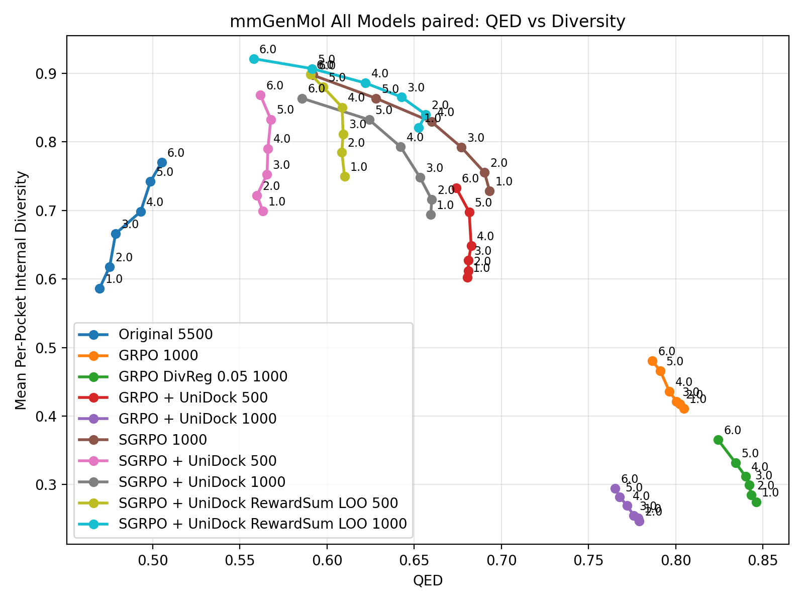
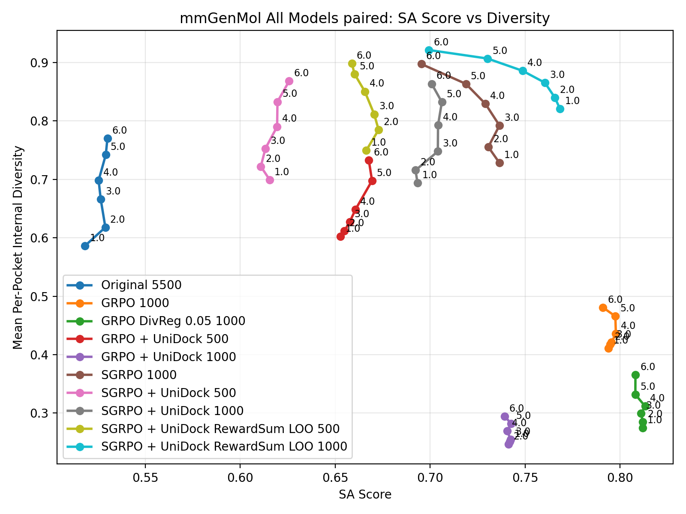
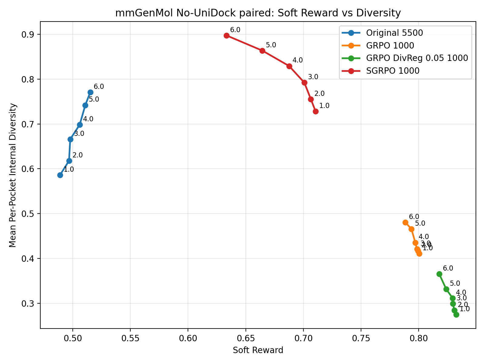
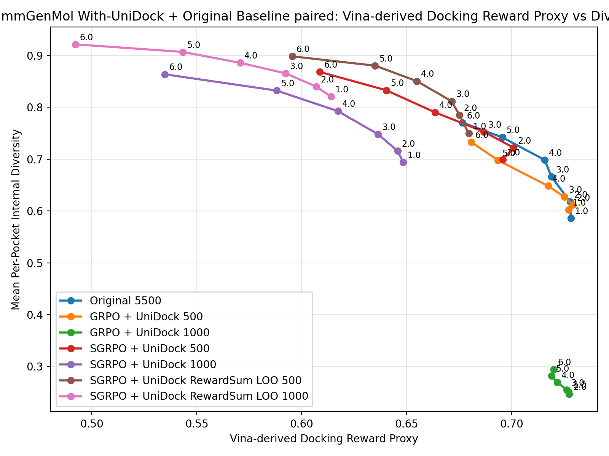
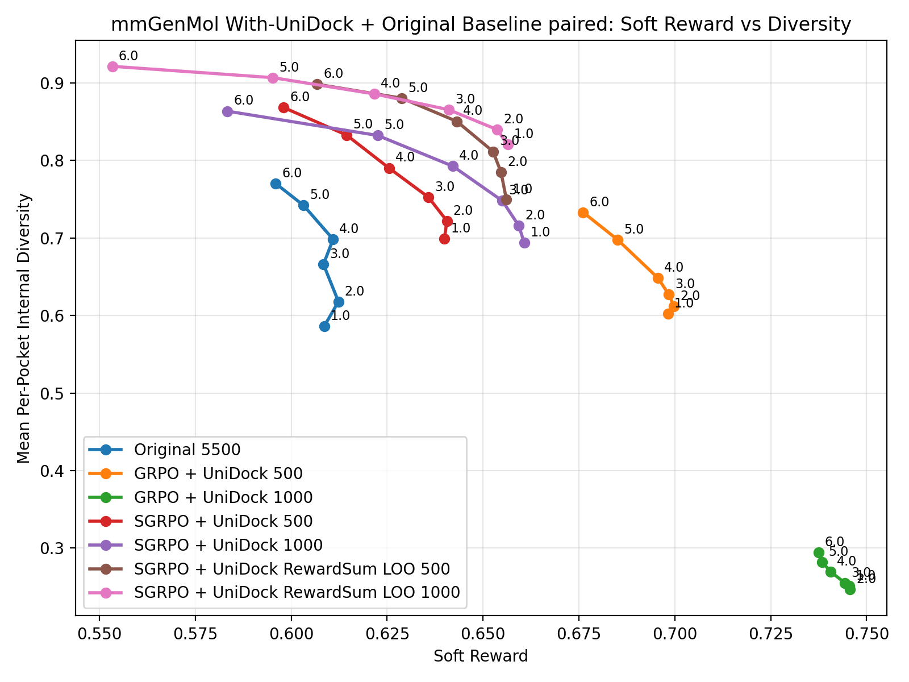

# mmGenMol Sweep Results

- `summary_json`: `sgrpo-main-results/mmgenmol/mmgenmol_paired_main_results_20260502.json`
- `raw_rows_jsonl`: `sgrpo-main-results/mmgenmol/mmgenmol_paired_main_results_20260502.rows.jsonl`
- `num_pockets`: 100
- `samples_per_pocket`: 16
- `docking_mode`: `vina_dock`
- `diversity`: per sweep point, compute internal diversity separately within each pocket group, then average over pockets.
- `qed_mean` and `sa_score_mean`: means over valid generated molecules in the sweep point.
- `unidock_score_mean`: legacy field name. The value is a Vina-derived docking reward proxy computed by transforming offline `vina_dock` affinity with `unidock_affinity_to_score`; it is reported only for the UniDock-trained model family.
- `soft_reward_mean`: computed per model with that model family's registered training-time reward weights.
- `vina_dock_mean`: mean Vina dock affinity over successful dockings; lower is better.

| Model | Sweep | Value | Diversity | QED | SA Score | UniDock Reward | Soft Reward | Vina Dock Mean | Dock Success | Valid Fraction |
| --- | --- | --- | --- | --- | --- | --- | --- | --- | --- | --- |
| GRPO 1000 | paired | 1.000000 | 0.410854 | 0.804686 | 0.793902 | nan | 0.800373 | -6.461134 | 0.999373 | 0.996875 |
| GRPO DivReg 0.05 1000 | paired | 1.000000 | 0.274710 | 0.846138 | 0.811792 | nan | 0.832400 | -7.133833 | 0.996245 | 0.998750 |
| GRPO + UniDock 1000 | paired | 1.000000 | 0.251261 | 0.778577 | 0.741866 | 0.727214 | 0.745554 | -7.266162 | 1.000000 | 0.994375 |
| GRPO + UniDock 500 | paired | 1.000000 | 0.602351 | 0.680388 | 0.652799 | 0.727107 | 0.698230 | -7.269669 | 1.000000 | 0.981250 |
| Original 5500 | paired | 1.000000 | 0.586170 | 0.469621 | 0.518220 | nan | 0.489061 | -7.281619 | 0.984257 | 0.992500 |
| SGRPO 1000 | paired | 1.000000 | 0.728285 | 0.693298 | 0.736425 | nan | 0.710549 | -6.449704 | 0.967945 | 0.994375 |
| SGRPO + UniDock 1000 | paired | 1.000000 | 0.693844 | 0.659589 | 0.693297 | 0.648383 | 0.660727 | -6.460150 | 1.000000 | 0.976875 |
| SGRPO + UniDock 500 | paired | 1.000000 | 0.699276 | 0.563210 | 0.615468 | 0.695768 | 0.639941 | -6.915687 | 1.000000 | 0.966250 |
| SGRPO + UniDock RewardSum LOO 1000 | paired | 1.000000 | 0.820384 | 0.652552 | 0.768348 | 0.614007 | 0.656438 | -6.149039 | 1.000000 | 0.973750 |
| SGRPO + UniDock RewardSum LOO 500 | paired | 1.000000 | 0.749778 | 0.610091 | 0.666385 | 0.679578 | 0.656094 | -6.830837 | 1.000000 | 0.964375 |
| GRPO 1000 | paired | 2.000000 | 0.417338 | 0.802385 | 0.794661 | nan | 0.799296 | -6.396598 | 0.997484 | 0.993750 |
| GRPO DivReg 0.05 1000 | paired | 2.000000 | 0.284610 | 0.843421 | 0.811917 | nan | 0.830819 | -7.202537 | 0.996243 | 0.998125 |
| GRPO + UniDock 1000 | paired | 2.000000 | 0.246413 | 0.779040 | 0.741268 | 0.727322 | 0.745627 | -7.255943 | 1.000000 | 0.995000 |
| GRPO + UniDock 500 | paired | 2.000000 | 0.611526 | 0.681030 | 0.654783 | 0.729069 | 0.699800 | -7.314208 | 1.000000 | 0.982500 |
| Original 5500 | paired | 2.000000 | 0.617888 | 0.475418 | 0.528965 | nan | 0.496836 | -7.277975 | 0.981750 | 0.993125 |
| SGRPO 1000 | paired | 2.000000 | 0.755430 | 0.690362 | 0.730594 | nan | 0.706454 | -6.402739 | 0.950252 | 0.992500 |
| SGRPO + UniDock 1000 | paired | 2.000000 | 0.715576 | 0.660122 | 0.692286 | 0.645712 | 0.659350 | -6.461485 | 1.000000 | 0.977500 |
| SGRPO + UniDock 500 | paired | 2.000000 | 0.722001 | 0.559910 | 0.610826 | 0.700909 | 0.640593 | -7.015926 | 1.000000 | 0.960000 |
| SGRPO + UniDock RewardSum LOO 1000 | paired | 2.000000 | 0.839829 | 0.656718 | 0.765645 | 0.606993 | 0.653641 | -6.074791 | 1.000000 | 0.975625 |
| SGRPO + UniDock RewardSum LOO 500 | paired | 2.000000 | 0.784796 | 0.608573 | 0.672828 | 0.675117 | 0.654696 | -6.772458 | 1.000000 | 0.962500 |
| GRPO 1000 | paired | 3.000000 | 0.421166 | 0.800555 | 0.795387 | nan | 0.798488 | -6.416257 | 0.997484 | 0.993750 |
| GRPO DivReg 0.05 1000 | paired | 3.000000 | 0.299501 | 0.842121 | 0.811066 | nan | 0.829699 | -7.159428 | 0.996241 | 0.997500 |
| GRPO + UniDock 1000 | paired | 3.000000 | 0.254957 | 0.775964 | 0.742311 | 0.726229 | 0.744366 | -7.280243 | 1.000000 | 0.996875 |
| GRPO + UniDock 500 | paired | 3.000000 | 0.626896 | 0.681159 | 0.657592 | 0.725170 | 0.698451 | -7.274789 | 1.000000 | 0.973125 |
| Original 5500 | paired | 3.000000 | 0.665989 | 0.478807 | 0.526521 | nan | 0.497893 | -7.189359 | 0.979887 | 0.994375 |
| SGRPO 1000 | paired | 3.000000 | 0.792191 | 0.677053 | 0.736462 | nan | 0.700817 | -6.324965 | 0.949495 | 0.990000 |
| SGRPO + UniDock 1000 | paired | 3.000000 | 0.747845 | 0.653441 | 0.704016 | 0.636434 | 0.655052 | -6.306800 | 1.000000 | 0.973750 |
| SGRPO + UniDock 500 | paired | 3.000000 | 0.752700 | 0.565653 | 0.613227 | 0.686790 | 0.635736 | -6.875525 | 1.000000 | 0.957500 |
| SGRPO + UniDock RewardSum LOO 1000 | paired | 3.000000 | 0.865403 | 0.642730 | 0.760373 | 0.592385 | 0.641086 | -5.930466 | 1.000000 | 0.962500 |
| SGRPO + UniDock RewardSum LOO 500 | paired | 3.000000 | 0.811495 | 0.609254 | 0.670500 | 0.671494 | 0.652623 | -6.667026 | 1.000000 | 0.955625 |
| GRPO 1000 | paired | 4.000000 | 0.435576 | 0.796496 | 0.797759 | nan | 0.797001 | -6.386865 | 0.998739 | 0.991250 |
| GRPO DivReg 0.05 1000 | paired | 4.000000 | 0.311655 | 0.840174 | 0.813152 | nan | 0.829365 | -7.162188 | 0.995600 | 0.994375 |
| GRPO + UniDock 1000 | paired | 4.000000 | 0.269420 | 0.772170 | 0.740524 | 0.721731 | 0.740621 | -7.205527 | 1.000000 | 0.994375 |
| GRPO + UniDock 500 | paired | 4.000000 | 0.648347 | 0.682740 | 0.660644 | 0.717289 | 0.695596 | -7.182461 | 1.000000 | 0.978125 |
| Original 5500 | paired | 4.000000 | 0.698329 | 0.493196 | 0.525427 | nan | 0.506088 | -7.157472 | 0.976010 | 0.990000 |
| SGRPO 1000 | paired | 4.000000 | 0.829224 | 0.659975 | 0.729067 | nan | 0.687612 | -6.094207 | 0.951654 | 0.982500 |
| SGRPO + UniDock 1000 | paired | 4.000000 | 0.792624 | 0.642298 | 0.704119 | 0.617230 | 0.642128 | -6.185957 | 1.000000 | 0.960625 |
| SGRPO + UniDock 500 | paired | 4.000000 | 0.790275 | 0.566174 | 0.619404 | 0.663475 | 0.625471 | -6.593733 | 1.000000 | 0.965625 |
| SGRPO + UniDock RewardSum LOO 1000 | paired | 4.000000 | 0.885789 | 0.622157 | 0.748619 | 0.570661 | 0.621701 | -5.713219 | 1.000000 | 0.945625 |
| SGRPO + UniDock RewardSum LOO 500 | paired | 4.000000 | 0.850388 | 0.608752 | 0.665575 | 0.654866 | 0.643174 | -6.574770 | 1.000000 | 0.956250 |
| GRPO 1000 | paired | 5.000000 | 0.465682 | 0.791200 | 0.797469 | nan | 0.793707 | -6.373661 | 0.998737 | 0.990000 |
| GRPO DivReg 0.05 1000 | paired | 5.000000 | 0.331705 | 0.834359 | 0.808010 | nan | 0.823819 | -7.135296 | 0.994340 | 0.993750 |
| GRPO + UniDock 1000 | paired | 5.000000 | 0.282146 | 0.767804 | 0.742578 | 0.719006 | 0.738360 | -7.205736 | 1.000000 | 0.993125 |
| GRPO + UniDock 500 | paired | 5.000000 | 0.697722 | 0.681581 | 0.669361 | 0.693481 | 0.685087 | -6.814030 | 1.000000 | 0.970625 |
| Original 5500 | paired | 5.000000 | 0.741931 | 0.498779 | 0.529182 | nan | 0.510940 | -6.955426 | 0.976967 | 0.976875 |
| SGRPO 1000 | paired | 5.000000 | 0.863461 | 0.628215 | 0.718764 | nan | 0.664435 | -5.700970 | 0.958630 | 0.966875 |
| SGRPO + UniDock 1000 | paired | 5.000000 | 0.832210 | 0.624270 | 0.706126 | 0.588106 | 0.622559 | -5.730409 | 1.000000 | 0.942500 |
| SGRPO + UniDock 500 | paired | 5.000000 | 0.832789 | 0.567817 | 0.619581 | 0.640320 | 0.614421 | -6.411014 | 1.000000 | 0.946250 |
| SGRPO + UniDock RewardSum LOO 1000 | paired | 5.000000 | 0.906768 | 0.591574 | 0.730146 | 0.543422 | 0.595213 | -5.413042 | 1.000000 | 0.943750 |
| SGRPO + UniDock RewardSum LOO 500 | paired | 5.000000 | 0.880289 | 0.597682 | 0.660156 | 0.634972 | 0.628822 | -6.319341 | 1.000000 | 0.935625 |
| GRPO 1000 | paired | 6.000000 | 0.480730 | 0.786577 | 0.790946 | nan | 0.788325 | -6.291110 | 0.996823 | 0.983750 |
| GRPO DivReg 0.05 1000 | paired | 6.000000 | 0.365325 | 0.824321 | 0.808046 | nan | 0.817811 | -7.040825 | 0.994937 | 0.987500 |
| GRPO + UniDock 1000 | paired | 6.000000 | 0.294570 | 0.765357 | 0.739140 | 0.720047 | 0.737459 | -7.214693 | 1.000000 | 0.984375 |
| GRPO + UniDock 500 | paired | 6.000000 | 0.733036 | 0.674096 | 0.667661 | 0.680681 | 0.676102 | -6.795502 | 1.000000 | 0.955625 |
| Original 5500 | paired | 6.000000 | 0.770390 | 0.505257 | 0.530068 | nan | 0.515181 | -6.766356 | 0.963368 | 0.972500 |
| SGRPO 1000 | paired | 6.000000 | 0.897401 | 0.591935 | 0.695302 | nan | 0.633282 | -5.284288 | 0.961488 | 0.957500 |
| SGRPO + UniDock 1000 | paired | 6.000000 | 0.863581 | 0.585738 | 0.700749 | 0.534901 | 0.583322 | -5.293880 | 1.000000 | 0.936875 |
| SGRPO + UniDock 500 | paired | 6.000000 | 0.868230 | 0.561846 | 0.625732 | 0.608655 | 0.598028 | -6.052728 | 1.000000 | 0.926875 |
| SGRPO + UniDock RewardSum LOO 1000 | paired | 6.000000 | 0.921387 | 0.557941 | 0.699212 | 0.492307 | 0.553378 | -4.917278 | 1.000000 | 0.918750 |
| SGRPO + UniDock RewardSum LOO 500 | paired | 6.000000 | 0.898252 | 0.590700 | 0.658771 | 0.595525 | 0.606727 | -5.910916 | 1.000000 | 0.920625 |

## all-model paired QED vs diversity

## all-model paired SA Score vs diversity

## no-UniDock paired Soft Reward vs diversity

## with-UniDock paired Vina-derived Docking Reward Proxy vs diversity

## with-UniDock paired Soft Reward vs diversity

