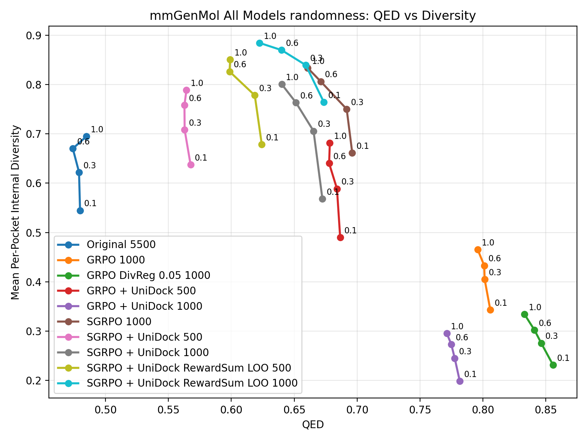
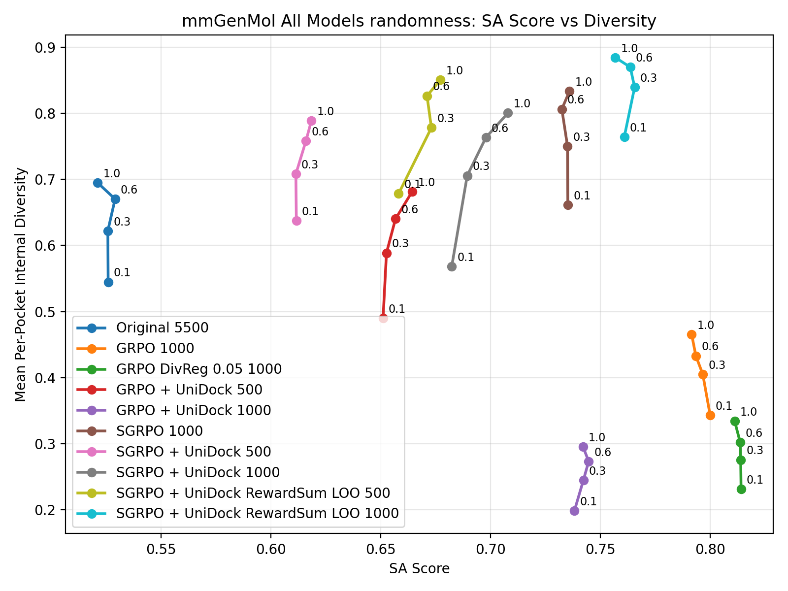
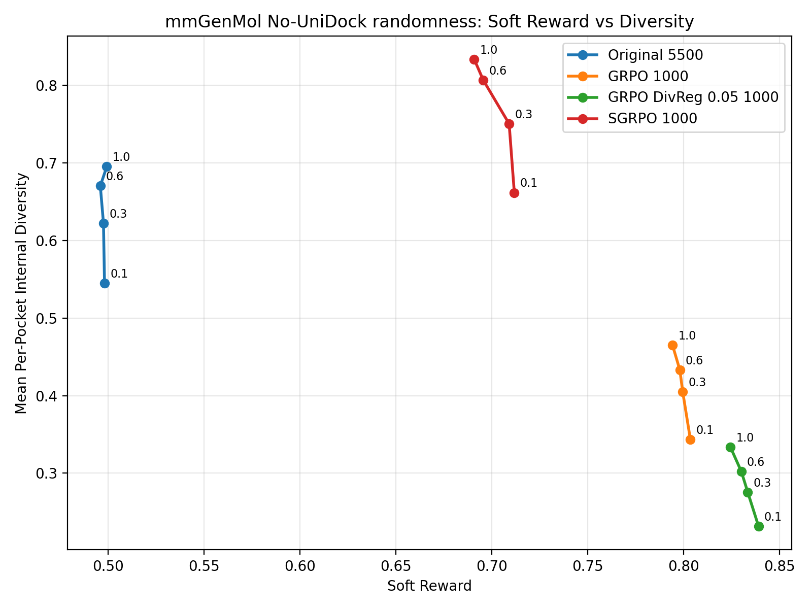
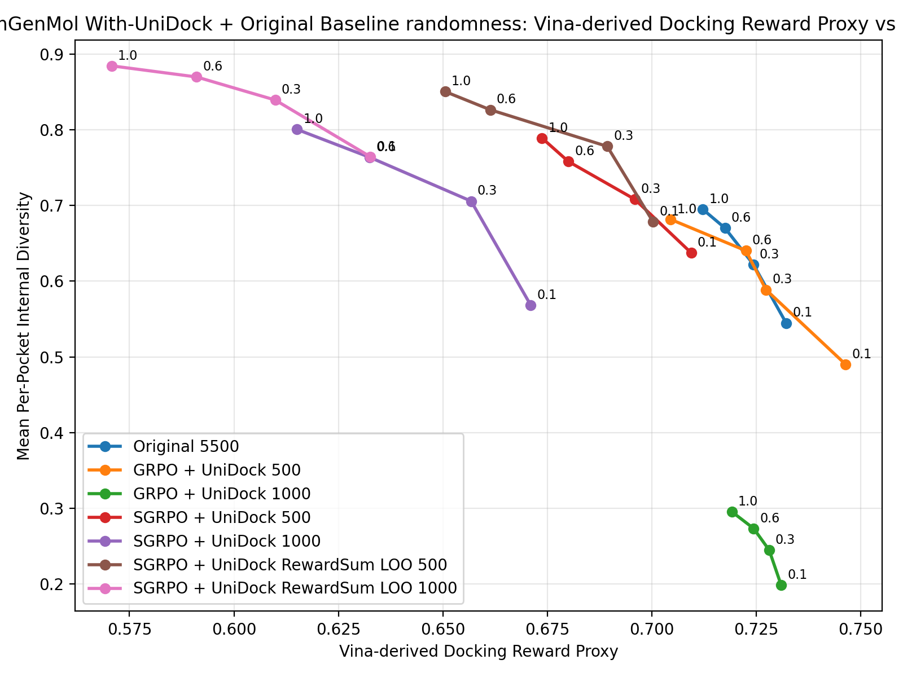
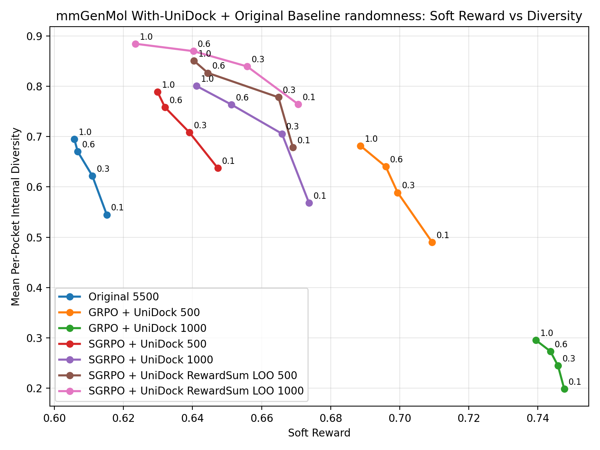

# mmGenMol Sweep Results

- `summary_json`: `sgrpo-main-results/mmgenmol/mmgenmol_randomness_main_results_20260502.json`
- `raw_rows_jsonl`: `sgrpo-main-results/mmgenmol/mmgenmol_randomness_main_results_20260502.rows.jsonl`
- `num_pockets`: 100
- `samples_per_pocket`: 16
- `docking_mode`: `vina_dock`
- `diversity`: per sweep point, compute internal diversity separately within each pocket group, then average over pockets.
- `qed_mean` and `sa_score_mean`: means over valid generated molecules in the sweep point.
- `unidock_score_mean`: legacy field name. The value is a Vina-derived docking reward proxy computed by transforming offline `vina_dock` affinity with `unidock_affinity_to_score`; it is reported only for the UniDock-trained model family.
- `soft_reward_mean`: computed per model with that model family's registered training-time reward weights.
- `vina_dock_mean`: mean Vina dock affinity over successful dockings; lower is better.

| Model | Sweep | Value | Diversity | QED | SA Score | UniDock Reward | Soft Reward | Vina Dock Mean | Dock Success | Valid Fraction |
| --- | --- | --- | --- | --- | --- | --- | --- | --- | --- | --- |
| GRPO 1000 | randomness | 0.100000 | 0.343151 | 0.805986 | 0.799975 | nan | 0.803581 | -6.300665 | 0.998121 | 0.998125 |
| GRPO DivReg 0.05 1000 | randomness | 0.100000 | 0.231363 | 0.855863 | 0.814055 | nan | 0.839140 | -7.284363 | 0.994994 | 0.998750 |
| GRPO + UniDock 1000 | randomness | 0.100000 | 0.198124 | 0.781736 | 0.738157 | 0.730977 | 0.747641 | -7.330682 | 1.000000 | 0.996875 |
| GRPO + UniDock 500 | randomness | 0.100000 | 0.490045 | 0.686576 | 0.651067 | 0.746396 | 0.709384 | -7.479842 | 1.000000 | 0.982500 |
| Original 5500 | randomness | 0.100000 | 0.544726 | 0.479652 | 0.525897 | nan | 0.498150 | -7.321590 | 0.981179 | 0.996250 |
| SGRPO 1000 | randomness | 0.100000 | 0.661608 | 0.696176 | 0.735191 | nan | 0.711782 | -6.609278 | 0.960526 | 0.997500 |
| SGRPO + UniDock 1000 | randomness | 0.100000 | 0.568195 | 0.672442 | 0.682329 | 0.671040 | 0.673718 | -6.668775 | 1.000000 | 0.961875 |
| SGRPO + UniDock 500 | randomness | 0.100000 | 0.637563 | 0.567569 | 0.611586 | 0.709409 | 0.647292 | -7.125113 | 1.000000 | 0.940000 |
| SGRPO + UniDock RewardSum LOO 1000 | randomness | 0.100000 | 0.764531 | 0.673558 | 0.760899 | 0.632629 | 0.670562 | -6.332855 | 1.000000 | 0.976875 |
| SGRPO + UniDock RewardSum LOO 500 | randomness | 0.100000 | 0.678578 | 0.624227 | 0.658163 | 0.700300 | 0.669051 | -7.040846 | 1.000000 | 0.956875 |
| GRPO 1000 | randomness | 0.300000 | 0.404945 | 0.801514 | 0.796646 | nan | 0.799566 | -6.432403 | 0.997491 | 0.996250 |
| GRPO DivReg 0.05 1000 | randomness | 0.300000 | 0.275579 | 0.846507 | 0.813896 | nan | 0.833462 | -7.154357 | 0.996238 | 0.996875 |
| GRPO + UniDock 1000 | randomness | 0.300000 | 0.244669 | 0.777723 | 0.742277 | 0.728093 | 0.745819 | -7.285592 | 1.000000 | 0.995625 |
| GRPO + UniDock 500 | randomness | 0.300000 | 0.588704 | 0.684026 | 0.652619 | 0.727341 | 0.699402 | -7.295484 | 1.000000 | 0.982500 |
| Original 5500 | randomness | 0.300000 | 0.622208 | 0.478838 | 0.525759 | nan | 0.497606 | -7.243106 | 0.980515 | 0.994375 |
| SGRPO 1000 | randomness | 0.300000 | 0.750277 | 0.691767 | 0.735042 | nan | 0.709077 | -6.418187 | 0.952050 | 0.990625 |
| SGRPO + UniDock 1000 | randomness | 0.300000 | 0.705788 | 0.665404 | 0.689385 | 0.656770 | 0.665883 | -6.550006 | 1.000000 | 0.974375 |
| SGRPO + UniDock 500 | randomness | 0.300000 | 0.708225 | 0.562864 | 0.611365 | 0.695930 | 0.639097 | -6.995862 | 1.000000 | 0.950625 |
| SGRPO + UniDock RewardSum LOO 1000 | randomness | 0.300000 | 0.839428 | 0.659250 | 0.765595 | 0.609864 | 0.655826 | -6.087196 | 1.000000 | 0.974375 |
| SGRPO + UniDock RewardSum LOO 500 | randomness | 0.300000 | 0.778171 | 0.618640 | 0.673071 | 0.689338 | 0.664875 | -6.877172 | 1.000000 | 0.953125 |
| GRPO 1000 | randomness | 0.600000 | 0.432903 | 0.801160 | 0.793475 | nan | 0.798086 | -6.375395 | 0.998117 | 0.995625 |
| GRPO DivReg 0.05 1000 | randomness | 0.600000 | 0.302271 | 0.841103 | 0.813651 | nan | 0.830122 | -7.174169 | 0.995609 | 0.996250 |
| GRPO + UniDock 1000 | randomness | 0.600000 | 0.273150 | 0.774956 | 0.744679 | 0.724390 | 0.743617 | -7.257452 | 1.000000 | 0.995000 |
| GRPO + UniDock 500 | randomness | 0.600000 | 0.640238 | 0.677789 | 0.656727 | 0.722539 | 0.695952 | -7.252386 | 1.000000 | 0.979375 |
| Original 5500 | randomness | 0.600000 | 0.670246 | 0.473894 | 0.529055 | nan | 0.495958 | -7.175157 | 0.982976 | 0.991250 |
| SGRPO 1000 | randomness | 0.600000 | 0.806452 | 0.671060 | 0.732456 | nan | 0.695619 | -6.196509 | 0.954978 | 0.985625 |
| SGRPO + UniDock 1000 | randomness | 0.600000 | 0.763695 | 0.651350 | 0.697934 | 0.632501 | 0.651243 | -6.315013 | 1.000000 | 0.970625 |
| SGRPO + UniDock 500 | randomness | 0.600000 | 0.758161 | 0.562700 | 0.615944 | 0.680045 | 0.632021 | -6.710374 | 1.000000 | 0.955625 |
| SGRPO + UniDock RewardSum LOO 1000 | randomness | 0.600000 | 0.869897 | 0.640021 | 0.763619 | 0.591057 | 0.640259 | -5.870924 | 1.000000 | 0.958750 |
| SGRPO + UniDock RewardSum LOO 500 | randomness | 0.600000 | 0.826565 | 0.598560 | 0.671070 | 0.661334 | 0.644449 | -6.597283 | 1.000000 | 0.960000 |
| GRPO 1000 | randomness | 1.000000 | 0.465324 | 0.795972 | 0.791575 | nan | 0.794213 | -6.390044 | 0.996845 | 0.990625 |
| GRPO DivReg 0.05 1000 | randomness | 1.000000 | 0.333871 | 0.833222 | 0.811154 | nan | 0.824395 | -7.110293 | 0.993734 | 0.997500 |
| GRPO + UniDock 1000 | randomness | 1.000000 | 0.295239 | 0.771403 | 0.742105 | 0.719186 | 0.739435 | -7.205714 | 1.000000 | 0.993125 |
| GRPO + UniDock 500 | randomness | 1.000000 | 0.681728 | 0.678353 | 0.664368 | 0.704495 | 0.688627 | -7.012413 | 1.000000 | 0.964375 |
| Original 5500 | randomness | 1.000000 | 0.695035 | 0.484793 | 0.521087 | nan | 0.499310 | -7.121937 | 0.978467 | 0.986875 |
| SGRPO 1000 | randomness | 1.000000 | 0.833511 | 0.660797 | 0.735957 | nan | 0.690861 | -6.146106 | 0.956907 | 0.986250 |
| SGRPO + UniDock 1000 | randomness | 1.000000 | 0.800526 | 0.640158 | 0.707933 | 0.615108 | 0.641188 | -6.159126 | 1.000000 | 0.968750 |
| SGRPO + UniDock 500 | randomness | 1.000000 | 0.789180 | 0.564290 | 0.618469 | 0.673722 | 0.629842 | -6.317071 | 1.000000 | 0.953750 |
| SGRPO + UniDock RewardSum LOO 1000 | randomness | 1.000000 | 0.884593 | 0.622384 | 0.756813 | 0.570726 | 0.623441 | -5.661860 | 1.000000 | 0.949375 |
| SGRPO + UniDock RewardSum LOO 500 | randomness | 1.000000 | 0.850572 | 0.599117 | 0.677143 | 0.650539 | 0.640433 | -6.498206 | 1.000000 | 0.959375 |

## all-model randomness QED vs diversity

## all-model randomness SA Score vs diversity

## no-UniDock randomness Soft Reward vs diversity

## with-UniDock randomness Vina-derived Docking Reward Proxy vs diversity

## with-UniDock randomness Soft Reward vs diversity

