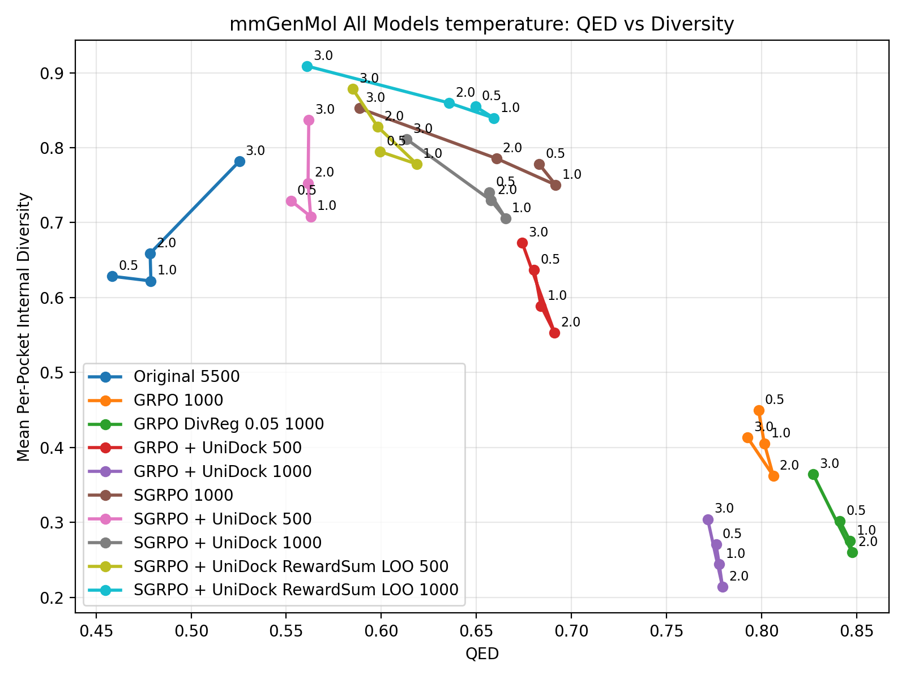
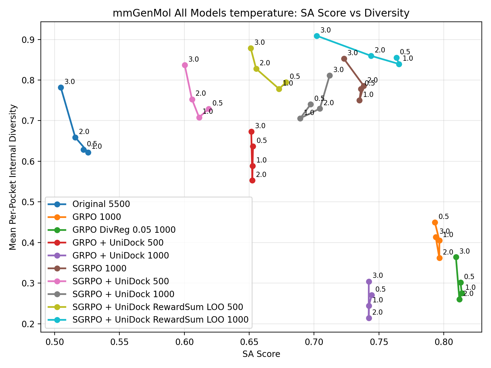
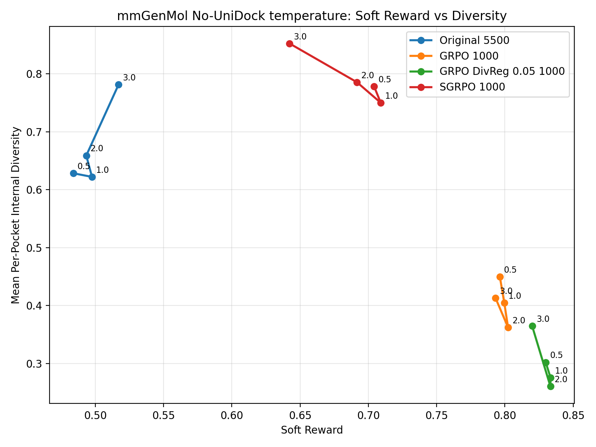
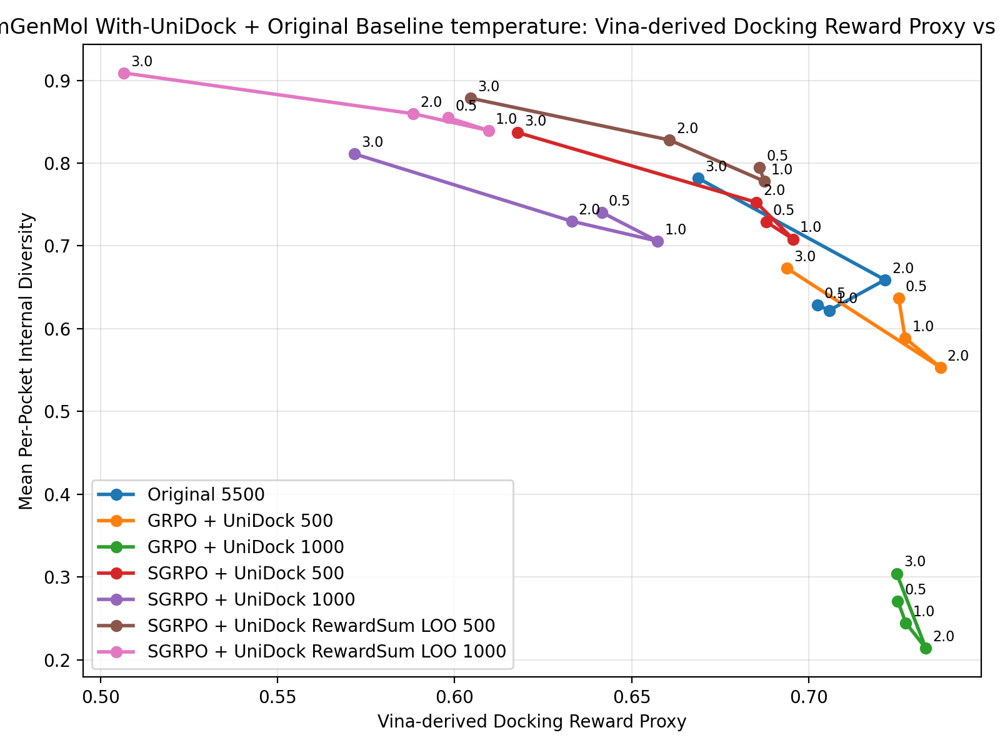
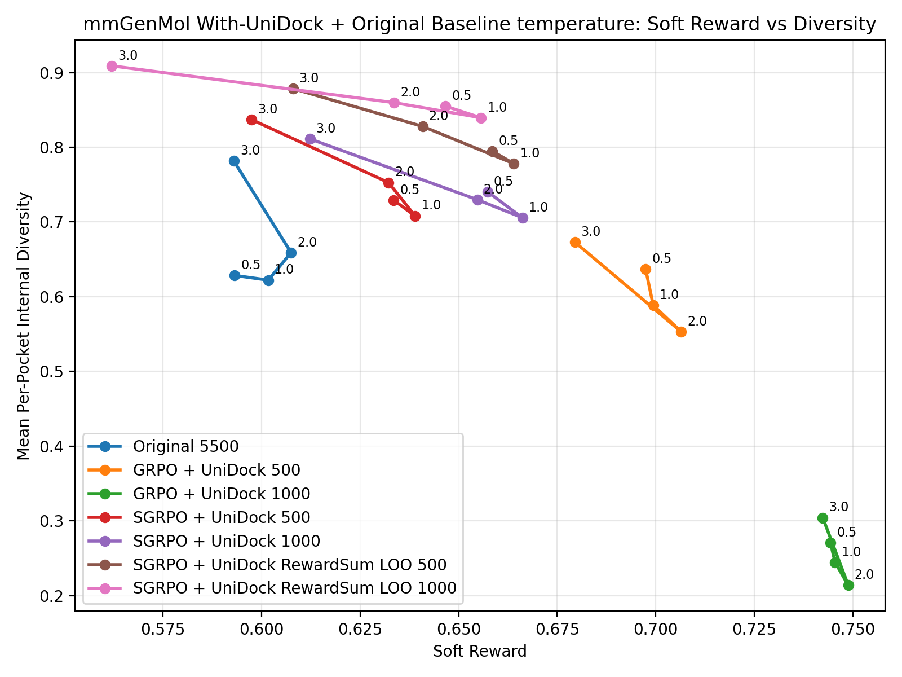

# mmGenMol Sweep Results

- `summary_json`: `sgrpo-main-results/mmgenmol/mmgenmol_temperature_main_results_20260502.json`
- `raw_rows_jsonl`: `sgrpo-main-results/mmgenmol/mmgenmol_temperature_main_results_20260502.rows.jsonl`
- `num_pockets`: 100
- `samples_per_pocket`: 16
- `docking_mode`: `vina_dock`
- `diversity`: per sweep point, compute internal diversity separately within each pocket group, then average over pockets.
- `qed_mean` and `sa_score_mean`: means over valid generated molecules in the sweep point.
- `unidock_score_mean`: legacy field name. The value is a Vina-derived docking reward proxy computed by transforming offline `vina_dock` affinity with `unidock_affinity_to_score`; it is reported only for the UniDock-trained model family.
- `soft_reward_mean`: computed per model with that model family's registered training-time reward weights.
- `vina_dock_mean`: mean Vina dock affinity over successful dockings; lower is better.

| Model | Sweep | Value | Diversity | QED | SA Score | UniDock Reward | Soft Reward | Vina Dock Mean | Dock Success | Valid Fraction |
| --- | --- | --- | --- | --- | --- | --- | --- | --- | --- | --- |
| GRPO 1000 | temperature | 0.500000 | 0.449927 | 0.798413 | 0.793173 | nan | 0.796317 | -6.434161 | 0.996855 | 0.993750 |
| GRPO DivReg 0.05 1000 | temperature | 0.500000 | 0.302039 | 0.841217 | 0.812937 | nan | 0.829905 | -7.176831 | 0.998118 | 0.996250 |
| GRPO + UniDock 1000 | temperature | 0.500000 | 0.271035 | 0.776083 | 0.744481 | 0.725178 | 0.744310 | -7.266377 | 1.000000 | 0.989375 |
| GRPO + UniDock 500 | temperature | 0.500000 | 0.637148 | 0.680450 | 0.652934 | 0.725423 | 0.697433 | -7.282630 | 1.000000 | 0.978750 |
| Original 5500 | temperature | 0.500000 | 0.628460 | 0.458480 | 0.522132 | nan | 0.483941 | -7.024656 | 0.977287 | 0.990625 |
| SGRPO 1000 | temperature | 0.500000 | 0.778147 | 0.682971 | 0.736226 | nan | 0.704273 | -6.388259 | 0.957862 | 0.993750 |
| SGRPO + UniDock 1000 | temperature | 0.500000 | 0.740513 | 0.656793 | 0.697432 | 0.641543 | 0.657296 | -6.250331 | 1.000000 | 0.980000 |
| SGRPO + UniDock 500 | temperature | 0.500000 | 0.729234 | 0.552510 | 0.618873 | 0.687975 | 0.633515 | -6.868771 | 1.000000 | 0.971250 |
| SGRPO + UniDock RewardSum LOO 1000 | temperature | 0.500000 | 0.854878 | 0.649563 | 0.763521 | 0.598222 | 0.646684 | -5.844757 | 1.000000 | 0.970625 |
| SGRPO + UniDock RewardSum LOO 500 | temperature | 0.500000 | 0.794779 | 0.599370 | 0.678499 | 0.686113 | 0.658567 | -6.901146 | 1.000000 | 0.958750 |
| GRPO 1000 | temperature | 1.000000 | 0.404945 | 0.801514 | 0.796646 | nan | 0.799566 | -6.383834 | 0.997491 | 0.996250 |
| GRPO DivReg 0.05 1000 | temperature | 1.000000 | 0.275579 | 0.846507 | 0.813896 | nan | 0.833462 | -7.201010 | 0.996238 | 0.996875 |
| GRPO + UniDock 1000 | temperature | 1.000000 | 0.244669 | 0.777723 | 0.742277 | 0.727455 | 0.745500 | -7.290536 | 1.000000 | 0.995625 |
| GRPO + UniDock 500 | temperature | 1.000000 | 0.588704 | 0.684026 | 0.652619 | 0.727250 | 0.699356 | -7.240784 | 1.000000 | 0.982500 |
| Original 5500 | temperature | 1.000000 | 0.622208 | 0.478838 | 0.525759 | nan | 0.497606 | -7.058283 | 0.980515 | 0.994375 |
| SGRPO 1000 | temperature | 1.000000 | 0.750277 | 0.691767 | 0.735042 | nan | 0.709077 | -6.232247 | 0.952050 | 0.990625 |
| SGRPO + UniDock 1000 | temperature | 1.000000 | 0.705788 | 0.665404 | 0.689385 | 0.657334 | 0.666165 | -6.574338 | 1.000000 | 0.974375 |
| SGRPO + UniDock 500 | temperature | 1.000000 | 0.708225 | 0.562864 | 0.611365 | 0.695592 | 0.638928 | -6.989370 | 1.000000 | 0.950625 |
| SGRPO + UniDock RewardSum LOO 1000 | temperature | 1.000000 | 0.839472 | 0.659266 | 0.765582 | 0.609574 | 0.655683 | -6.048381 | 1.000000 | 0.974375 |
| SGRPO + UniDock RewardSum LOO 500 | temperature | 1.000000 | 0.778205 | 0.618647 | 0.673064 | 0.687456 | 0.663935 | -6.871455 | 1.000000 | 0.953125 |
| GRPO 1000 | temperature | 2.000000 | 0.362375 | 0.806160 | 0.796602 | nan | 0.802337 | -6.428269 | 0.996865 | 0.996875 |
| GRPO DivReg 0.05 1000 | temperature | 2.000000 | 0.260358 | 0.847584 | 0.812077 | nan | 0.833381 | -7.235307 | 0.994354 | 0.996250 |
| GRPO + UniDock 1000 | temperature | 2.000000 | 0.213922 | 0.779488 | 0.742164 | 0.733127 | 0.748843 | -7.349779 | 1.000000 | 0.998750 |
| GRPO + UniDock 500 | temperature | 2.000000 | 0.553305 | 0.691106 | 0.652439 | 0.737219 | 0.706429 | -7.205652 | 1.000000 | 0.972500 |
| Original 5500 | temperature | 2.000000 | 0.659054 | 0.478433 | 0.515902 | nan | 0.493421 | -7.215622 | 0.963245 | 0.986250 |
| SGRPO 1000 | temperature | 2.000000 | 0.785678 | 0.660569 | 0.738346 | nan | 0.691679 | -6.073644 | 0.942748 | 0.982500 |
| SGRPO + UniDock 1000 | temperature | 2.000000 | 0.729854 | 0.657613 | 0.704532 | 0.633070 | 0.654725 | -6.341060 | 1.000000 | 0.961875 |
| SGRPO + UniDock 500 | temperature | 2.000000 | 0.752756 | 0.561498 | 0.605885 | 0.685166 | 0.632209 | -6.862914 | 1.000000 | 0.946875 |
| SGRPO + UniDock RewardSum LOO 1000 | temperature | 2.000000 | 0.859658 | 0.635742 | 0.743915 | 0.588360 | 0.633686 | -5.864441 | 1.000000 | 0.947500 |
| SGRPO + UniDock RewardSum LOO 500 | temperature | 2.000000 | 0.827934 | 0.598109 | 0.655339 | 0.660695 | 0.640848 | -6.609940 | 1.000000 | 0.945625 |
| GRPO 1000 | temperature | 3.000000 | 0.413189 | 0.792665 | 0.793854 | nan | 0.793141 | -6.357838 | 0.992453 | 0.993750 |
| GRPO DivReg 0.05 1000 | temperature | 3.000000 | 0.364599 | 0.827087 | 0.809389 | nan | 0.820008 | -7.061805 | 0.982933 | 0.988750 |
| GRPO + UniDock 1000 | temperature | 3.000000 | 0.304377 | 0.771679 | 0.742210 | 0.724859 | 0.742375 | -7.246491 | 1.000000 | 0.981250 |
| GRPO + UniDock 500 | temperature | 3.000000 | 0.673134 | 0.674121 | 0.651602 | 0.693815 | 0.679464 | -6.937369 | 1.000000 | 0.883125 |
| Original 5500 | temperature | 3.000000 | 0.781675 | 0.525314 | 0.504754 | nan | 0.517090 | -6.688348 | 0.905035 | 0.980625 |
| SGRPO 1000 | temperature | 3.000000 | 0.852595 | 0.588446 | 0.722999 | nan | 0.642267 | -5.217987 | 0.951792 | 0.959375 |
| SGRPO + UniDock 1000 | temperature | 3.000000 | 0.811249 | 0.613378 | 0.712028 | 0.571645 | 0.612242 | -5.632040 | 1.000000 | 0.935625 |
| SGRPO + UniDock 500 | temperature | 3.000000 | 0.837045 | 0.561872 | 0.600276 | 0.617698 | 0.597466 | -6.200395 | 1.000000 | 0.895625 |
| SGRPO + UniDock RewardSum LOO 1000 | temperature | 3.000000 | 0.908930 | 0.560921 | 0.702136 | 0.506564 | 0.561986 | -5.057827 | 1.000000 | 0.926250 |
| SGRPO + UniDock RewardSum LOO 500 | temperature | 3.000000 | 0.878450 | 0.584965 | 0.651177 | 0.604463 | 0.607956 | -6.053997 | 1.000000 | 0.896875 |

## all-model temperature QED vs diversity

## all-model temperature SA Score vs diversity

## no-UniDock temperature Soft Reward vs diversity

## with-UniDock temperature Vina-derived Docking Reward Proxy vs diversity

## with-UniDock temperature Soft Reward vs diversity

